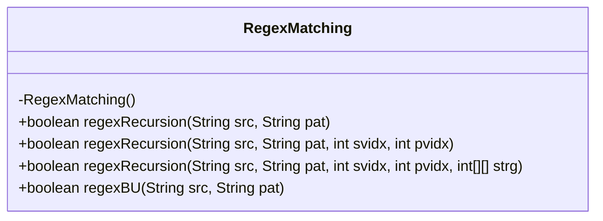
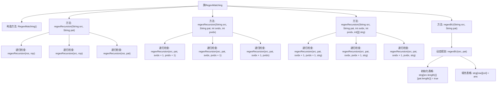

# 基础信息

|      |      |
|------|------|
| 名称 | RegexMatching |
| 编码语言 | .java |
| 代码路径 | Java/src/main/java/com/thealgorithms/dynamicprogramming/RegexMatching.java |
| 包名 | com.thealgorithms.dynamicprogramming |
| 依赖项 | [] |
| 概述说明 | RegexMatching类提供四种方法匹配字符串与模式，支持'?'和'*'通配符。 |

# 说明

类RegexMatching提供了四种方法用于匹配字符串与模式，支持使用'?'和'*'通配符。这四种方法分别是递归、索引递归、记忆化递归和动态规划。递归方法通过直接调用自身进行匹配；索引递归在递归过程中使用索引来跟踪匹配位置；记忆化递归通过存储中间结果来优化递归性能；动态规划则通过构建表格来系统地解决匹配问题。这些方法各有特点，适用于不同的场景和需求。

# 类列表 Class Summary

| 名称   | 类型  | 说明 |
|-------|------|-------------|
| RegexMatching | class | 类RegexMatching提供四种方法匹配字符串与模式，支持'?'和'*'通配符，包括递归、索引递归、记忆化递归和动态规划。 |

## 类 RegexMatching

|      |      |
|------|------|
| 访问范围 | public final |
| 类型 | class |
| 名称 | RegexMatching |
| 说明 | 类RegexMatching提供四种方法匹配字符串与模式，支持'?'和'*'通配符，包括递归、索引递归、记忆化递归和动态规划。 |

### UML类图

这段代码定义了一个名为 `RegexMatching` 的类，该类包含四个静态方法，用于判断给定的源字符串是否与给定的模式匹配。这些方法分别采用递归、带索引的递归、带备忘录的递归以及自底向上的动态规划方法来实现模式匹配。其中，模式可以包含通配符 `?` 和 `*`，分别匹配单个字符和任意长度的字符序列。每个方法的时间复杂度和空间复杂度各不相同，适用于不同的场景和需求。

### 内部方法调用关系图

该流程图展示了`RegexMatching`类中的主要方法及其调用关系。`regexRecursion`方法通过递归方式检查字符串与模式是否匹配，考虑了通配符`?`和`*`。`regexBU`方法则通过动态规划自底向上地填充表格，最终判断字符串与模式是否匹配。每个方法都通过递归或迭代的方式处理字符串和模式的匹配问题，确保在不同情况下都能正确判断匹配结果。

### 字段列表 Field List

| 名称  | 类型  | 说明 |
|-------|-------|------|

### 方法列表 Method List

| 名称  | 类型  | 说明 |
|-------|-------|------|
| regexBU | boolean | 动态规划实现字符串与模式匹配。 |
| regexRecursion | boolean | 递归实现字符串与模式匹配，支持通配符?和*。 |
| regexRecursion | boolean | 递归实现字符串与模式匹配，支持通配符?和*，使用缓存优化性能。 |
| regexRecursion | boolean | 递归实现字符串与模式匹配，支持通配符?和*。 |

