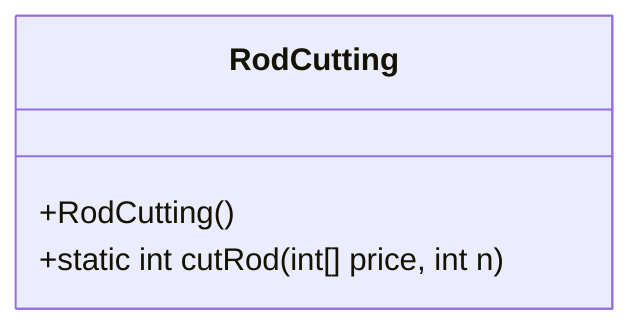
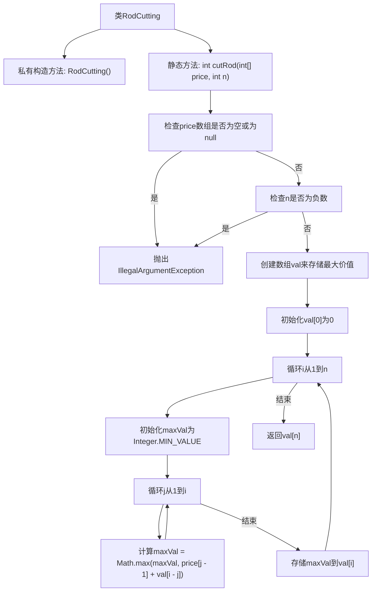

# 基础信息

|      |      |
|------|------|
| 名称 | RodCutting |
| 编码语言 | .java |
| 代码路径 | Java/src/main/java/com/thealgorithms/dynamicprogramming/RodCutting.java |
| 包名 | com.thealgorithms.dynamicprogramming |
| 依赖项 | [] |
| 概述说明 | 计算钢条切割方案，最大化n长度钢条的总价值。 |

# 说明

计算长度为n的钢条的最大价值，基于给定的各长度价格。通过分析不同切割方案，确定最优切割方式，以最大化钢条的总价值。此问题涉及动态规划，通过子问题的最优解构建整体最优解。关键在于找到每种长度对应的最大价值，并利用这些值逐步计算更长钢条的最大价值。最终目标是确定如何切割钢条，使其总价值最高。

# 类列表 Class Summary

| 名称   | 类型  | 说明 |
|-------|------|-------------|
| RodCutting | class | 计算切割长度为n的钢条的最大价值，给定各长度价格。 |

## 类 RodCutting

|      |      |
|------|------|
| 访问范围 | public final |
| 类型 | class |
| 名称 | RodCutting |
| 说明 | 计算切割长度为n的钢条的最大价值，给定各长度价格。 |

### UML类图

类图描述：
`RodCutting` 类是一个工具类，用于解决切割钢条的问题。它包含一个私有构造函数，确保该类不能被实例化。类中的 `cutRod` 方法接受一个价格数组和钢条长度作为参数，返回切割钢条所能获得的最大价值。该方法首先检查输入的有效性，然后通过动态规划计算最大价值，并最终返回结果。

### 内部方法调用关系图

这段代码实现了“切割钢条”问题的动态规划解法。`RodCutting`类中的`cutRod`方法通过计算不同长度钢条的最大价值，最终返回长度为`n`的钢条的最大价值。代码首先检查输入参数的有效性，然后通过双重循环计算每个长度的最大价值，并将结果存储在数组中。最终返回数组中的最后一个元素，即长度为`n`的钢条的最大价值。

### 字段列表 Field List

| 名称  | 类型  | 说明 |
|-------|-------|------|

### 方法列表 Method List

| 名称  | 类型  | 说明 |
|-------|-------|------|
| cutRod | int | 计算给定长度钢条的最大价值，使用动态规划实现。 |

