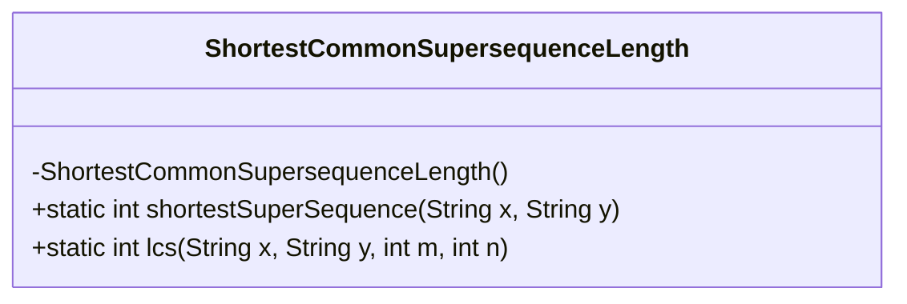
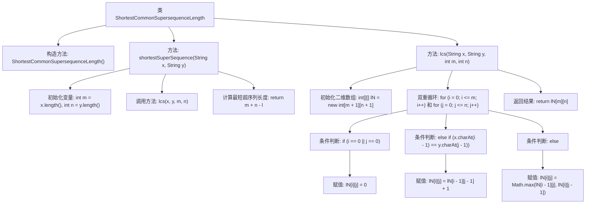

# 基础信息

|      |      |
|------|------|
| 名称 | ShortestCommonSupersequenceLength |
| 编码语言 | .java |
| 代码路径 | Java/src/main/java/com/thealgorithms/dynamicprogramming/ShortestCommonSupersequenceLength.java |
| 包名 | com.thealgorithms.dynamicprogramming |
| 依赖项 | [] |
| 概述说明 | 计算两字符串最短超序列长度，基于最长公共子序列。 |

# 说明

该方法通过计算两个字符串的最长公共子序列来确定它们的最短超序列长度。最短超序列是指包含两个字符串所有字符的最短序列。首先，找到两个字符串的最长公共子序列，然后利用该子序列的长度来计算最短超序列的长度。具体步骤包括：确定两个字符串的长度，找到它们的最长公共子序列的长度，最后用两个字符串的长度之和减去最长公共子序列的长度，得到最短超序列的长度。这种方法有效地利用了最长公共子序列的特性，简化了计算过程。

# 类列表 Class Summary

| 名称   | 类型  | 说明 |
|-------|------|-------------|
| ShortestCommonSupersequenceLength | class | 计算两个字符串最短超序列长度，基于最长公共子序列。 |

## 类 ShortestCommonSupersequenceLength

|      |      |
|------|------|
| 访问范围 | final |
| 类型 | class |
| 名称 | ShortestCommonSupersequenceLength |
| 说明 | 计算两个字符串最短超序列长度，基于最长公共子序列。 |

### UML类图

这段代码定义了一个名为 `ShortestCommonSupersequenceLength` 的最终类，该类包含两个静态方法：`shortestSuperSequence` 和 `lcs`。`shortestSuperSequence` 方法用于计算两个字符串的最短公共超序列的长度，而 `lcs` 方法用于计算两个字符串的最长公共子序列（LCS）的长度。`shortestSuperSequence` 方法通过调用 `lcs` 方法来实现其功能，最终返回最短公共超序列的长度。该类没有公开的构造函数，因此无法实例化。

### 内部方法调用关系图

这段代码定义了一个名为 `ShortestCommonSupersequenceLength` 的类，包含两个静态方法：`shortestSuperSequence` 和 `lcs`。`shortestSuperSequence` 方法用于计算两个字符串的最短超序列长度，而 `lcs` 方法用于计算两个字符串的最长公共子序列（LCS）长度。`shortestSuperSequence` 方法通过调用 `lcs` 方法获取 LCS 长度，然后根据公式 `m + n - l` 计算最短超序列长度。`lcs` 方法使用动态规划构建一个二维数组，通过双重循环和条件判断填充数组，最终返回 LCS 长度。

### 字段列表 Field List

| 名称  | 类型  | 说明 |
|-------|-------|------|

### 方法列表 Method List

| 名称  | 类型  | 说明 |
|-------|-------|------|
| lcs | int | 动态规划求解两个字符串的最长公共子序列长度。 |
| shortestSuperSequence | int | 计算两字符串最短超序列长度，即两字符串长度之和减去最长公共子序列长度。 |

