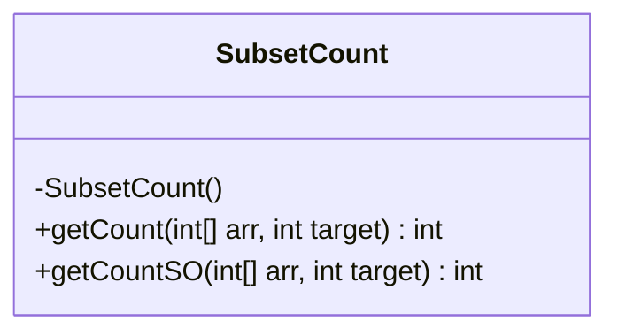
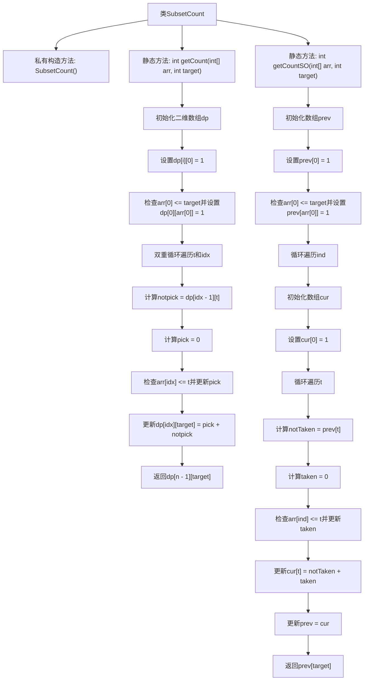

# 基础信息

|      |      |
|------|------|
| 名称 | SubsetCount |
| 编码语言 | .java |
| 代码路径 | Java/src/main/java/com/thealgorithms/dynamicprogramming/SubsetCount.java |
| 包名 | com.thealgorithms.dynamicprogramming |
| 依赖项 | [] |
| 概述说明 | 动态规划解决子集和计数，时间复杂度O(n*target)，空间复杂度O(n*target)或O(target)。 |

# 说明

动态规划用于实现子集和计数问题，其时间复杂度为O(n*target)，其中n为元素数量，target为目标和。空间复杂度为O(n*target)或O(target)，具体取决于实现方式。该方法通过构建状态转移表，逐步计算达到目标和的所有可能子集数量，确保高效且准确地解决问题。

# 类列表 Class Summary

| 名称   | 类型  | 说明 |
|-------|------|-------------|
| SubsetCount | class | 动态规划实现子集和计数，时间O(n*target)，空间O(n*target)或O(target)。 |

## 类 SubsetCount

|      |      |
|------|------|
| 访问范围 | public final |
| 类型 | class |
| 名称 | SubsetCount |
| 说明 | 动态规划实现子集和计数，时间O(n*target)，空间O(n*target)或O(target)。 |

### UML类图

**描述：**
`SubsetCount` 类包含两个静态方法，用于计算数组中子集的和等于目标值的数量。`getCount` 方法使用动态规划实现，时间复杂度和空间复杂度均为 O(n*target)。`getCountSO` 是 `getCount` 的空间优化版本，空间复杂度降低为 O(target)。这两个方法都通过填充二维或一维数组来存储中间结果，最终返回满足条件的子集数量。

### 内部方法调用关系图

这段代码实现了一个动态规划算法，用于计算数组中子集的和等于目标值的数量。`getCount`方法使用二维数组存储中间结果，而`getCountSO`方法通过空间优化，使用一维数组减少空间复杂度。两个方法都通过遍历数组和目标值，逐步计算可能的子集和，并最终返回符合条件的子集数量。

### 字段列表 Field List

| 名称  | 类型  | 说明 |
|-------|-------|------|

### 方法列表 Method List

| 名称  | 类型  | 说明 |
|-------|-------|------|
| getCount | int | 动态规划算法计算数组中子集和等于目标值的组合数。 |
| getCountSO | int | 该方法计算数组中元素组合等于目标值的数量。 |

