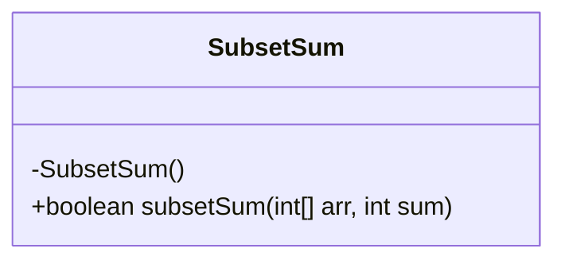
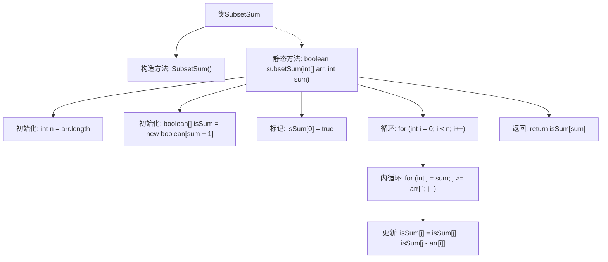

# 基础信息

|      |      |
|------|------|
| 名称 | SubsetSum |
| 编码语言 | .java |
| 代码路径 | Java/src/main/java/com/thealgorithms/dynamicprogramming/SubsetSum.java |
| 包名 | com.thealgorithms.dynamicprogramming |
| 依赖项 | [] |
| 概述说明 | SubsetSum类用于检查数组中是否存在子集，其元素之和等于指定值。 |

# 说明

SubsetSum类用于检查一个数组中是否存在一个子集，该子集的元素之和等于给定的目标值。该类通过分析数组中的元素组合，确定是否存在满足条件的子集，从而解决子集和问题。这一功能在算法设计和优化中具有重要意义，特别是在处理组合优化和资源分配问题时。

# 类列表 Class Summary

| 名称   | 类型  | 说明 |
|-------|------|-------------|
| SubsetSum | class | SubsetSum类检查数组中是否存在子集，其元素之和等于给定值。 |

## 类 SubsetSum

|      |      |
|------|------|
| 访问范围 | public final |
| 类型 | class |
| 名称 | SubsetSum |
| 说明 | SubsetSum类检查数组中是否存在子集，其元素之和等于给定值。 |

### UML类图

**描述：**
`SubsetSum` 类是一个工具类，用于判断给定整数数组中是否存在一个子集，其元素之和等于目标值。该类包含一个私有构造函数以防止实例化，以及一个静态方法 `subsetSum`，该方法通过动态规划算法来检查是否存在符合条件的子集。该方法使用一个布尔数组来记录可能的和，并通过反向遍历数组来避免覆盖已经计算的结果。最终，方法返回布尔值，表示是否存在满足条件的子集。

### 内部方法调用关系图

这段代码定义了一个名为`SubsetSum`的类，其中包含一个静态方法`subsetSum`，用于判断一个整数数组中是否存在一个子集，其元素之和等于给定的目标值。方法通过动态规划的方式，初始化一个布尔数组`isSum`，并通过嵌套循环更新数组中的值，最终返回`isSum[sum]`作为结果。流程图清晰地展示了方法的执行流程，从初始化到循环处理，再到最终返回结果。

### 字段列表 Field List

| 名称  | 类型  | 说明 |
|-------|-------|------|

### 方法列表 Method List

| 名称  | 类型  | 说明 |
|-------|-------|------|
| subsetSum | boolean | 判断数组子集和是否等于给定值。 |

