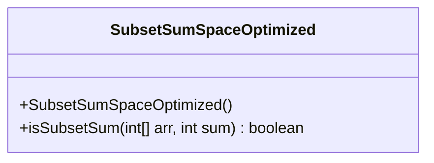
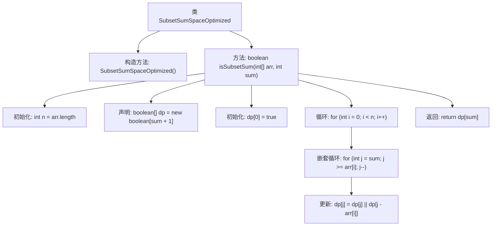

# 基础信息

|      |      |
|------|------|
| 名称 | SubsetSumSpaceOptimized |
| 编码语言 | .java |
| 代码路径 | Java/src/main/java/com/thealgorithms/dynamicprogramming/SubsetSumSpaceOptimized.java |
| 包名 | com.thealgorithms.dynamicprogramming |
| 依赖项 | [] |
| 概述说明 | 一维布尔数组优化空间，检查子集是否含目标和。时间O(n*sum)，空间O(sum)。 |

# 说明

该方法通过使用一维布尔数组来优化空间复杂度，用于检查数组子集是否包含目标和。其时间复杂度为O(n*sum)，其中n为数组长度，sum为目标和。空间复杂度为O(sum)，仅需存储与目标和相关的布尔值。这种方法通过减少存储需求，提高了算法的空间效率，同时保持了较高的时间性能。

# 类列表 Class Summary

| 名称   | 类型  | 说明 |
|-------|------|-------------|
| SubsetSumSpaceOptimized | class | 使用一维布尔数组优化空间，检查数组子集是否包含目标和。时间复杂度O(n*sum)，空间复杂度O(sum)。 |

## 类 SubsetSumSpaceOptimized

|      |      |
|------|------|
| 访问范围 | public final |
| 类型 | class |
| 名称 | SubsetSumSpaceOptimized |
| 说明 | 使用一维布尔数组优化空间，检查数组子集是否包含目标和。时间复杂度O(n*sum)，空间复杂度O(sum)。 |

### UML类图

**描述：**  
`SubsetSumSpaceOptimized` 是一个工具类，用于判断给定数组中是否存在一个子集，其元素之和等于目标值。该类提供了一个静态方法 `isSubsetSum`，该方法通过使用一维布尔数组进行空间优化，时间复杂度为 O(n * sum)，空间复杂度为 O(sum)。该方法通过动态规划的方式，逐步检查数组中每个元素是否能够组合成目标值，最终返回是否存在这样的子集。

### 内部方法调用关系图

这段代码定义了一个名为 `SubsetSumSpaceOptimized` 的类，其中包含一个静态方法 `isSubsetSum`，用于检查给定数组中是否存在一个子集，其元素之和等于目标值。该方法通过使用一维布尔数组来优化空间复杂度，时间复杂度为 O(n * sum)，空间复杂度为 O(sum)。流程图展示了从类定义到方法执行的完整流程，包括数组初始化、循环嵌套和最终结果返回。

### 字段列表 Field List

| 名称  | 类型  | 说明 |
|-------|-------|------|

### 方法列表 Method List

| 名称  | 类型  | 说明 |
|-------|-------|------|
| isSubsetSum | boolean | 动态规划判断数组子集和是否等于目标值。 |

