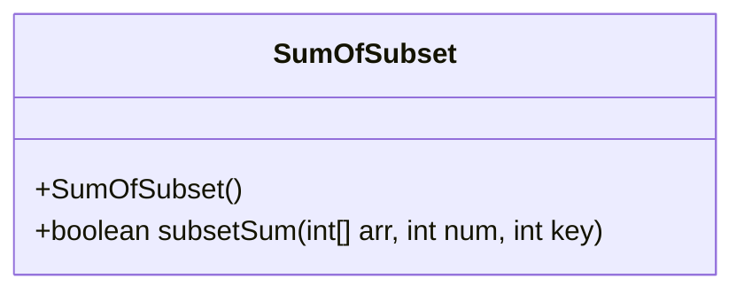
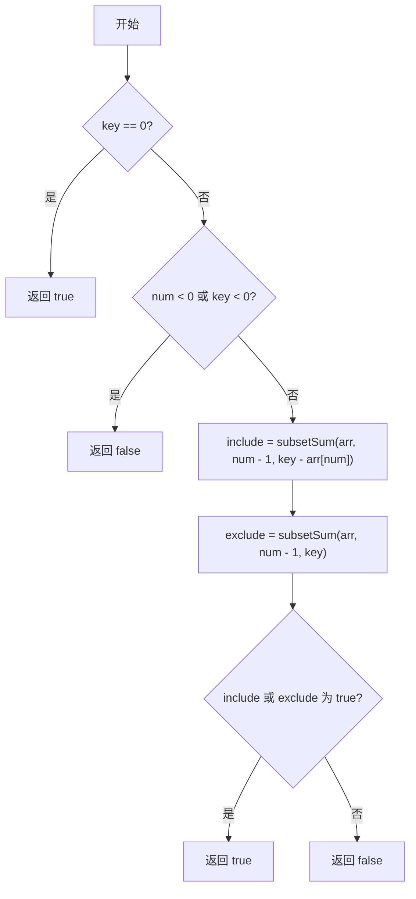
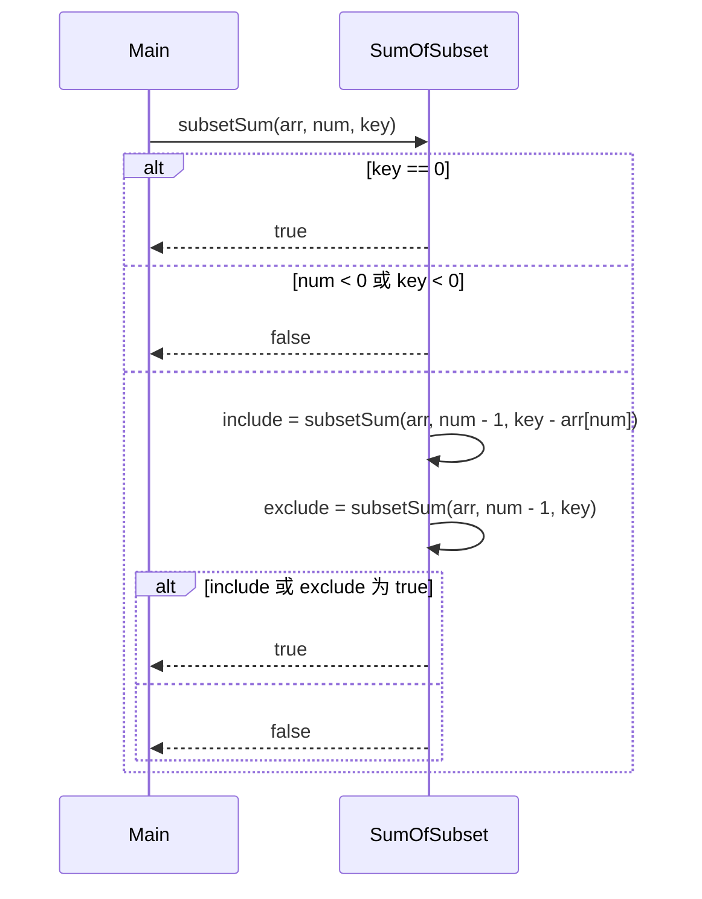
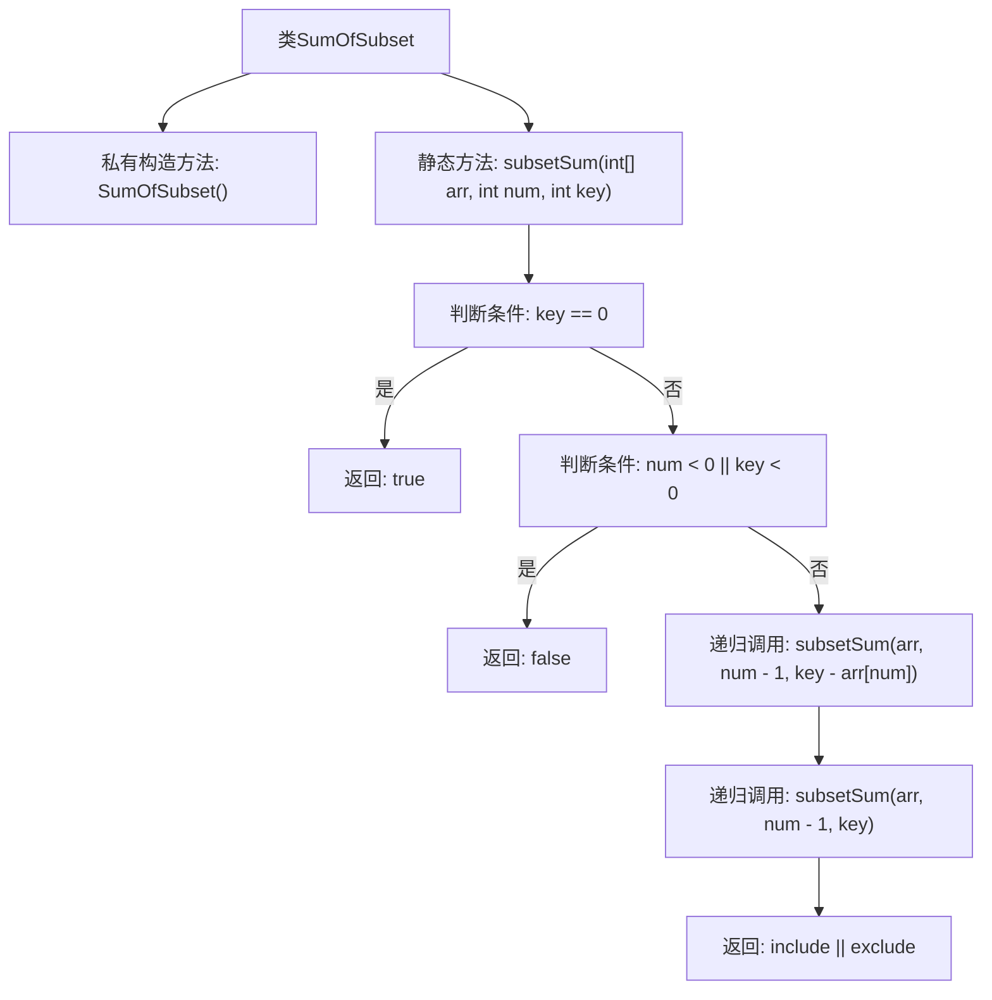

# 基础信息

|      |      |
|------|------|
| 名称 | SumOfSubset |
| 编码语言 | .java |
| 代码路径 | Java/src/main/java/com/thealgorithms/dynamicprogramming/SumOfSubset.java |
| 包名 | com.thealgorithms.dynamicprogramming |
| 依赖项 | [] |
| 概述说明 | 递归检查数组子集和是否等于目标值。 |

# 说明

该内容描述了一个算法问题，要求判断一个数组中是否存在一个子集，使得该子集内元素的和等于给定的目标值。这是一个典型的递归问题，通常通过遍历数组中的每个元素，并递归地检查是否可以通过选择或不选择当前元素来达到目标值。这种问题在算法和数据结构中常见，涉及子集生成和回溯技术，常用于解决组合优化和搜索问题。

# 类列表 Class Summary

| 名称   | 类型  | 说明 |
|-------|------|-------------|
| SumOfSubset | class | 递归判断数组中是否存在子集的和等于目标值。 |

## 类 SumOfSubset

|      |      |
|------|------|
| 访问范围 | public final |
| 类型 | class |
| 名称 | SumOfSubset |
| 说明 | 递归判断数组中是否存在子集的和等于目标值。 |

### UML类图

**描述：**  
`SumOfSubset` 类包含一个私有构造函数和一个静态方法 `subsetSum`，用于判断数组中是否存在一个子集，其元素之和等于给定的目标值。该方法通过递归实现，每次递归检查是否包含当前元素或排除当前元素，最终返回是否存在满足条件的子集。类图展示了类的结构，流程图和时序图分别展示了方法的执行流程和调用顺序。

### 内部方法调用关系图

这段代码定义了一个名为`SumOfSubset`的类，其中包含一个私有构造方法和一个静态方法`subsetSum`。`subsetSum`方法通过递归的方式判断数组中是否存在一个子集，其元素之和等于给定的目标值`key`。流程图展示了该方法的执行流程，包括对目标值`key`和索引`num`的检查，以及递归调用和最终结果的返回。

### 字段列表 Field List

| 名称  | 类型  | 说明 |
|-------|-------|------|

### 方法列表 Method List

| 名称  | 类型  | 说明 |
|-------|-------|------|
| subsetSum | boolean | 判断数组中是否存在子集和等于给定值。 |

