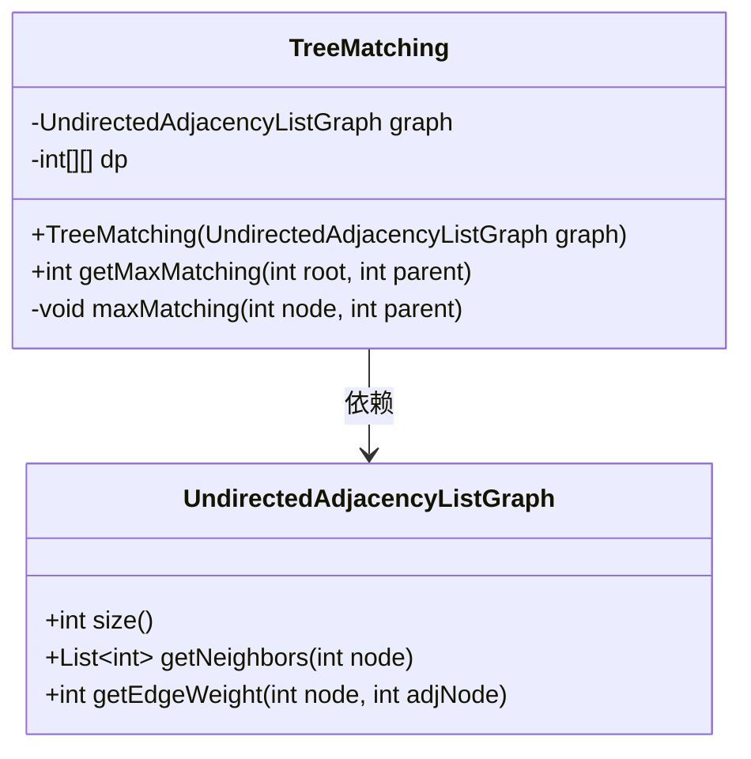
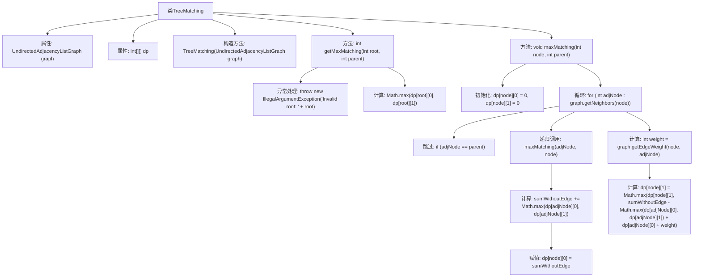

# 基础信息

|      |      |
|------|------|
| 名称 | TreeMatching |
| 编码语言 | .java |
| 代码路径 | Java/src/main/java/com/thealgorithms/dynamicprogramming/TreeMatching.java |
| 包名 | com.thealgorithms.dynamicprogramming |
| 依赖项 | ['com.thealgorithms.datastructures.graphs.UndirectedAdjacencyListGraph'] |
| 概述说明 | TreeMatching类递归计算树的最大加权匹配，DP表存储节点匹配结果。 |

# 说明

TreeMatching类通过递归方法计算树的最大加权匹配，利用动态规划（DP）表存储各节点的匹配结果，确保计算过程高效且结果准确。

# 类列表 Class Summary

| 名称   | 类型  | 说明 |
|-------|------|-------------|
| TreeMatching | class | TreeMatching类通过递归计算树的最大加权匹配，使用DP表存储节点匹配结果。 |

## 类 TreeMatching

|      |      |
|------|------|
| 访问范围 | public |
| 类型 | class |
| 名称 | TreeMatching |
| 说明 | TreeMatching类通过递归计算树的最大加权匹配，使用DP表存储节点匹配结果。 |

### UML类图

类图描述：
`TreeMatching` 类用于计算树的最大加权匹配，依赖于 `UndirectedAdjacencyListGraph` 类来表示树结构。`TreeMatching` 类包含一个二维数组 `dp` 用于存储动态规划结果，并提供了 `getMaxMatching` 和 `maxMatching` 方法来实现匹配计算。`UndirectedAdjacencyListGraph` 类提供了获取节点邻居和边权重的方法，支持 `TreeMatching` 类的计算需求。

### 内部方法调用关系图

这段代码实现了一个树的最大加权匹配算法。通过递归计算每个节点的匹配值，并利用动态规划表 `dp` 来存储中间结果。代码首先初始化 `dp` 表，然后通过递归遍历树的每个节点，计算不包含当前边和包含当前边的匹配值，最终返回最大匹配值。该算法的时间复杂度为 O(n)，其中 n 是树的节点数。

### 字段列表 Field List

| 名称  | 类型  | 说明 |
|-------|-------|------|
| dp | int[][] | 定义了一个私有的二维整数数组dp。 |
| graph | UndirectedAdjacencyListGraph | 私有属性：无向邻接表图实例。 |

### 方法列表 Method List

| 名称  | 类型  | 说明 |
|-------|-------|------|
| maxMatching | void | 计算树中节点的最大匹配，通过动态规划实现。 |
| getMaxMatching | int | 获取根节点最大匹配值，验证根节点有效性，返回最大值。 |

