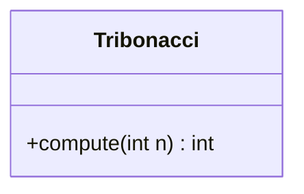
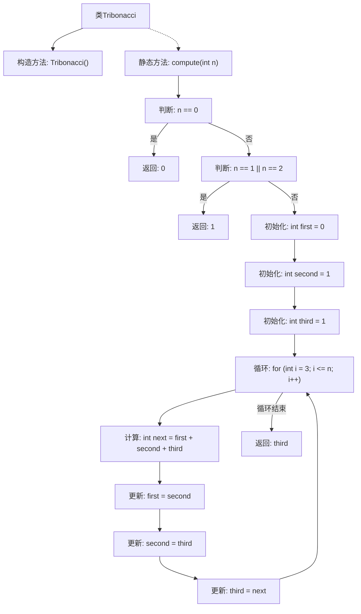

# 基础信息

|      |      |
|------|------|
| 名称 | Tribonacci |
| 编码语言 | .java |
| 代码路径 | Java/src/main/java/com/thealgorithms/dynamicprogramming/Tribonacci.java |
| 包名 | com.thealgorithms.dynamicprogramming |
| 依赖项 | [] |
| 概述说明 | Tribonacci类通过迭代方法计算第n个Tribonacci数。 |

# 说明

Tribonacci类用于计算第n个Tribonacci数，采用迭代方法实现。Tribonacci数列与Fibonacci数列类似，但每个数是前三个数的和。通过迭代方式，该类逐步计算并返回第n个Tribonacci数，确保计算过程高效且易于理解。

# 类列表 Class Summary

| 名称   | 类型  | 说明 |
|-------|------|-------------|
| Tribonacci | class | Tribonacci类计算第n个Tribonacci数，使用迭代方法实现。 |

## 类 Tribonacci

|      |      |
|------|------|
| 访问范围 | public final |
| 类型 | class |
| 名称 | Tribonacci |
| 说明 | Tribonacci类计算第n个Tribonacci数，使用迭代方法实现。 |

### UML类图

这段代码定义了一个名为 `Tribonacci` 的类，该类包含一个静态方法 `compute`，用于计算第 n 个 Tribonacci 数。Tribonacci 数列类似于 Fibonacci 数列，但每个数是前三个数的和。代码通过迭代的方式计算 Tribonacci 数，避免了递归带来的性能问题。类 `Tribonacci` 是 `final` 的，表示它不能被继承，并且构造函数是私有的，确保该类不能被实例化。

### 内部方法调用关系图

这段代码定义了一个名为 `Tribonacci` 的类，其中包含一个静态方法 `compute(int n)`，用于计算第 n 个 Tribonacci 数。Tribonacci 数列的定义是：T(0) = 0, T(1) = 1, T(2) = 1, T(n) = T(n-1) + T(n-2) + T(n-3)。方法通过初始化前三个数，然后使用循环计算后续的 Tribonacci 数，并返回第 n 个数的值。

### 字段列表 Field List

| 名称  | 类型  | 说明 |
|-------|-------|------|

### 方法列表 Method List

| 名称  | 类型  | 说明 |
|-------|-------|------|
| compute | int | 计算第n个三阶斐波那契数列值的静态方法。 |

