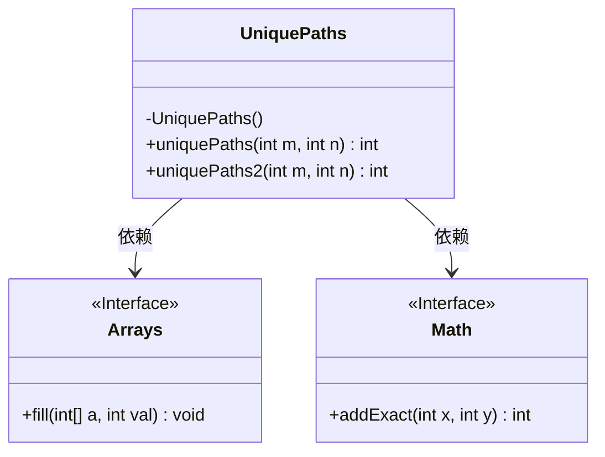
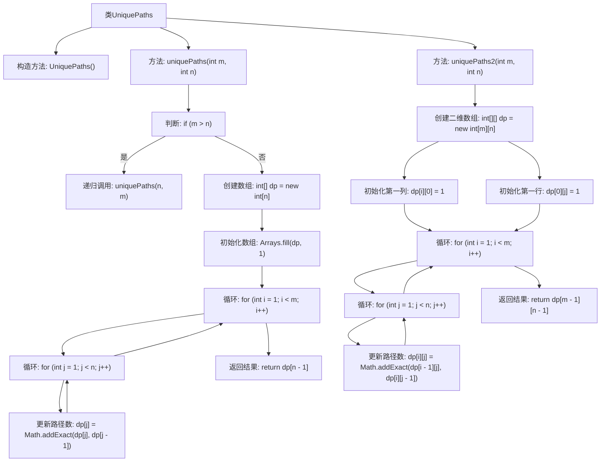

# 基础信息

|      |      |
|------|------|
| 名称 | UniquePaths |
| 编码语言 | .java |
| 代码路径 | Java/src/main/java/com/thealgorithms/dynamicprogramming/UniquePaths.java |
| 包名 | com.thealgorithms.dynamicprogramming |
| 依赖项 | ['java.util.Arrays'] |
| 概述说明 | UniquePaths类提供两种动态规划方法计算网格路径数，1D数组空间低，2D数组直观但空间高。 |

# 说明

UniquePaths类提供了两种动态规划方法来计算网格中的唯一路径数。第一种方法使用一维数组，具有较低的空间复杂度，适合优化内存使用。第二种方法使用二维数组，虽然更加直观，但空间复杂度较高，适合理解算法逻辑。两种方法各有优劣，用户可根据具体需求选择合适的方式。

# 类列表 Class Summary

| 名称   | 类型  | 说明 |
|-------|------|-------------|
| UniquePaths | class | UniquePaths类提供两种动态规划方法计算网格唯一路径数，1D数组空间复杂度低，2D数组直观但空间复杂度高。 |

## 类 UniquePaths

|      |      |
|------|------|
| 访问范围 | public final |
| 类型 | class |
| 名称 | UniquePaths |
| 说明 | UniquePaths类提供两种动态规划方法计算网格唯一路径数，1D数组空间复杂度低，2D数组直观但空间复杂度高。 |

### UML类图

**描述：**  
`UniquePaths` 类提供了两种计算网格中唯一路径数量的方法：`uniquePaths` 和 `uniquePaths2`。`uniquePaths` 使用一维动态规划数组，空间复杂度为 `O(min(n,m))`，而 `uniquePaths2` 使用二维动态规划数组，空间复杂度为 `O(n*m)`。两种方法都通过递归和动态规划来更新路径数量，最终返回从起点到终点的唯一路径数。`UniquePaths` 类依赖于 `Arrays` 和 `Math` 类来执行数组初始化和加法操作。

### 内部方法调用关系图

这段代码实现了两个方法来计算网格中的唯一路径数。`uniquePaths`方法使用一维动态规划数组，通过递归调用来处理行数大于列数的情况，并最终返回结果。`uniquePaths2`方法使用二维动态规划数组，初始化第一行和第一列后，通过双重循环更新每个单元格的路径数，最终返回右下角单元格的值。两种方法的时间复杂度均为O(n*m)，但空间复杂度分别为O(min(n,m))和O(n*m)。

### 字段列表 Field List

| 名称  | 类型  | 说明 |
|-------|-------|------|

### 方法列表 Method List

| 名称  | 类型  | 说明 |
|-------|-------|------|
| uniquePaths2 | int | 计算二维网格从左上到右下的唯一路径数，使用动态规划初始化边界并逐格累加。 |
| uniquePaths | int | 计算m×n网格中从左上角到右下角的唯一路径数，使用动态规划优化空间复杂度。 |

