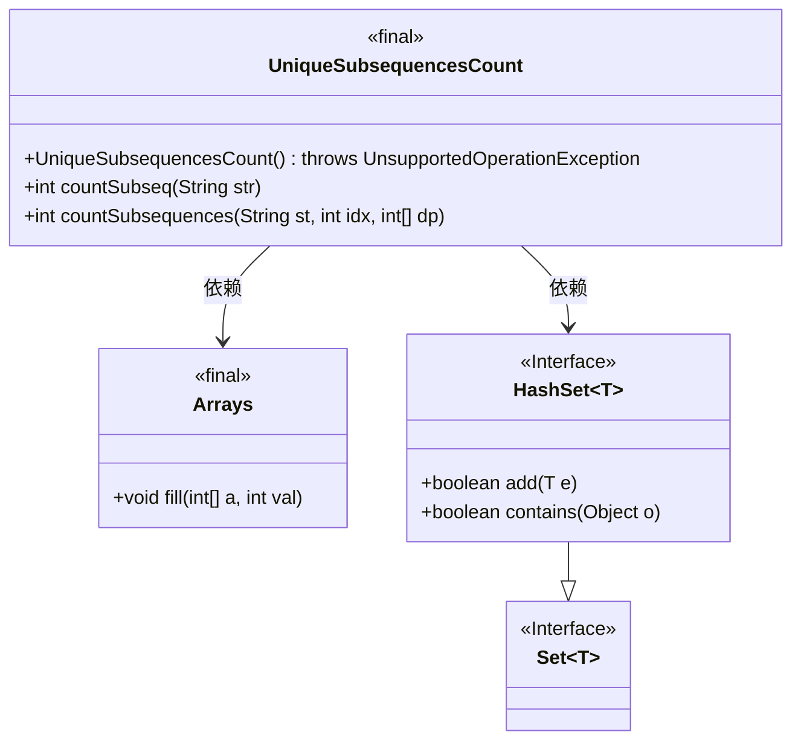
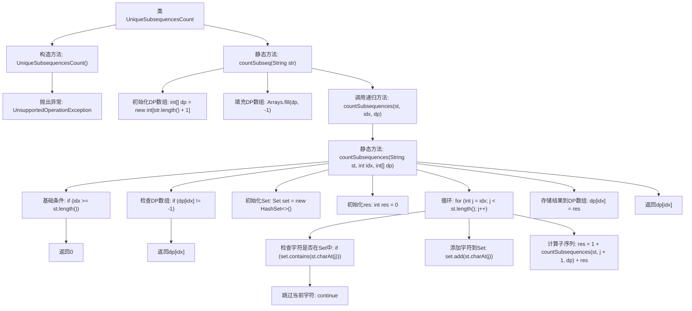

# 基础信息

|      |      |
|------|------|
| 名称 | UniqueSubsequencesCount |
| 编码语言 | .java |
| 代码路径 | Java/src/main/java/com/thealgorithms/dynamicprogramming/UniqueSubsequencesCount.java |
| 包名 | com.thealgorithms.dynamicprogramming |
| 依赖项 | ['java.util.Arrays', 'java.util.HashSet', 'java.util.Set'] |
| 概述说明 | UniqueSubsequencesCount类利用动态规划递归计算字符串唯一子序列数。 |

# 说明

UniqueSubsequencesCount类采用动态规划方法，通过递归机制计算给定字符串中所有唯一子序列的数量。该方法利用动态规划的特性，逐步构建子问题的解，从而高效地计算出最终结果。通过递归调用，系统能够处理字符串的各个子串，确保每个可能的子序列都被考虑并计数，最终得到唯一子序列的总数。

# 类列表 Class Summary

| 名称   | 类型  | 说明 |
|-------|------|-------------|
| UniqueSubsequencesCount | class | UniqueSubsequencesCount类通过动态规划递归计算字符串的唯一子序列数。 |

## 类 UniqueSubsequencesCount

|      |      |
|------|------|
| 访问范围 | public final |
| 类型 | class |
| 名称 | UniqueSubsequencesCount |
| 说明 | UniqueSubsequencesCount类通过动态规划递归计算字符串的唯一子序列数。 |

### UML类图

这段代码定义了一个工具类 `UniqueSubsequencesCount`，用于计算字符串中唯一子序列的数量。该类包含两个静态方法：`countSubseq` 和 `countSubsequences`，前者初始化动态规划数组并调用后者进行递归计算。`countSubsequences` 方法使用 `HashSet` 来避免重复字符，并通过动态规划数组 `dp` 进行结果缓存，以提高效率。`Arrays` 类用于初始化数组，`HashSet` 实现了 `Set` 接口，用于存储和检查字符。

### 内部方法调用关系图

这段代码定义了一个名为 `UniqueSubsequencesCount` 的工具类，用于计算给定字符串中唯一子序列的数量。代码通过动态规划和递归的方法来避免重复计算，并利用 `HashSet` 来确保子序列中的字符唯一。流程图展示了从初始化到递归计算的完整流程，包括基础条件、DP数组的使用以及字符去重的逻辑。

### 字段列表 Field List

| 名称  | 类型  | 说明 |
|-------|-------|------|

### 方法列表 Method List

| 名称  | 类型  | 说明 |
|-------|-------|------|
| countSubseq | int | 静态方法countSubseq使用动态规划计算字符串子序列数量。 |
| countSubsequences | int | 动态规划计算字符串不重复子序列数量。 |

