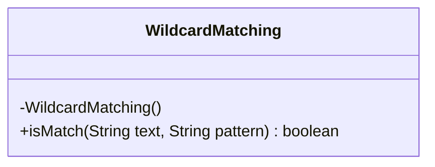
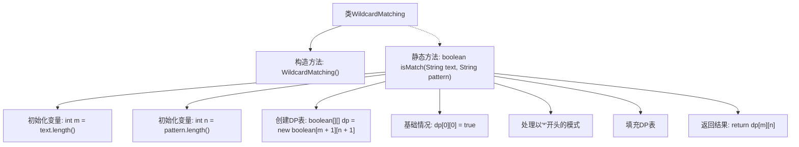

# 基础信息

|      |      |
|------|------|
| 名称 | WildcardMatching |
| 编码语言 | .java |
| 代码路径 | Java/src/main/java/com/thealgorithms/dynamicprogramming/WildcardMatching.java |
| 包名 | com.thealgorithms.dynamicprogramming |
| 依赖项 | [] |
| 概述说明 | 动态规划实现通配符匹配算法。 |

# 说明

动态规划是一种高效的算法设计技术，用于解决复杂的优化问题。通配符匹配算法旨在判断一个字符串是否与包含通配符的模式字符串匹配。通过动态规划，可以构建一个二维状态表，记录字符串与模式的匹配状态。初始化时，空字符串与空模式匹配。状态转移时，根据当前字符与模式字符的关系更新状态表，如普通字符匹配、通配符匹配等。最终，状态表的最后一个单元格表示整个字符串与模式是否匹配。该方法能有效处理各种复杂的匹配情况，确保算法的准确性和高效性。

# 类列表 Class Summary

| 名称   | 类型  | 说明 |
|-------|------|-------------|
| WildcardMatching | class | 使用动态规划实现通配符匹配算法。 |

## 类 WildcardMatching

|      |      |
|------|------|
| 访问范围 | public final |
| 类型 | class |
| 名称 | WildcardMatching |
| 说明 | 使用动态规划实现通配符匹配算法。 |

### UML类图

**描述：**
`WildcardMatching` 类是一个工具类，用于判断给定的文本字符串是否与包含通配符的模式字符串匹配。该类包含一个私有构造函数，防止实例化，并提供一个静态方法 `isMatch`，该方法使用动态规划（DP）算法来填充一个二维布尔数组，以确定文本和模式是否匹配。通配符 `?` 可以匹配任意单个字符，而 `*` 可以匹配任意长度的字符序列。最终，DP 表的右下角单元格的值决定了匹配结果。

### 内部方法调用关系图

这段代码实现了一个用于通配符匹配的算法。它使用动态规划（DP）来解决文本与模式之间的匹配问题。代码首先初始化DP表，然后处理模式以'*'开头的情况，接着填充DP表，最后返回匹配结果。整个过程通过DP表来存储中间结果，确保高效地找到匹配结果。

### 字段列表 Field List

| 名称  | 类型  | 说明 |
|-------|-------|------|

### 方法列表 Method List

| 名称  | 类型  | 说明 |
|-------|-------|------|
| isMatch | boolean | 动态规划实现字符串匹配，支持'?'和'*'通配符。 |

