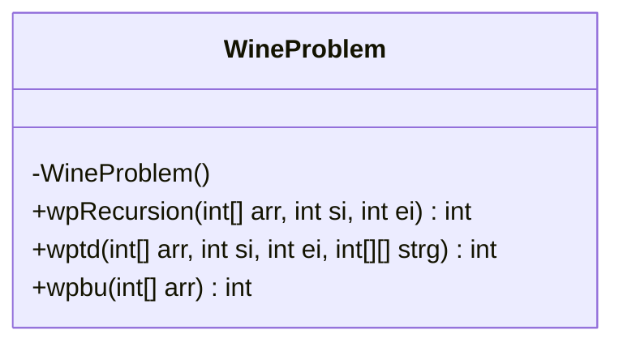
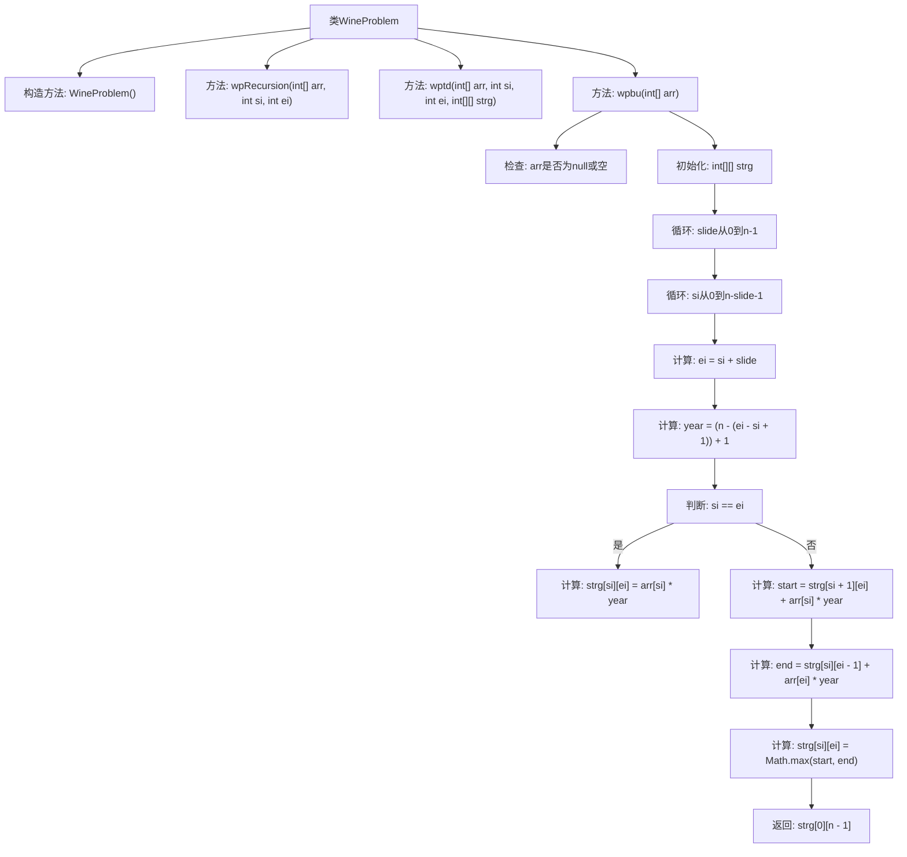

# 基础信息

|      |      |
|------|------|
| 名称 | WineProblem |
| 编码语言 | .java |
| 代码路径 | Java/src/main/java/com/thealgorithms/dynamicprogramming/WineProblem.java |
| 包名 | com.thealgorithms.dynamicprogramming |
| 依赖项 | [] |
| 概述说明 | 三种方法计算葡萄酒销售最大利润：递归、自上而下动态规划、自下而上动态规划。 |

# 说明

计算葡萄酒销售最大利润的三种方法包括递归、动态规划（自上而下）和动态规划（自下而上）。递归方法通过不断分解问题为子问题来求解，但可能导致重复计算和效率低下。动态规划（自上而下）通过记忆化技术存储已计算的结果，避免重复计算，提高效率。动态规划（自下而上）则从最小子问题开始，逐步构建解决方案，确保每个子问题只计算一次，进一步优化性能。这三种方法各有优缺点，适用于不同场景和需求。

# 类列表 Class Summary

| 名称   | 类型  | 说明 |
|-------|------|-------------|
| WineProblem | class | 计算葡萄酒销售最大利润的三种方法：递归、动态规划（自上而下）、动态规划（自下而上）。 |

## 类 WineProblem

|      |      |
|------|------|
| 访问范围 | public final |
| 类型 | class |
| 名称 | WineProblem |
| 说明 | 计算葡萄酒销售最大利润的三种方法：递归、动态规划（自上而下）、动态规划（自下而上）。 |

### UML类图

这段代码定义了一个名为 `WineProblem` 的类，该类包含三个静态方法，分别用于计算在不同情况下出售葡萄酒的最大利润。`wpRecursion` 方法使用递归来计算最大利润，`wptd` 方法使用带有备忘录的自顶向下动态规划，而 `wpbu` 方法使用自底向上的动态规划。这些方法通过不同的策略来解决同一个问题，即如何在不同的年份出售葡萄酒以获得最大利润。代码中还包括了对输入数组的有效性检查，以确保程序的健壮性。

### 内部方法调用关系图

**描述：**  
该流程图展示了`WineProblem`类中的三个主要方法：`wpRecursion`、`wptd`和`wpbu`。`wpRecursion`通过递归计算最大利润，`wptd`使用自上而下的动态规划方法并利用记忆化存储子问题的结果，`wpbu`则使用自下而上的动态规划方法通过表格存储结果。流程图详细描述了`wpbu`方法中的循环和条件判断过程，最终返回最大利润。

### 字段列表 Field List

| 名称  | 类型  | 说明 |
|-------|-------|------|

### 方法列表 Method List

| 名称  | 类型  | 说明 |
|-------|-------|------|
| wptd | int | 递归计算数组子序列最大值，使用动态规划优化存储。 |
| wpbu | int | 计算数组元素按特定规则累加的最大值。 |
| wpRecursion | int | 递归函数计算数组元素加权和，取最大值。 |

