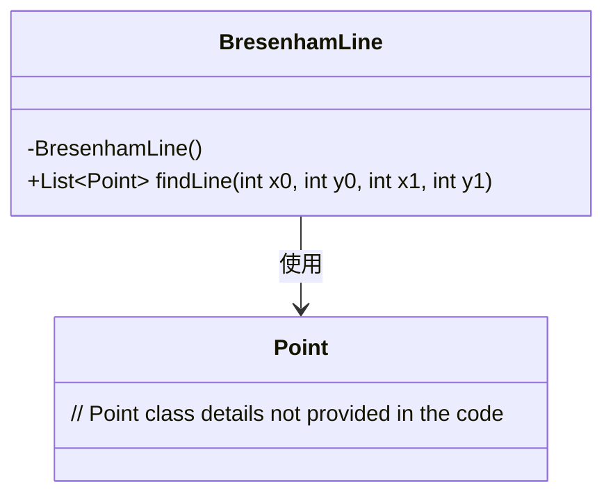
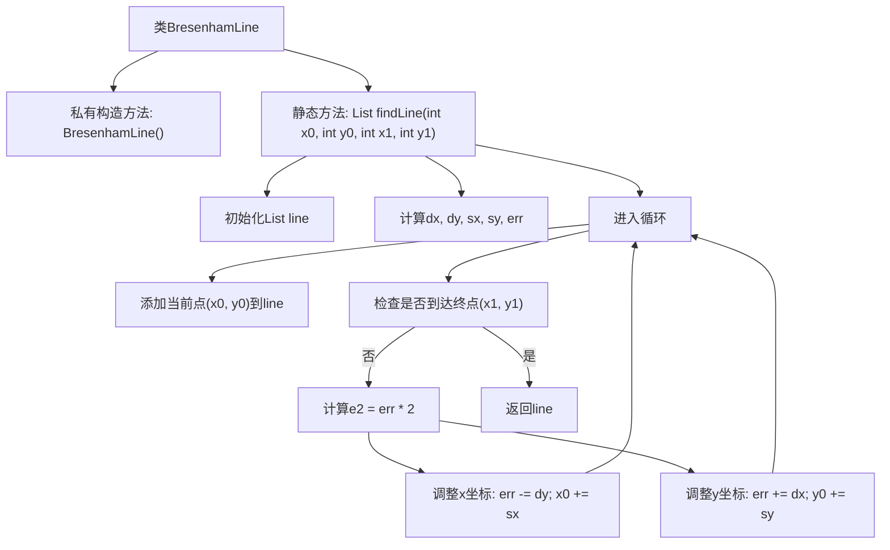

# 基础信息

|      |      |
|------|------|
| 名称 | BresenhamLine |
| 编码语言 | .java |
| 代码路径 | Java/src/main/java/com/thealgorithms/geometry/BresenhamLine.java |
| 包名 | com.thealgorithms.geometry |
| 依赖项 | ['java.awt.Point', 'java.util.ArrayList', 'java.util.List'] |
| 概述说明 | Bresenham算法用于计算两点间直线上的像素点。 |

# 说明

Bresenham算法是一种用于计算两点之间直线上的像素点的有效方法。该算法通过整数运算避免了浮点数计算，提高了效率。它基于误差项的递推计算，逐步确定下一个像素点的位置。Bresenham算法适用于计算机图形学中的直线绘制，能够确保生成的直线在视觉上平滑且连续。该算法的核心思想是通过比较误差项来决定下一个点的位置，从而避免复杂的计算。Bresenham算法因其高效和简洁而被广泛应用。

# 类列表 Class Summary

| 名称   | 类型  | 说明 |
|-------|------|-------------|
| BresenhamLine | class | Bresenham算法实现两点间直线点的计算。 |

## 类 BresenhamLine

|      |      |
|------|------|
| 访问范围 | public final |
| 类型 | class |
| 名称 | BresenhamLine |
| 说明 | Bresenham算法实现两点间直线点的计算。 |

### UML类图

**描述：**
`BresenhamLine` 类是一个工具类，用于计算两个端点之间的直线上的所有点。它包含一个私有构造函数以防止实例化，并提供一个静态方法 `findLine`，该方法接受两个端点的坐标作为参数，返回一个包含所有直线点的列表。`findLine` 方法使用 Bresenham 算法来计算直线上的点，该算法通过逐步调整误差项来决定下一个点的位置。`Point` 类用于表示点的坐标，但其具体实现在代码中未提供。

### 内部方法调用关系图

该流程图描述了BresenhamLine类中findLine方法的执行过程。方法首先初始化一个点列表，然后计算起点和终点之间的差异和步长。接着进入循环，不断添加当前点到列表中，并根据误差项调整x和y坐标，直到到达终点。最终返回包含所有点的列表，形成一条直线。

### 字段列表 Field List

| 名称  | 类型  | 说明 |
|-------|-------|------|

### 方法列表 Method List

| 名称  | 类型  | 说明 |
|-------|-------|------|
| findLine | List<Point> | 该函数通过Bresenham算法计算两点间的直线路径，返回包含所有点的列表。 |

