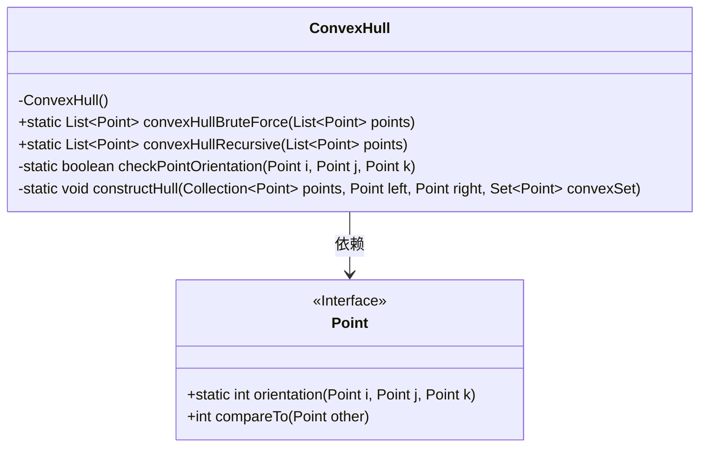

# 基础信息

|      |      |
|------|------|
| 名称 | ConvexHull |
| 编码语言 | .java |
| 代码路径 | Java/src/main/java/com/thealgorithms/geometry/ConvexHull.java |
| 包名 | com.thealgorithms.geometry |
| 依赖项 | ['java.util.ArrayList', 'java.util.Collection', 'java.util.Collections', 'java.util.Comparator', 'java.util.HashSet', 'java.util.List', 'java.util.Set', 'java.util.TreeSet'] |
| 概述说明 | ConvexHull类提供暴力法和递归法计算凸包，分别通过遍历点对和分治策略实现。 |

# 说明

ConvexHull类提供了两种计算凸包的方法：暴力法和递归法。暴力法通过遍历所有点对并检查点集分布来确定凸包。递归法则采用分治策略，分别构建上下凸包，最终将结果合并。

# 类列表 Class Summary

| 名称   | 类型  | 说明 |
|-------|------|-------------|
| ConvexHull | class | ConvexHull类包含暴力法和递归法计算凸包。暴力法通过遍历所有点对并检查点集分布确定凸包。递归法通过分治策略构建上下凸包，最终合并结果。 |

## 类 ConvexHull

|      |      |
|------|------|
| 访问范围 | public final |
| 类型 | class |
| 名称 | ConvexHull |
| 说明 | ConvexHull类包含暴力法和递归法计算凸包。暴力法通过遍历所有点对并检查点集分布确定凸包。递归法通过分治策略构建上下凸包，最终合并结果。 |

### UML类图

这段代码定义了一个 `ConvexHull` 类，用于计算给定点集的凸包。`ConvexHull` 类包含两个主要方法：`convexHullBruteForce` 和 `convexHullRecursive`，分别通过暴力法和递归法计算凸包。`checkPointOrientation` 方法用于确定点的方向，而 `constructHull` 方法用于递归构建凸包。`Point` 接口提供了计算点方向和比较点的方法。代码通过依赖 `Point` 接口来实现凸包的计算。

### 内部方法调用关系图

```mermaid
graph TD
    A["类ConvexHull"]
    B["私有构造方法: ConvexHull()"]
    C["私有静态方法: checkPointOrientation(Point i, Point j, Point k)"]
    D["调用: Point.orientation(i, j, k)"]
    E["判断: detK > 0"]
    F["判断: detK < 0"]
    G["判断: k.compareTo(i) >= 0 && k.compareTo(j) <= 0"]
    H["返回: true"]
    I["返回: false"]
    J["返回: k.compareTo(i) >= 0 && k.compareTo(j) <= 0"]
    K["公有静态方法: convexHullBruteForce(List<Point> points)"]
    L["创建: Set<Point> convexSet"]
    M["循环: i from 0 to points.size() - 1"]
    N["循环: j from i + 1 to points.size()"]
    O["调用: checkPointOrientation(points.get(i), points.get(j), points.get((i + 1) % points.size()))"]
    P["循环: k from 0 to points.size()"]
    Q["判断: k != i && k != j && checkPointOrientation(points.get(i), points.get(j), points.get(k)) != leftSide"]
    R["设置: allPointsOnOneSide = false"]
    S["判断: allPointsOnOneSide"]
    T["添加: convexSet.add(points.get(i))"]
    U["添加: convexSet.add(points.get(j))"]
    V["返回: new ArrayList<>(convexSet)"]
    W["公有静态方法: convexHullRecursive(List<Point> points)"]
    X["排序: Collections.sort(points)"]
    Y["创建: Set<Point> convexSet"]
    Z["获取: leftMostPoint = points.get(0)"]
    AA["获取: rightMostPoint = points.get(points.size() - 1)"]
    AB["添加: convexSet.add(leftMostPoint)"]
    AC["添加: convexSet.add(rightMostPoint)"]
    AD["创建: List<Point> upperHull"]
    AE["创建: List<Point> lowerHull"]
    AF["循环: i from 1 to points.size() - 1"]
    AG["调用: Point.orientation(leftMostPoint, rightMostPoint, points.get(i))"]
    AH["判断: det > 0"]
    AI["添加: upperHull.add(points.get(i))"]
    AJ["判断: det < 0"]
    AK["添加: lowerHull.add(points.get(i))"]
    AL["调用: constructHull(upperHull, leftMostPoint, rightMostPoint, convexSet)"]
    AM["调用: constructHull(lowerHull, rightMostPoint, leftMostPoint, convexSet)"]
    AN["返回: new ArrayList<>(convexSet)"]
    AO["私有静态方法: constructHull(Collection<Point> points, Point left, Point right, Set<Point> convexSet)"]
    AP["判断: !points.isEmpty()"]
    AQ["初始化: extremePoint = null"]
    AR["初始化: extremePointDistance = Integer.MIN_VALUE"]
    AS["创建: List<Point> candidatePoints"]
    AT["循环: for (Point p : points)"]
    AU["调用: Point.orientation(left, right, p)"]
    AV["判断: det > 0"]
    AW["添加: candidatePoints.add(p)"]
    AX["判断: det > extremePointDistance"]
    AY["设置: extremePointDistance = det"]
    AZ["设置: extremePoint = p"]
    BA["判断: extremePoint != null"]
    BB["调用: constructHull(candidatePoints, left, extremePoint, convexSet)"]
    BC["添加: convexSet.add(extremePoint)"]
    BD["调用: constructHull(candidatePoints, extremePoint, right, convexSet)"]

    A --> B
    A --> C
    C --> D
    D --> E
    E --> H
    D --> F
    F --> I
    D --> G
    G --> J
    A --> K
    K --> L
    K --> M
    M --> N
    N --> O
    O --> P
    P --> Q
    Q --> R
    R --> S
    S --> T
    S --> U
    K --> V
    A --> W
    W --> X
    W --> Y
    W --> Z
    W --> AA
    W --> AB
    W --> AC
    W --> AD
    W --> AE
    W --> AF
    AF --> AG
    AG --> AH
    AH --> AI
    AG --> AJ
    AJ --> AK
    W --> AL
    W --> AM
    W --> AN
    A --> AO
    AO --> AP
    AP --> AQ
    AP --> AR
    AP --> AS
    AP --> AT
    AT --> AU
    AU --> AV
    AV --> AW
    AV --> AX
    AX --> AY
    AX --> AZ
    AP --> BA
    BA --> BB
    BA --> BC
    BA --> BD
```

这段代码实现了两种计算凸包的算法：暴力法和递归法。`ConvexHull`类包含多个方法，用于计算给定点集的凸包。`checkPointOrientation`方法用于判断点的位置关系，`convexHullBruteForce`方法通过暴力枚举所有点对来构建凸包，而`convexHullRecursive`方法则通过递归分割点集来构建凸包。`constructHull`方法用于递归地构建凸包的上半部分和下半部分。

### 字段列表 Field List

| 名称  | 类型  | 说明 |
|-------|-------|------|

### 方法列表 Method List

| 名称  | 类型  | 说明 |
|-------|-------|------|
| checkPointOrientation | boolean | 检查三点方向，判断k在ij左侧、右侧或中间。 |
| convexHullRecursive | List<Point> | 递归算法计算点集的凸包，分为上下两部分处理。 |
| constructHull | void | 递归构建凸包，筛选极值点，更新候选集，最终形成凸集。 |
| convexHullBruteForce | List<Point> | 暴力法计算点集的凸包，通过遍历所有点对并检查其余点是否在同一侧，最终返回凸包点集。 |

