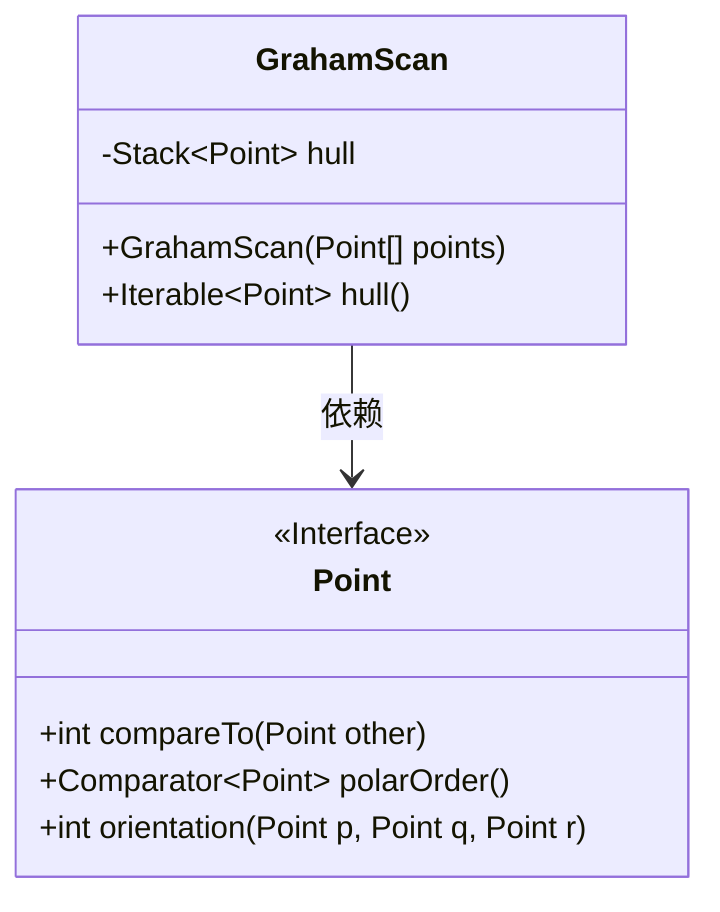
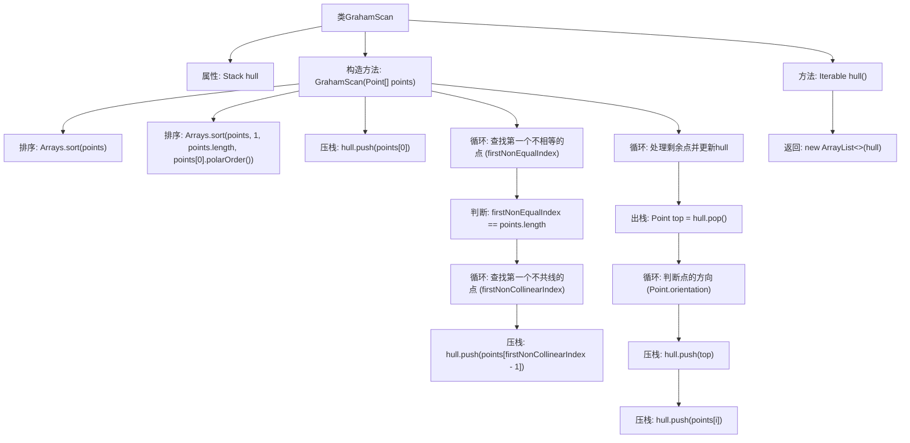

# 基础信息

|      |      |
|------|------|
| 名称 | GrahamScan |
| 编码语言 | .java |
| 代码路径 | Java/src/main/java/com/thealgorithms/geometry/GrahamScan.java |
| 包名 | com.thealgorithms.geometry |
| 依赖项 | ['java.util.ArrayList', 'java.util.Arrays', 'java.util.Stack'] |
| 概述说明 | GrahamScan算法通过排序和极角顺序处理点集，生成凸包点集。 |

# 说明

Graham Scan算法是一种用于计算二维点集凸包的高效方法。该算法首先对点集进行排序，通常选择最左下角的点作为起始点，然后根据其余点相对于起始点的极角进行排序。接着，算法通过遍历排序后的点集，利用栈结构逐步筛选出构成凸包的点。在处理过程中，算法会检查当前点是否会导致凸包性质被破坏，如果会则移除栈顶的点，直到满足凸包条件。最终，栈中剩余的点即为构成凸包的点集。该方法的时间复杂度主要取决于排序步骤，通常为O(n log n)。

# 类列表 Class Summary

| 名称   | 类型  | 说明 |
|-------|------|-------------|
| GrahamScan | class | GrahamScan算法实现凸包计算，通过排序和极角顺序处理点集，生成凸包点集。 |

## 类 GrahamScan

|      |      |
|------|------|
| 访问范围 | public |
| 类型 | class |
| 名称 | GrahamScan |
| 说明 | GrahamScan算法实现凸包计算，通过排序和极角顺序处理点集，生成凸包点集。 |

### UML类图

**描述：**  
`GrahamScan` 类用于计算给定点集的凸包。它通过预处理点集，按 y 坐标排序后，再按极角排序，然后使用栈结构逐步构建凸包。`Point` 接口定义了点的比较、极角排序和方向判断方法。`GrahamScan` 依赖 `Point` 接口来实现凸包的计算，最终返回一个表示凸包的点集。

### 内部方法调用关系图

这段代码实现了Graham扫描算法，用于计算给定点集的凸包。首先对点进行排序，然后通过循环查找第一个不相等的点和第一个不共线的点，接着处理剩余点并更新凸包。最终返回一个包含凸包点的可迭代集合。

### 字段列表 Field List

| 名称  | 类型  | 说明 |
|-------|-------|------|
| hull = new Stack<>() | Stack<Point> | 声明了一个私有不可变的栈，用于存储点对象。 |

### 方法列表 Method List

| 名称  | 类型  | 说明 |
|-------|-------|------|
| hull | Iterable<Point> | 该方法返回一个包含凸包点的可迭代列表。 |

