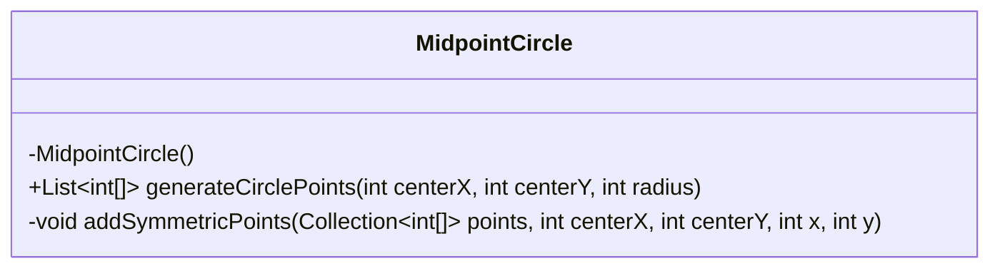
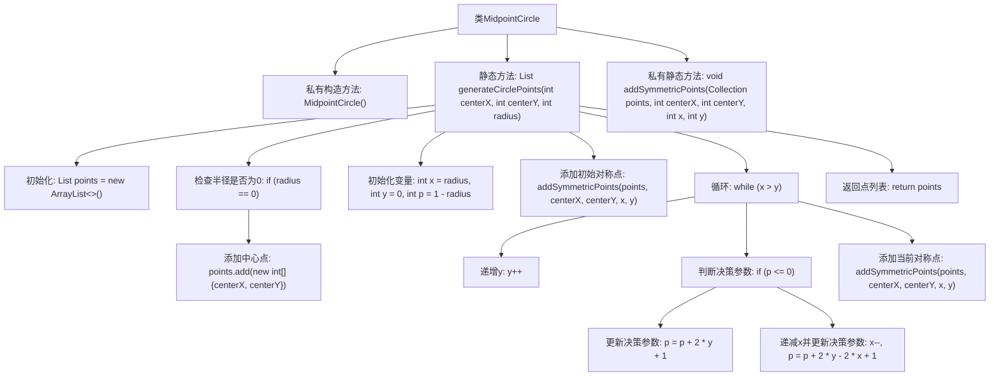

# 基础信息

|      |      |
|------|------|
| 名称 | MidpointCircle |
| 编码语言 | .java |
| 代码路径 | Java/src/main/java/com/thealgorithms/geometry/MidpointCircle.java |
| 包名 | com.thealgorithms.geometry |
| 依赖项 | ['java.util.ArrayList', 'java.util.Collection', 'java.util.List'] |
| 概述说明 | MidpointCircle类实现中点圆算法，生成圆上对称点。 |

# 说明

MidpointCircle类实现了中点圆算法，用于生成圆上所有对称点。该算法通过计算圆的对称性，确定圆上各个点的位置，确保生成的圆具有均匀分布的点。该方法基于中点决策参数，逐步绘制圆上的点，利用对称性减少计算量，提高绘制效率。MidpointCircle类的实现旨在高效、准确地生成圆的所有对称点，适用于需要精确绘制圆形的场景。

# 类列表 Class Summary

| 名称   | 类型  | 说明 |
|-------|------|-------------|
| MidpointCircle | class | MidpointCircle类实现中点圆算法，生成圆上所有对称点。 |

## 类 MidpointCircle

|      |      |
|------|------|
| 访问范围 | public final |
| 类型 | class |
| 名称 | MidpointCircle |
| 说明 | MidpointCircle类实现中点圆算法，生成圆上所有对称点。 |

### UML类图

**描述：**  
`MidpointCircle` 类是一个工具类，用于生成圆上的点。它使用中点圆算法来计算圆的周长上的点，并通过 `generateCirclePoints` 方法返回这些点的列表。该类包含一个私有构造函数以防止实例化，并通过 `addSymmetricPoints` 方法添加对称点以确保生成的圆在各个象限中对称。

### 内部方法调用关系图

这段代码实现了一个中点圆算法，用于生成圆周上的点。首先，代码检查半径是否为0，如果是，则只添加中心点。否则，初始化变量并开始迭代，通过决策参数判断点的位置，并添加对称点。最终返回所有生成的点。

### 字段列表 Field List

| 名称  | 类型  | 说明 |
|-------|-------|------|

### 方法列表 Method List

| 名称  | 类型  | 说明 |
|-------|-------|------|
| generateCirclePoints | List<int[]> | 生成圆形点坐标列表，基于中点算法实现。 |
| addSymmetricPoints | void | 该方法利用八分对称性生成中心点周围的对称点坐标。 |

