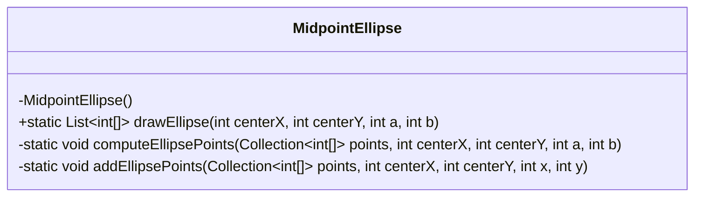
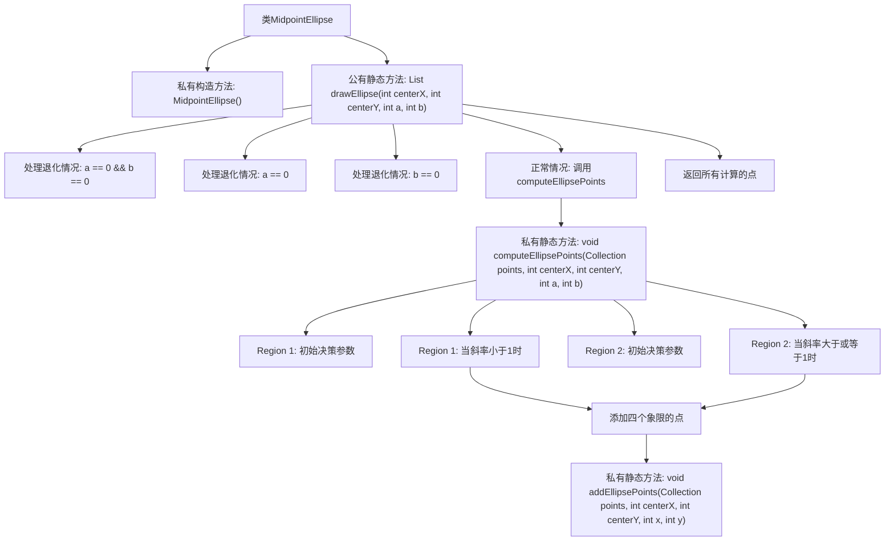

# 基础信息

|      |      |
|------|------|
| 名称 | MidpointEllipse |
| 编码语言 | .java |
| 代码路径 | Java/src/main/java/com/thealgorithms/geometry/MidpointEllipse.java |
| 包名 | com.thealgorithms.geometry |
| 依赖项 | ['java.util.ArrayList', 'java.util.Collection', 'java.util.List'] |
| 概述说明 | MidpointEllipse类利用中点椭圆算法绘制椭圆，处理退化并返回所有计算点。 |

# 说明

MidpointEllipse类采用中点椭圆算法来实现椭圆的绘制。该算法能够有效处理椭圆的退化情况，确保在各种条件下都能正确生成椭圆的轮廓。通过计算椭圆上所有关键点的坐标，MidpointEllipse类最终返回这些计算点，为后续的绘制操作提供精确的数据支持。

# 类列表 Class Summary

| 名称   | 类型  | 说明 |
|-------|------|-------------|
| MidpointEllipse | class | MidpointEllipse类使用中点椭圆算法绘制椭圆，处理退化情况并返回所有计算点。 |

## 类 MidpointEllipse

|      |      |
|------|------|
| 访问范围 | public final |
| 类型 | class |
| 名称 | MidpointEllipse |
| 说明 | MidpointEllipse类使用中点椭圆算法绘制椭圆，处理退化情况并返回所有计算点。 |

### UML类图

**描述：**  
`MidpointEllipse` 类实现了中点椭圆算法，用于绘制椭圆。该类包含一个私有构造函数以防止实例化，并提供了三个静态方法：`drawEllipse` 用于绘制椭圆并返回点的列表，`computeEllipsePoints` 用于计算非退化椭圆的点，`addEllipsePoints` 用于基于对称性添加椭圆的所有四个象限的点。该类通过处理退化情况（如半轴为零）来确保算法的鲁棒性，并通过对称性减少计算量。

### 内部方法调用关系图

这段代码实现了中点椭圆算法，用于绘制椭圆。`MidpointEllipse`类包含一个私有构造方法和三个静态方法。`drawEllipse`方法处理退化情况（如椭圆退化为点或线），并在正常情况下调用`computeEllipsePoints`方法计算椭圆点。`computeEllipsePoints`方法分为两个区域，分别处理斜率小于1和大于或等于1的情况，并调用`addEllipsePoints`方法添加四个象限的点。最终，`drawEllipse`方法返回所有计算的点。

### 字段列表 Field List

| 名称  | 类型  | 说明 |
|-------|-------|------|

### 方法列表 Method List

| 名称  | 类型  | 说明 |
|-------|-------|------|
| drawEllipse | List<int[]> | 该方法绘制椭圆，处理退化情况并返回所有计算点。 |
| computeEllipsePoints | void | 计算椭圆点坐标，更新决策参数和变量。 |
| addEllipsePoints | void | 该方法在集合中添加椭圆对称点的坐标。 |

