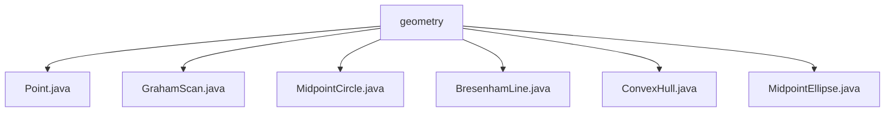

# 基础信息

|      |      |
|------|------|
| 名称 | geometry |
| 编码语言 | .java |
| 代码路径 | Java/src/main/java/com/thealgorithms/geometry |
| 包名 | Java.src.main.java.com.thealgorithms.geometry |
| 概述说明 | Graham Scan、MidpointCircle、Bresenham、ConvexHull、MidpointEllipse算法实现。 |

# 说明

## 概述
该代码模块主要实现了多种几何算法，涵盖了计算几何中的凸包、直线、圆和椭圆的生成与绘制。模块中的每个类都专注于解决特定的几何问题，提供了高效且精确的算法实现。这些算法在计算机图形学、计算几何等领域具有广泛的应用，能够帮助开发者快速生成和处理几何图形。

## 主要业务场景
1. **凸包计算**：
   - **Graham Scan算法**：用于高效计算二维点集的凸包，适用于需要快速确定点集边界轮廓的场景。
   - **ConvexHull类**：提供了暴力法和递归法两种凸包计算方法，适用于不同规模和复杂度的点集。

2. **直线生成**：
   - **Bresenham算法**：用于生成两点之间的直线上的像素点，适用于计算机图形学中的直线绘制，确保生成的直线在视觉上平滑且连续。

3. **圆生成**：
   - **MidpointCircle类**：实现了中点圆算法，用于生成圆上所有对称点，适用于需要精确绘制圆形的场景。

4. **椭圆生成**：
   - **MidpointEllipse类**：采用中点椭圆算法来实现椭圆的绘制，适用于需要处理椭圆退化情况并生成精确椭圆轮廓的场景。

这些算法在图形绘制、图像处理、路径规划等领域具有广泛的应用，能够帮助开发者高效地处理各种几何问题。

### 包内部结构视图

该流程图展示了 `geometry` 文件夹下的所有文件结构。`geometry` 是根节点，包含六个文件：`Point.java`、`GrahamScan.java`、`MidpointCircle.java`、`BresenhamLine.java`、`ConvexHull.java` 和 `MidpointEllipse.java`。这些文件都是几何算法相关的实现，直接位于 `geometry` 文件夹下，没有进一步的子文件夹层级。

# 文件列表 File List

| 名称   | 类型  | 说明 |
|-------|------|-------------|
| [MidpointEllipse.java](MidpointEllipse.md) | file | MidpointEllipse类利用中点椭圆算法绘制椭圆，处理退化并返回所有计算点。 |
| [BresenhamLine.java](BresenhamLine.md) | file | Bresenham算法用于计算两点间直线上的像素点。 |
| [MidpointCircle.java](MidpointCircle.md) | file | MidpointCircle类实现中点圆算法，生成圆上对称点。 |
| [GrahamScan.java](GrahamScan.md) | file | GrahamScan算法通过排序和极角顺序处理点集，生成凸包点集。 |
| [ConvexHull.java](ConvexHull.md) | file | ConvexHull类提供暴力法和递归法计算凸包，分别通过遍历点对和分治策略实现。 |
| [Point.java](Point.md) | file | 信息为空，无法生成概要描述。 |

