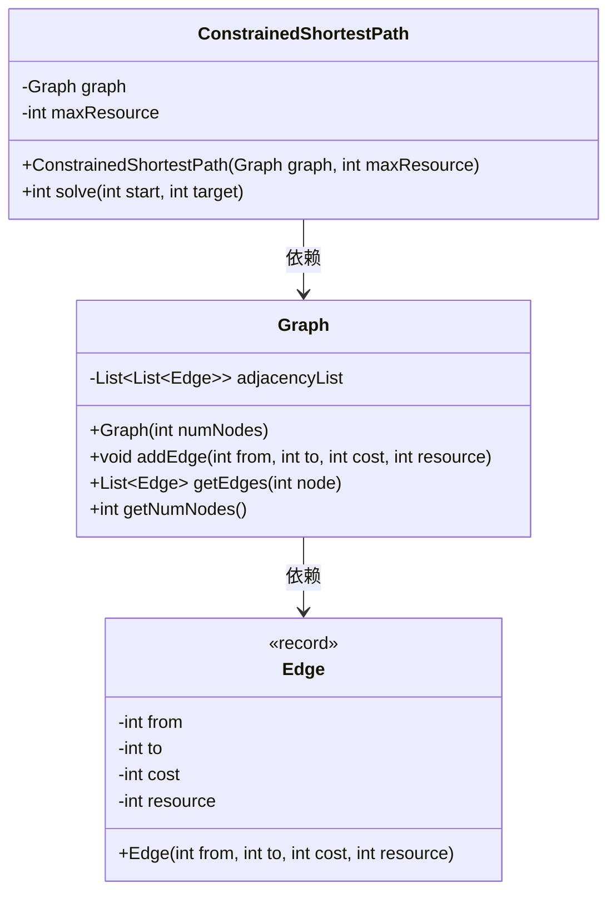
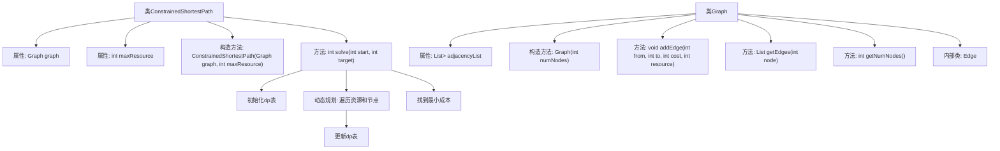
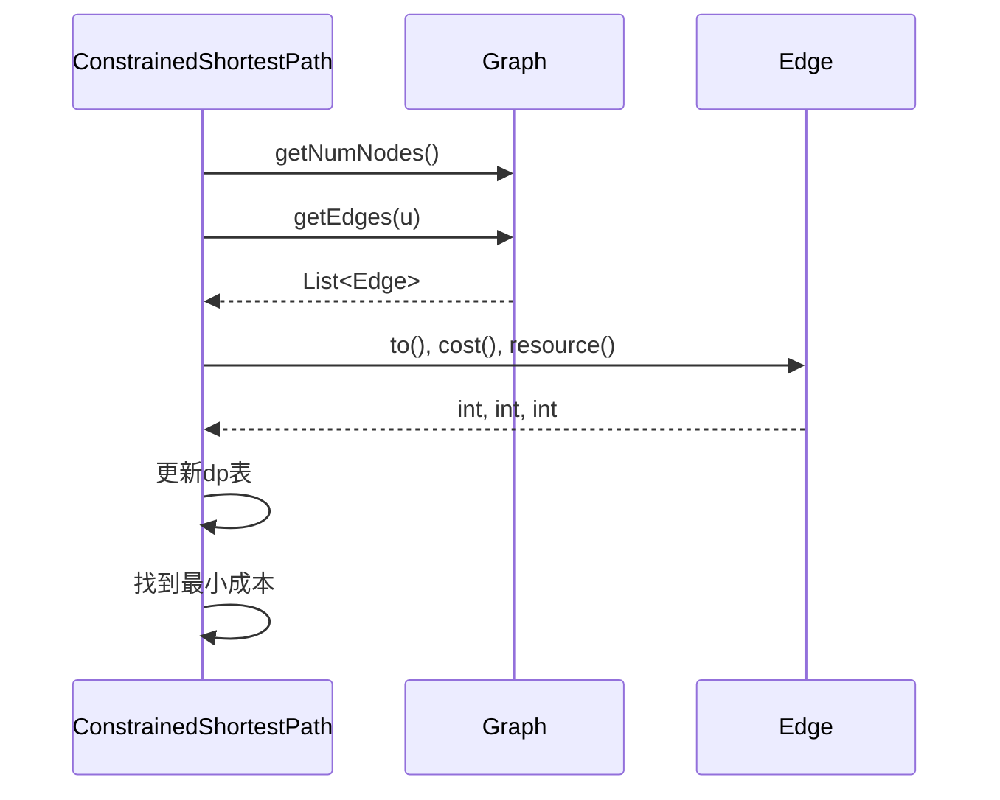

# 基础信息

|      |      |
|------|------|
| 名称 | ConstrainedShortestPath |
| 编码语言 | .java |
| 代码路径 | Java/src/main/java/com/thealgorithms/graph/ConstrainedShortestPath.java |
| 包名 | com.thealgorithms.graph |
| 依赖项 | ['java.util.ArrayList', 'java.util.Arrays', 'java.util.List'] |
| 概述说明 | 动态规划解决资源约束的最短路径问题，确保路径不超限。 |

# 说明

解决带资源约束的最短路径问题，采用动态规划方法确保路径在资源限制内。通过逐步计算每个节点的最短路径，并检查资源消耗，确保最终路径既最短又不超资源限制。

# 类列表 Class Summary

| 名称   | 类型  | 说明 |
|-------|------|-------------|
| ConstrainedShortestPath | class | 解决带资源约束的最短路径问题，使用动态规划确保路径不超资源限制。 |

## 类 ConstrainedShortestPath

|      |      |
|------|------|
| 访问范围 | public |
| 类型 | class |
| 名称 | ConstrainedShortestPath |
| 说明 | 解决带资源约束的最短路径问题，使用动态规划确保路径不超资源限制。 |

### UML类图

### 描述
该代码实现了一个约束最短路径问题（CSPP）的求解器。`ConstrainedShortestPath`类包含一个`Graph`对象和最大资源约束`maxResource`，并提供了`solve`方法用于计算从起始节点到目标节点的最短路径，同时确保路径的资源消耗不超过最大资源约束。`Graph`类表示图的邻接表结构，包含节点和边的信息。`Edge`类是一个记录类型，表示图中的边，包含起点、终点、成本和资源消耗。

### 内部方法调用关系图

**描述：**  
这段代码实现了一个解决约束最短路径问题（CSPP）的类 `ConstrainedShortestPath`。它通过动态规划算法在给定的图中找到从起点到目标点的最短路径，且路径的总资源消耗不超过设定的最大值。`Graph` 类用于表示图的邻接表结构，`Edge` 类表示图中的边。`solve` 方法通过初始化 dp 表、遍历资源和节点、更新 dp 表以及找到最小成本来完成计算。

### 字段列表 Field List

| 名称  | 类型  | 说明 |
|-------|-------|------|
| maxResource | int | 定义私有整型变量maxResource。 |
| graph | Graph | 声明一个私有的Graph类型变量graph。 |

### 方法列表 Method List

| 名称  | 类型  | 说明 |
|-------|-------|------|
| solve | int | 动态规划求解从起点到目标节点的最小成本。 |

