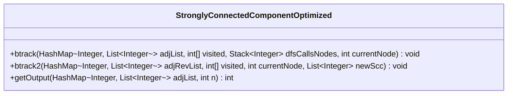
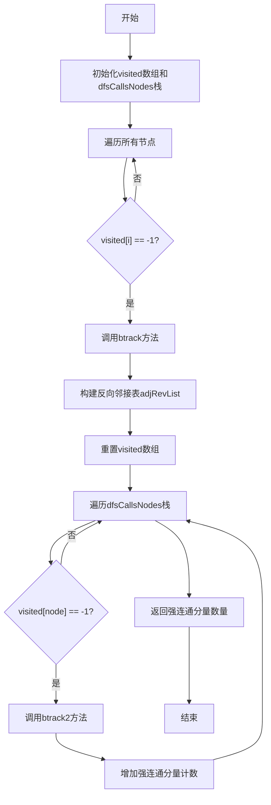
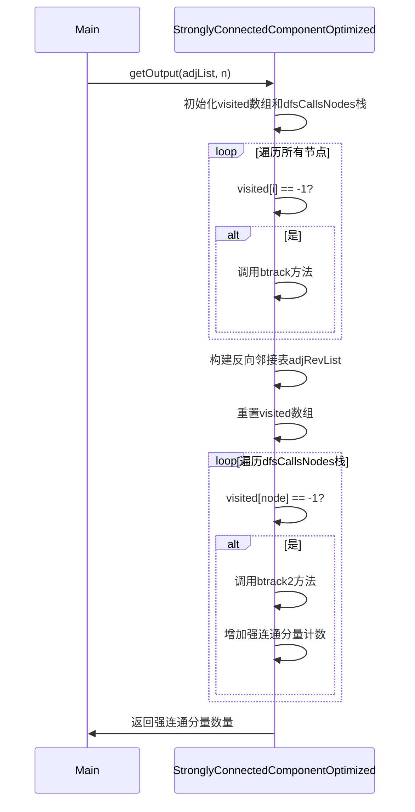
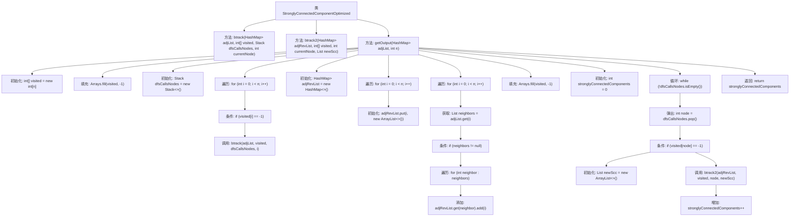

# 基础信息

|      |      |
|------|------|
| 名称 | StronglyConnectedComponentOptimized |
| 编码语言 | .java |
| 代码路径 | Java/src/main/java/com/thealgorithms/graph/StronglyConnectedComponentOptimized.java |
| 包名 | com.thealgorithms.graph |
| 依赖项 | ['java.util.ArrayList', 'java.util.Arrays', 'java.util.HashMap', 'java.util.List', 'java.util.Stack'] |
| 概述说明 | 优化强连通分量算法，利用回溯和反向图计算数量。 |

# 说明

优化强连通分量算法的方法包括使用回溯技术和反向图计算。回溯技术通过递归探索图中的节点，确保每个节点都被正确标记为强连通分量的一部分。反向图计算则通过构建原图的反向图，利用深度优先搜索（DFS）来确定强连通分量的数量。这种方法能够有效减少计算复杂度，提高算法效率，确保在复杂图中快速准确地识别所有强连通分量。

# 类列表 Class Summary

| 名称   | 类型  | 说明 |
|-------|------|-------------|
| StronglyConnectedComponentOptimized | class | 优化强连通分量算法，通过回溯和反向图计算强连通分量数量。 |

## 类 StronglyConnectedComponentOptimized

|      |      |
|------|------|
| 访问范围 | public |
| 类型 | class |
| 名称 | StronglyConnectedComponentOptimized |
| 说明 | 优化强连通分量算法，通过回溯和反向图计算强连通分量数量。 |

### UML类图

**描述：**
`StronglyConnectedComponentOptimized` 类用于计算有向图中的强连通分量数量。通过深度优先搜索（DFS）遍历图，构建反向邻接表，并再次使用DFS遍历反向图，最终统计强连通分量的数量。该类包含三个主要方法：`btrack` 用于首次DFS遍历，`btrack2` 用于反向图的DFS遍历，`getOutput` 负责初始化、调用上述方法并返回结果。

### 内部方法调用关系图

这段代码实现了一个优化后的强连通分量（SCC）算法。它首先通过深度优先搜索（DFS）遍历图，将节点按访问顺序压入栈中。然后，通过反转图的邻接表，再次使用DFS遍历栈中的节点，找到所有的强连通分量。最终，返回强连通分量的数量。代码中使用了两个递归方法 `btrack` 和 `btrack2` 分别进行DFS遍历和反转图的DFS遍历。

### 字段列表 Field List

| 名称  | 类型  | 说明 |
|-------|-------|------|

### 方法列表 Method List

| 名称  | 类型  | 说明 |
|-------|-------|------|
| getOutput | int | 通过深度优先搜索计算有向图的强连通分量数量。 |
| btrack2 | void | 递归遍历邻接表，标记已访问节点并收集强连通分量。 |
| btrack | void | 递归遍历邻接表，标记访问节点并记录DFS调用顺序。 |

