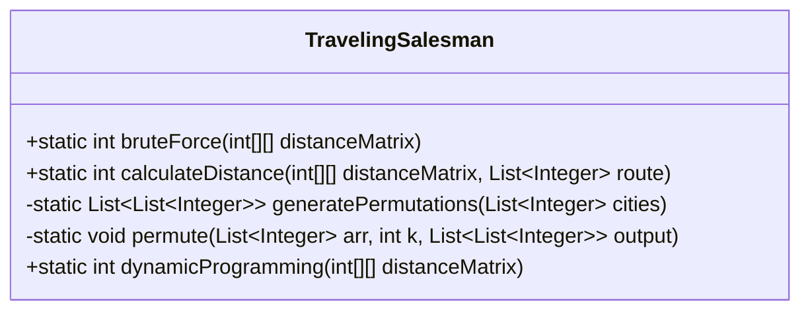
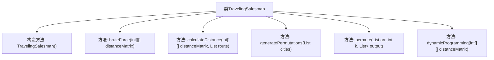
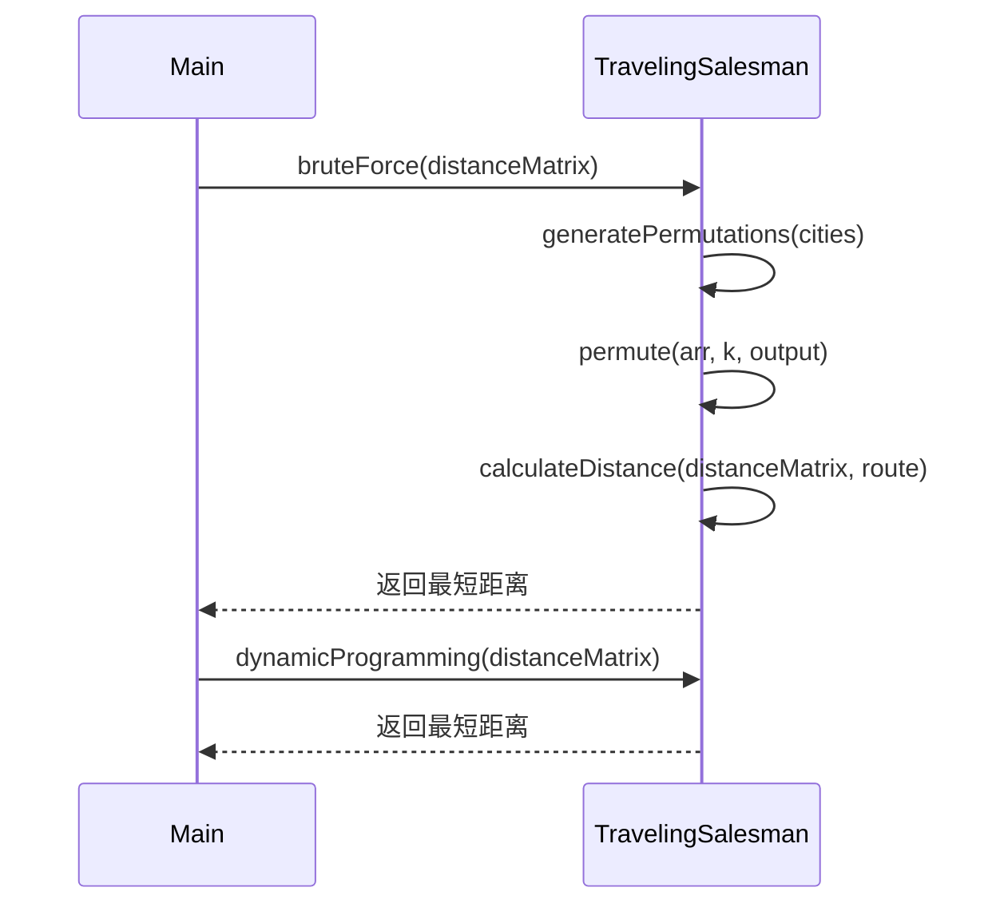

# 基础信息

|      |      |
|------|------|
| 名称 | TravelingSalesman |
| 编码语言 | .java |
| 代码路径 | Java/src/main/java/com/thealgorithms/graph/TravelingSalesman.java |
| 包名 | com.thealgorithms.graph |
| 依赖项 | ['java.util.ArrayList', 'java.util.Arrays', 'java.util.Collections', 'java.util.List'] |
| 概述说明 | 旅行商问题：含暴力求解与动态规划两种解法。 |

# 说明

旅行商问题类提供了两种求解方法：暴力求解和动态规划。暴力求解通过枚举所有可能的路径组合，计算每种组合的总距离，最终选择最短路径。这种方法适用于小规模问题，但计算复杂度随城市数量增加而急剧上升。动态规划方法则通过存储和重用子问题的解，减少重复计算，显著提高效率，适用于较大规模问题。两种方法各有优劣，选择取决于问题规模和计算资源。

# 类列表 Class Summary

| 名称   | 类型  | 说明 |
|-------|------|-------------|
| TravelingSalesman | class | 旅行商问题类，包含暴力求解和动态规划两种方法。 |

## 类 TravelingSalesman

|      |      |
|------|------|
| 访问范围 | public final |
| 类型 | class |
| 名称 | TravelingSalesman |
| 说明 | 旅行商问题类，包含暴力求解和动态规划两种方法。 |

### UML类图

这段代码定义了一个 `TravelingSalesman` 类，该类提供了两种解决旅行商问题（TSP）的算法：暴力搜索和动态规划。`bruteForce` 方法通过生成所有可能的城市排列来计算最短路径，`calculateDistance` 方法用于计算给定路径的总距离，`generatePermutations` 和 `permute` 方法用于生成所有可能的城市排列。`dynamicProgramming` 方法使用 Held-Karp 算法通过动态规划来解决 TSP 问题。该类通过静态方法提供了这些功能，且无法被实例化。

### 内部方法调用关系图

**流程图描述**：  
该流程图展示了`TravelingSalesman`类的结构及其内部方法之间的关系。类包含一个私有构造方法和四个公共静态方法：`bruteForce`、`calculateDistance`、`generatePermutations`、`permute`和`dynamicProgramming`。`bruteForce`方法通过生成所有可能的城市排列并计算每种排列的总距离来求解旅行商问题，`dynamicProgramming`方法则使用动态规划算法求解。`generatePermutations`和`permute`方法用于生成所有可能的城市排列，`calculateDistance`方法用于计算给定路线的总距离。

### 字段列表 Field List

| 名称  | 类型  | 说明 |
|-------|-------|------|

### 方法列表 Method List

| 名称  | 类型  | 说明 |
|-------|-------|------|
| bruteForce | int | 暴力搜索算法计算最短路径。 |
| generatePermutations | List<List<Integer>> | 生成城市列表的全排列。 |
| calculateDistance | int | 计算路径总距离，若包含无效值则返回最大值。 |
| dynamicProgramming | int | 动态规划算法计算最短路径，适用于方阵，返回最小距离。 |
| permute | void | 递归生成数组全排列，使用交换法避免重复。 |

