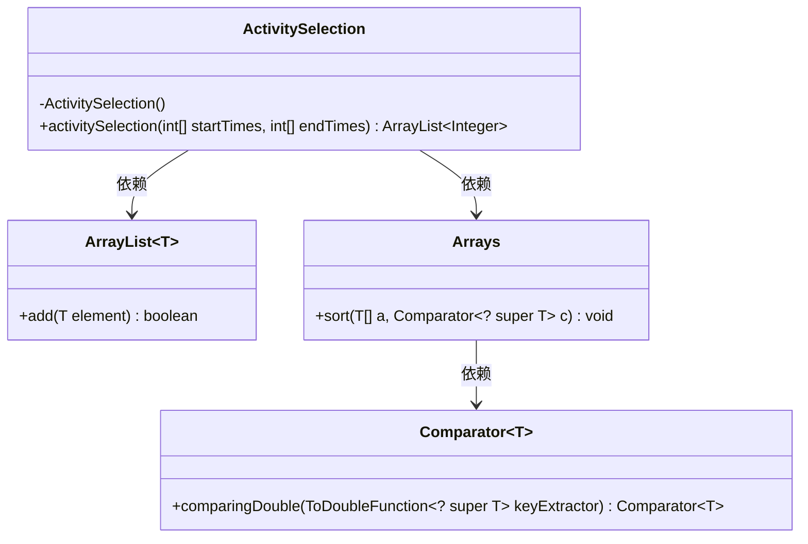
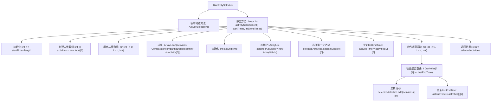

# 基础信息

|      |      |
|------|------|
| 名称 | ActivitySelection |
| 编码语言 | .java |
| 代码路径 | Java/src/main/java/com/thealgorithms/greedyalgorithms/ActivitySelection.java |
| 包名 | com.thealgorithms.greedyalgorithms |
| 依赖项 | ['java.util.ArrayList', 'java.util.Arrays', 'java.util.Comparator'] |
| 概述说明 | 贪心算法选择最大不重叠活动数。 |

# 说明

使用贪心算法选择不重叠的最大活动数是一种优化策略，旨在从一组可能重叠的活动中选出尽可能多的互不重叠的活动。该算法的核心思想是每次选择结束时间最早的活动，从而为后续活动留出更多时间，确保最大化活动数量。这种方法在时间安排、资源调度等场景中具有广泛应用，能够高效解决活动选择问题。

# 类列表 Class Summary

| 名称   | 类型  | 说明 |
|-------|------|-------------|
| ActivitySelection | class | 使用贪心算法选择不重叠的最大活动数。 |

## 类 ActivitySelection

|      |      |
|------|------|
| 访问范围 | public final |
| 类型 | class |
| 名称 | ActivitySelection |
| 说明 | 使用贪心算法选择不重叠的最大活动数。 |

### UML类图

**描述**：  
`ActivitySelection` 类是一个工具类，用于通过贪心算法选择不重叠的活动。它包含一个私有构造函数以防止实例化，以及一个静态方法 `activitySelection`，该方法接收活动的开始时间和结束时间数组，返回一个包含选定活动索引的 `ArrayList`。`Arrays` 类用于对活动进行排序，`Comparator` 类用于定义排序规则。`ArrayList` 用于存储选定的活动索引。

### 内部方法调用关系图

这段代码实现了一个贪心算法，用于解决活动选择问题。代码首先初始化一个二维数组来存储活动的索引、开始时间和结束时间，然后根据活动的结束时间进行排序。接着，选择第一个活动，并迭代检查后续活动是否与已选择的活动重叠，如果不重叠则选择该活动。最终返回一个包含所有不重叠活动索引的列表。流程图清晰地展示了代码的执行流程和各个步骤之间的逻辑关系。

### 字段列表 Field List

| 名称  | 类型  | 说明 |
|-------|-------|------|

### 方法列表 Method List

| 名称  | 类型  | 说明 |
|-------|-------|------|
| activitySelection | ArrayList<Integer> | 活动选择算法：按结束时间排序，选择无重叠活动。 |

