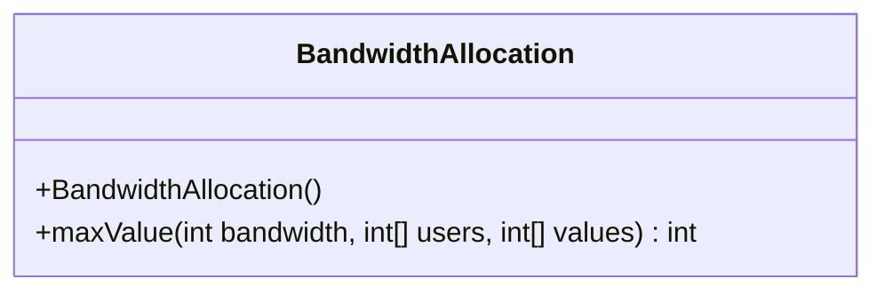
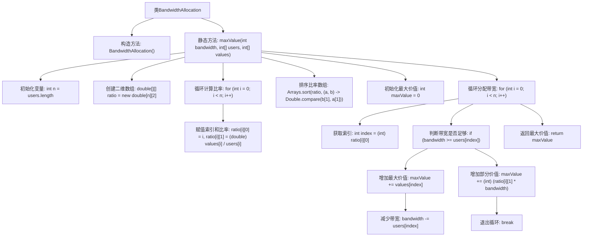

# 基础信息

|      |      |
|------|------|
| 名称 | BandwidthAllocation |
| 编码语言 | .java |
| 代码路径 | Java/src/main/java/com/thealgorithms/greedyalgorithms/BandwidthAllocation.java |
| 包名 | com.thealgorithms.greedyalgorithms |
| 依赖项 | ['java.util.Arrays'] |
| 概述说明 | 带宽分配算法按价值需求比排序，顺序分配以最大化总价值。 |

# 说明

带宽分配算法通过计算每个需求的价值与所需带宽的比值，对所有需求进行排序，然后按照排序结果依次分配带宽资源。该算法的核心目标是确保在有限的带宽资源下，最大化所有需求的总价值。通过这种有序分配方式，算法能够有效优化带宽使用效率，满足高价值需求，从而实现整体资源利用的最优配置。

# 类列表 Class Summary

| 名称   | 类型  | 说明 |
|-------|------|-------------|
| BandwidthAllocation | class | 带宽分配算法通过计算价值需求比，排序后按序分配带宽以最大化总价值。 |

## 类 BandwidthAllocation

|      |      |
|------|------|
| 访问范围 | public final |
| 类型 | class |
| 名称 | BandwidthAllocation |
| 说明 | 带宽分配算法通过计算价值需求比，排序后按序分配带宽以最大化总价值。 |

### UML类图

**描述：**
`BandwidthAllocation` 类是一个工具类，用于计算在给定带宽下如何分配资源以最大化价值。该类包含一个私有构造函数，防止实例化，以及一个静态方法 `maxValue`，该方法通过计算每个用户的价值需求比，按比例排序并分配带宽，最终返回最大可实现的价值。该方法通过排序和贪心算法实现资源的最优分配。

### 内部方法调用关系图

这段代码实现了一个带宽分配算法，目的是在给定总带宽和用户需求及价值的情况下，最大化总价值。首先，计算每个用户的价值与需求比率，并按比率降序排序。然后，按排序顺序分配带宽，如果带宽不足以满足用户需求，则按比例分配部分价值。最终返回最大可实现的价值。

### 字段列表 Field List

| 名称  | 类型  | 说明 |
|-------|-------|------|

### 方法列表 Method List

| 名称  | 类型  | 说明 |
|-------|-------|------|
| maxValue | int | 计算最大带宽价值，按用户价值比排序，累加满足带宽限制的价值。 |

