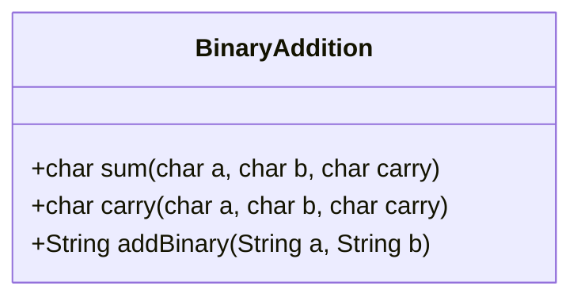
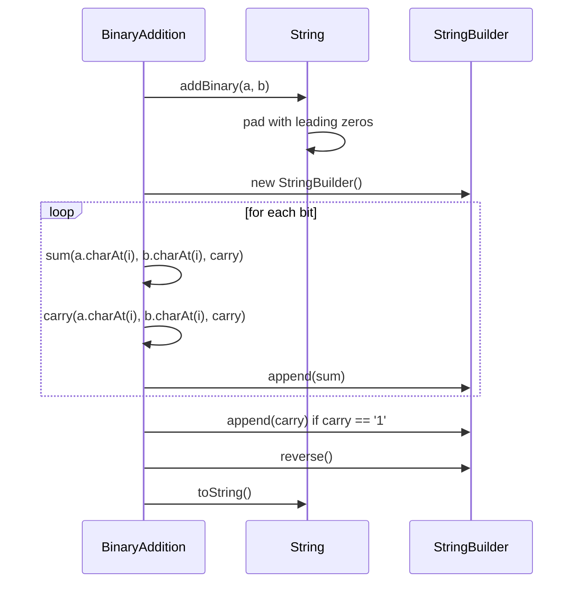

# 基础信息

|      |      |
|------|------|
| 名称 | BinaryAddition |
| 编码语言 | .java |
| 代码路径 | Java/src/main/java/com/thealgorithms/greedyalgorithms/BinaryAddition.java |
| 包名 | com.thealgorithms.greedyalgorithms |
| 依赖项 | ['java.util.Collections'] |
| 概述说明 | BinaryAddition类实现二进制加法，支持求和、进位及字符串相加功能。 |

# 说明

BinaryAddition类提供了二进制加法的完整实现，主要功能包括求和、进位处理以及二进制字符串的相加。该类能够处理二进制数的加法运算，确保每一步的计算准确无误，特别是在处理进位时能够正确地进行操作。此外，该类还支持将二进制字符串作为输入，进行相加运算并返回结果。整体设计旨在简化二进制加法的操作，提高计算效率。

# 类列表 Class Summary

| 名称   | 类型  | 说明 |
|-------|------|-------------|
| BinaryAddition | class | BinaryAddition类实现二进制加法，包括求和、进位和二进制字符串相加功能。 |

## 类 BinaryAddition

|      |      |
|------|------|
| 访问范围 | public |
| 类型 | class |
| 名称 | BinaryAddition |
| 说明 | BinaryAddition类实现二进制加法，包括求和、进位和二进制字符串相加功能。 |

### UML类图

**描述：**
`BinaryAddition` 类提供了三个方法：`sum`、`carry` 和 `addBinary`。`sum` 方法计算两个二进制字符和一个进位字符的和，返回结果的二进制字符。`carry` 方法计算两个二进制字符和一个进位字符的进位，返回结果的二进制字符。`addBinary` 方法将两个二进制字符串相加，返回它们的和作为二进制字符串。类图展示了类的结构，时序图展示了 `addBinary` 方法的执行流程。

### 内部方法调用关系图

```mermaid
graph TD
    A["类BinaryAddition"]
    B["方法: char sum(char a, char b, char carry)"]
    C["方法: char carry(char a, char b, char carry)"]
    D["方法: String addBinary(String a, String b)"]
    E["计算sum: count = 0"]
    F["判断a == '1': count++"]
    G["判断b == '1': count++"]
    H["判断carry == '1': count++"]
    I["返回sum: count % 2 == 0 ? '0' : '1'"]
    J["计算carry: count = 0"]
    K["判断a == '1': count++"]
    L["判断b == '1': count++"]
    M["判断carry == '1': count++"]
    N["返回carry: count >= 2 ? '1' : '0'"]
    O["补全较短字符串: a = padding + a"]
    P["补全较短字符串: b = padding + b"]
    Q["初始化StringBuilder: result = new StringBuilder()"]
    R["初始化carry: carry = '0'"]
    S["遍历二进制字符串: for i = maxLength - 1 to 0"]
    T["计算sum: sum = sum(a.charAt(i), b.charAt(i), carry)"]
    U["计算carry: carry = carry(a.charAt(i), b.charAt(i), carry)"]
    V["追加sum: result.append(sum)"]
    W["判断carry == '1': result.append('1')"]
    X["反转结果: result.reverse().toString()"]

    A --> B
    A --> C
    A --> D
    B --> E
    B --> F
    B --> G
    B --> H
    B --> I
    C --> J
    C --> K
    C --> L
    C --> M
    C --> N
    D --> O
    D --> P
    D --> Q
    D --> R
    D --> S
    S --> T
    S --> U
    S --> V
    D --> W
    D --> X
```

这段代码定义了一个`BinaryAddition`类，其中包含三个方法：`sum`、`carry`和`addBinary`。`sum`方法计算两个二进制字符和一个进位字符的和，`carry`方法计算下一个更高位的进位，`addBinary`方法将两个二进制字符串相加并返回它们的和。代码通过补全较短字符串、初始化StringBuilder和carry、遍历二进制字符串、计算sum和carry、追加sum、处理剩余carry、反转结果等步骤完成二进制加法操作。

### 字段列表 Field List

| 名称  | 类型  | 说明 |
|-------|-------|------|

### 方法列表 Method List

| 名称  | 类型  | 说明 |
|-------|-------|------|
| addBinary | String | 将两个二进制字符串相加，处理进位并返回结果。 |
| carry | char | 函数计算三个字符中'1'的数量，若大于等于2则返回'1'，否则返回'0'。 |
| sum | char | 函数sum计算三个字符中'1'的个数，返回奇偶结果。 |

