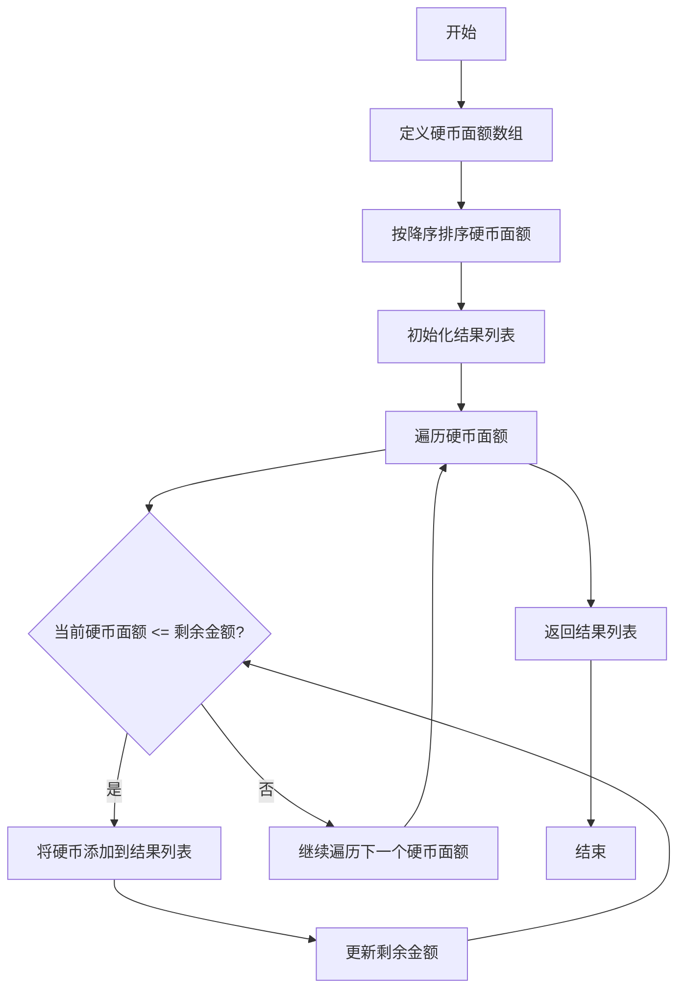
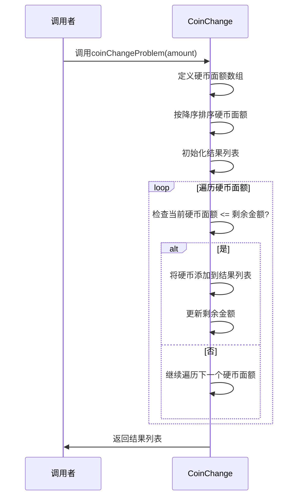
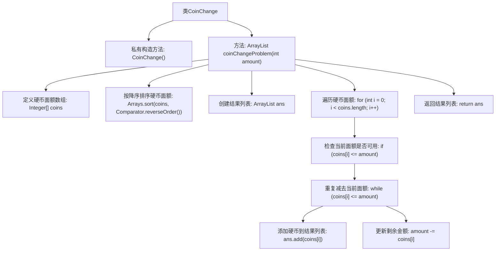

# 基础信息

|      |      |
|------|------|
| 名称 | CoinChange |
| 编码语言 | .java |
| 代码路径 | Java/src/main/java/com/thealgorithms/greedyalgorithms/CoinChange.java |
| 包名 | com.thealgorithms.greedyalgorithms |
| 依赖项 | ['java.util.ArrayList', 'java.util.Arrays', 'java.util.Comparator'] |
| 概述说明 | Java类通过降序硬币面额计算最少硬币数解决找零问题。 |

# 说明

该Java类旨在解决硬币找零问题，通过使用降序排列的硬币面额来计算所需的最少硬币数。其核心逻辑是优先使用较大面额的硬币进行找零，从而减少硬币的总数。该算法确保了找零过程的高效性和最优性，适用于各种硬币面额组合和不同的找零金额。通过这一方法，能够快速准确地确定最少硬币数，满足实际应用中的需求。

# 类列表 Class Summary

| 名称   | 类型  | 说明 |
|-------|------|-------------|
| CoinChange | class | 解决硬币找零问题的Java类，使用降序硬币面额计算最少硬币数。 |


## 类 CoinChange

|      |      |
|------|------|
| 访问范围 | public final |
| 类型 | class |
| 名称 | CoinChange |
| 说明 | 解决硬币找零问题的Java类，使用降序硬币面额计算最少硬币数。 |


### UML类图

```mermaid
classDiagram
    class CoinChange {
        -CoinChange()
        +ArrayList~Integer~ coinChangeProblem(int amount)
    }
    // CoinChange类是一个工具类，用于解决硬币找零问题。它包含一个私有构造函数以防止实例化，并提供了一个静态方法coinChangeProblem，该方法接受一个整数金额作为参数，返回一个包含找零硬币的ArrayList。
```

### 流程图


### 时序图


### 描述
`CoinChange`类是一个工具类，用于解决硬币找零问题。它包含一个私有构造函数以防止实例化，并提供了一个静态方法`coinChangeProblem`，该方法接受一个整数金额作为参数，返回一个包含找零硬币的`ArrayList`。该方法通过遍历按降序排列的硬币面额，逐步减少剩余金额，最终返回所需的硬币组合。


### 内部方法调用关系图



**描述：** 该代码实现了一个解决硬币找零问题的算法。首先，定义了一组硬币面额并按降序排序。然后，通过遍历这些面额，尽可能多地使用每个面额来减少剩余金额，并将使用的硬币添加到结果列表中。最终，返回包含所有使用硬币的列表。该算法确保使用最少数量的硬币来完成找零任务。

### 字段列表 Field List

| 名称  | 类型  | 说明 |
|-------|-------|------|

### 方法列表 Method List

| 名称  | 类型  | 说明 |
|-------|-------|------|
| coinChangeProblem | ArrayList<Integer> | 解决找零问题的贪心算法，返回最小硬币组合。 |


