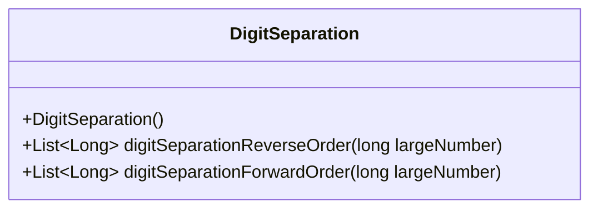
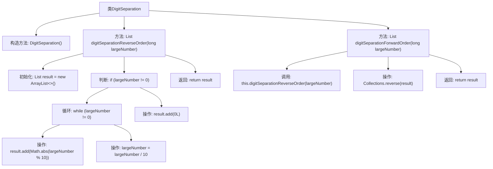

# 基础信息

|      |      |
|------|------|
| 名称 | DigitSeparation |
| 编码语言 | .java |
| 代码路径 | Java/src/main/java/com/thealgorithms/greedyalgorithms/DigitSeparation.java |
| 包名 | com.thealgorithms.greedyalgorithms |
| 依赖项 | ['java.util.ArrayList', 'java.util.Collections', 'java.util.List'] |
| 概述说明 | DigitSeparation类可将大数拆分为逆序和正序数字列表。 |

# 说明

DigitSeparation类是一个用于处理大数的工具，主要功能是将大数拆分为逆序和正序的数字列表。逆序列表表示从最低位到最高位的数字排列，而正序列表则表示从最高位到最低位的数字排列。该类适用于需要分别处理大数各位数字的场景，提供了灵活且高效的数字分离方法，便于后续的进一步处理或分析。

# 类列表 Class Summary

| 名称   | 类型  | 说明 |
|-------|------|-------------|
| DigitSeparation | class | DigitSeparation类提供将大数拆分为逆序和正序数字列表的功能。 |

## 类 DigitSeparation

|      |      |
|------|------|
| 访问范围 | public |
| 类型 | class |
| 名称 | DigitSeparation |
| 说明 | DigitSeparation类提供将大数拆分为逆序和正序数字列表的功能。 |

### UML类图

这段代码定义了一个名为 `DigitSeparation` 的类，该类包含两个方法：`digitSeparationReverseOrder` 和 `digitSeparationForwardOrder`。`digitSeparationReverseOrder` 方法将一个长整型数字的各位数字分离并以逆序存储在列表中，而 `digitSeparationForwardOrder` 方法则通过调用 `digitSeparationReverseOrder` 方法获取逆序列表后，再将其反转以获得正序列表。这两个方法都处理了输入为零的情况，确保在这种情况下也能正确返回结果。

### 内部方法调用关系图

这段代码定义了一个名为`DigitSeparation`的类，其中包含两个方法：`digitSeparationReverseOrder`和`digitSeparationForwardOrder`。`digitSeparationReverseOrder`方法将一个长整型数字的各位数字分离并逆序存储在列表中，而`digitSeparationForwardOrder`方法则通过调用`digitSeparationReverseOrder`方法获取逆序列表后，再将其反转以得到正序列表。代码通过循环和条件判断来处理数字的分离和存储，最终返回结果列表。

### 字段列表 Field List

| 名称  | 类型  | 说明 |
|-------|-------|------|

### 方法列表 Method List

| 名称  | 类型  | 说明 |
|-------|-------|------|
| digitSeparationForwardOrder | List<Long> | 该方法将大数按逆序分离数字后反转，返回正序数字列表。 |
| digitSeparationReverseOrder | List<Long> | 将大数字按位分离并逆序存储到列表中。 |

