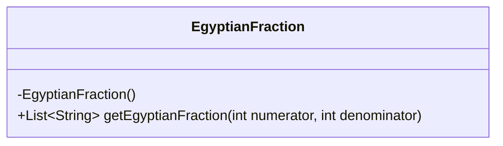
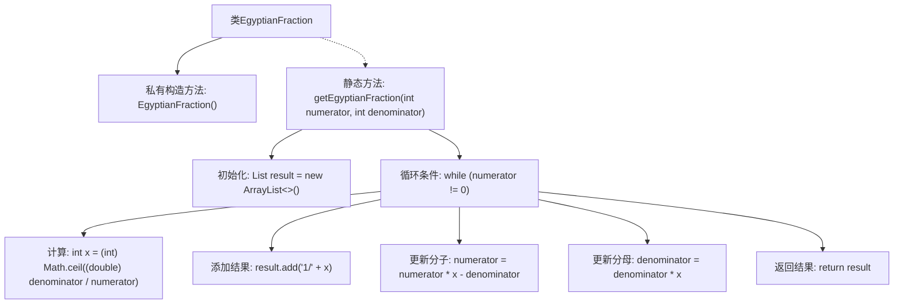

# 基础信息

|      |      |
|------|------|
| 名称 | EgyptianFraction |
| 编码语言 | .java |
| 代码路径 | Java/src/main/java/com/thealgorithms/greedyalgorithms/EgyptianFraction.java |
| 包名 | com.thealgorithms.greedyalgorithms |
| 依赖项 | ['java.util.ArrayList', 'java.util.List'] |
| 概述说明 | 埃及分数类用于将给定分数转换为单位分数列表。 |

# 说明

埃及分数类用于计算给定分数的埃及分数表示，返回一个单位分数列表。埃及分数是指分子为1的分数，该类通过将给定分数分解为若干个单位分数的和来实现。该过程涉及对分数的逐步分解和优化，确保最终得到的单位分数列表能够精确表示原分数。该方法在数学和计算机科学中具有重要应用，特别是在分数表示和优化算法中。

# 类列表 Class Summary

| 名称   | 类型  | 说明 |
|-------|------|-------------|
| EgyptianFraction | class | 埃及分数类，计算给定分数的埃及分数表示，返回单位分数列表。 |

## 类 EgyptianFraction

|      |      |
|------|------|
| 访问范围 | public final |
| 类型 | class |
| 名称 | EgyptianFraction |
| 说明 | 埃及分数类，计算给定分数的埃及分数表示，返回单位分数列表。 |

### UML类图

这段代码定义了一个名为 `EgyptianFraction` 的类，该类包含一个私有构造函数和一个公有静态方法 `getEgyptianFraction`。`getEgyptianFraction` 方法接受两个整数参数（分子和分母），并返回一个表示埃及分数的字符串列表。埃及分数是将一个分数表示为多个单位分数（即分子为1的分数）的和。该方法通过循环计算每个单位分数，并逐步更新分子和分母，直到分子为零为止。最终返回的单位分数列表以字符串形式表示，如 "1/x"。

### 内部方法调用关系图

这段代码定义了一个名为`EgyptianFraction`的类，其中包含一个静态方法`getEgyptianFraction`，用于计算给定分数的埃及分数表示。埃及分数是将一个分数表示为多个单位分数的和，每个单位分数的形式为“1/x”。代码通过循环计算每个单位分数，并更新分子和分母，直到分子为零，最终返回一个包含所有单位分数的列表。

### 字段列表 Field List

| 名称  | 类型  | 说明 |
|-------|-------|------|

### 方法列表 Method List

| 名称  | 类型  | 说明 |
|-------|-------|------|
| getEgyptianFraction | List<String> | 该代码将分数转换为埃及分数形式，返回1/x的列表。 |

