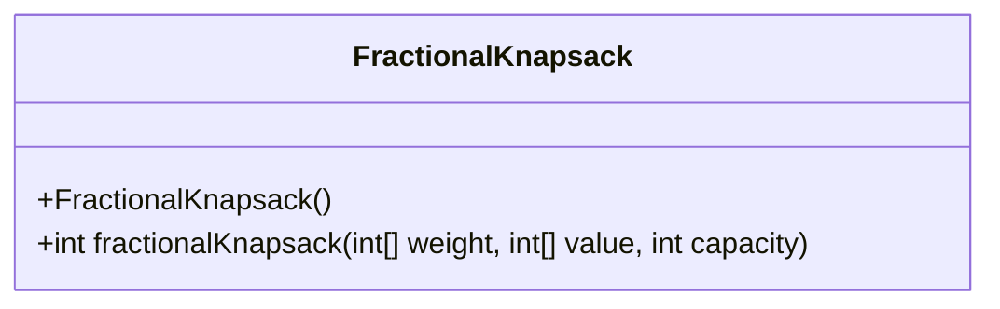
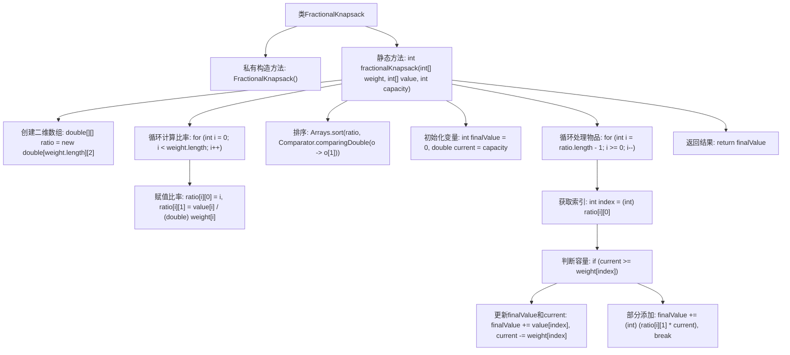

# 基础信息

|      |      |
|------|------|
| 名称 | FractionalKnapsack |
| 编码语言 | .java |
| 代码路径 | Java/src/main/java/com/thealgorithms/greedyalgorithms/FractionalKnapsack.java |
| 包名 | com.thealgorithms.greedyalgorithms |
| 依赖项 | ['java.util.Arrays', 'java.util.Comparator'] |
| 概述说明 | 动态规划求解背包问题，允许物品部分装入。 |

# 说明

该问题涉及在给定背包容量限制下，计算装入物品的最大价值，且允许部分装入物品。这意味着物品可以被分割，只需考虑其单位重量的价值，以优化总价值。目标是找到一种物品组合，使得在不超过背包容量的前提下，总价值最大化。这种问题通常通过贪心算法解决，优先选择单位重量价值最高的物品进行装入，直到背包容量被完全利用。

# 类列表 Class Summary

| 名称   | 类型  | 说明 |
|-------|------|-------------|
| FractionalKnapsack | class | 计算背包容量内物品的最大价值，支持部分装入。 |

## 类 FractionalKnapsack

|      |      |
|------|------|
| 访问范围 | public final |
| 类型 | class |
| 名称 | FractionalKnapsack |
| 说明 | 计算背包容量内物品的最大价值，支持部分装入。 |

### UML类图

这段代码定义了一个名为 `FractionalKnapsack` 的类，该类包含一个私有的构造函数和一个公有的静态方法 `fractionalKnapsack`。该方法用于计算在给定容量的背包中能够容纳的最大价值。通过计算每个物品的价值与重量比，并按照比例从高到低排序，逐步将物品放入背包，直到背包容量耗尽。最终返回背包中物品的总价值。

### 内部方法调用关系图

这段代码实现了一个分数背包问题的解决方案。它首先计算每个物品的价值与重量的比率，并根据比率对物品进行排序。然后，从比率最高的物品开始，尽可能多地将其加入背包，直到背包容量耗尽。如果某个物品无法完全放入背包，则将其部分加入，以确保最大化背包的总价值。最终，返回背包中物品的总价值。

### 字段列表 Field List

| 名称  | 类型  | 说明 |
|-------|-------|------|

### 方法列表 Method List

| 名称  | 类型  | 说明 |
|-------|-------|------|
| fractionalKnapsack | int | 分数背包算法，按价值重量比排序，计算最大价值。 |

