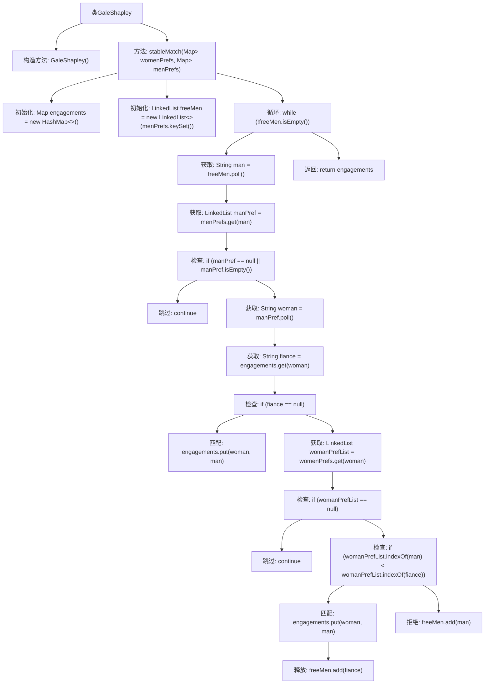

# 基础信息

|      |      |
|------|------|
| 名称 | GaleShapley |
| 编码语言 | .java |
| 代码路径 | Java/src/main/java/com/thealgorithms/greedyalgorithms/GaleShapley.java |
| 包名 | com.thealgorithms.greedyalgorithms |
| 依赖项 | ['java.util.HashMap', 'java.util.LinkedList', 'java.util.Map'] |
| 概述说明 | GaleShapley类实现稳定婚姻匹配算法，基于偏好列表生成稳定配对。 |

# 说明

GaleShapley类实现了稳定婚姻匹配算法，该算法通过男女双方的偏好列表生成稳定的配对关系。算法确保在最终匹配中不存在任何一对男女愿意离开各自当前的伴侣而选择彼此，从而保证了匹配的稳定性。这一过程通过迭代和优先选择机制完成，确保所有参与者都能获得最满意的配对结果。

# 类列表 Class Summary

| 名称   | 类型  | 说明 |
|-------|------|-------------|
| GaleShapley | class | GaleShapley类实现稳定婚姻匹配算法，通过男女偏好列表生成稳定配对。 |


## 类 GaleShapley

|      |      |
|------|------|
| 访问范围 | public final |
| 类型 | class |
| 名称 | GaleShapley |
| 说明 | GaleShapley类实现稳定婚姻匹配算法，通过男女偏好列表生成稳定配对。 |


### UML类图

```mermaid
classDiagram
    class GaleShapley {
        -GaleShapley()
        +stableMatch(Map~String, LinkedList~String~~ womenPrefs, Map~String, LinkedList~String~~ menPrefs) Map~String, String~
    }

    class Map~K, V~ {
        <<Interface>>
    }

    class LinkedList~E~ {
        <<Interface>>
    }

    class HashMap~K, V~ {
        <<Interface>>
    }

    GaleShapley --> Map~String, String~ : 返回稳定匹配结果
    GaleShapley --> Map~String, LinkedList~String~~ : 依赖
    GaleShapley --> LinkedList~String~ : 依赖
    Map~String, String~ <|.. HashMap~String, String~ : 实现
    Map~String, LinkedList~String~~ <|.. HashMap~String, LinkedList~String~~ : 实现
    LinkedList~String~ <|.. LinkedList~String~ : 实现
```

### 描述
`GaleShapley` 类实现了一个稳定匹配算法，用于在男女之间找到稳定的配对关系。它依赖于 `Map` 和 `LinkedList` 接口来处理男女的偏好列表，并使用 `HashMap` 来存储最终的匹配结果。`stableMatch` 方法接收男女的偏好列表作为输入，返回一个稳定的配对映射。该算法通过不断比较男女的偏好，确保最终的配对是稳定的。


### 内部方法调用关系图



这段代码实现了Gale-Shapley算法，用于在男女之间找到稳定的匹配。代码首先初始化所有男性为自由状态，然后通过循环让每个男性按照其偏好列表向女性求婚。如果女性未被匹配，则直接匹配；如果女性已有匹配，则根据其偏好选择更喜欢的男性，并将被拒绝的男性重新加入自由列表。最终返回所有稳定的匹配对。

### 字段列表 Field List

| 名称  | 类型  | 说明 |
|-------|-------|------|

### 方法列表 Method List

| 名称  | 类型  | 说明 |
|-------|-------|------|
| stableMatch | Map<String, String> | 稳定匹配算法，基于男女偏好列表，返回稳定配对结果。 |


