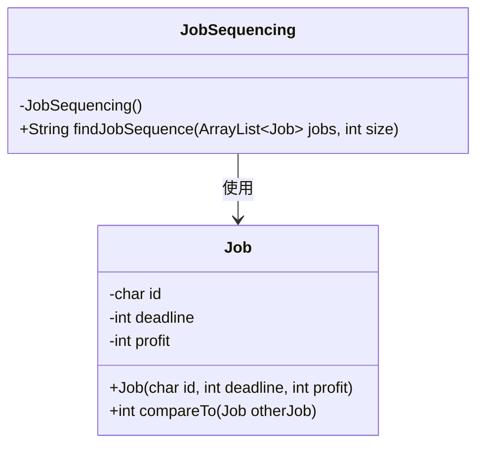
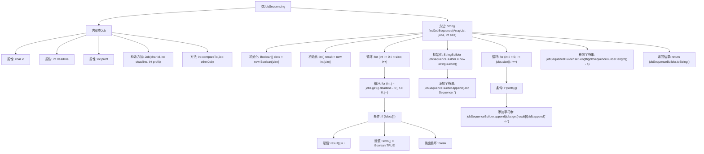

# 基础信息

|      |      |
|------|------|
| 名称 | JobSequencing |
| 编码语言 | .java |
| 代码路径 | Java/src/main/java/com/thealgorithms/greedyalgorithms/JobSequencing.java |
| 包名 | com.thealgorithms.greedyalgorithms |
| 依赖项 | ['java.util.ArrayList', 'java.util.Arrays'] |
| 概述说明 | JobSequencing类实现按利润降序排序的作业调度算法，输出最优序列。 |

# 说明

JobSequencing类实现了一种基于利润降序排序的作业调度算法，旨在找到最优的作业序列。该算法通过将作业按照利润从高到低进行排序，从而优先安排利润较高的作业，确保整体收益最大化。最终，该算法输出一个最优的作业序列，使得在满足时间约束的情况下，总利润达到最高。

# 类列表 Class Summary

| 名称   | 类型  | 说明 |
|-------|------|-------------|
| JobSequencing | class | JobSequencing类实现按利润降序排序的作业调度算法，输出最优作业序列。 |

## 类 JobSequencing

|      |      |
|------|------|
| 访问范围 | public final |
| 类型 | class |
| 名称 | JobSequencing |
| 说明 | JobSequencing类实现按利润降序排序的作业调度算法，输出最优作业序列。 |

### UML类图

这段代码定义了一个`JobSequencing`类，用于解决作业调度问题。`Job`类实现了`Comparable`接口，允许作业按利润降序排序。`findJobSequence`方法通过贪心算法找到最优的作业序列，并返回一个描述序列的字符串。`JobSequencing`类依赖于`Job`类来处理作业数据。

### 内部方法调用关系图

该流程图描述了`JobSequencing`类及其内部类`Job`的结构和功能。`JobSequencing`类包含一个静态方法`findJobSequence`，用于计算并返回最优的工作序列。该方法首先初始化两个数组`slots`和`result`，然后通过双重循环和条件判断来填充这两个数组。最后，使用`StringBuilder`构建并返回工作序列的字符串表示。整个过程展示了如何通过贪心算法解决工作调度问题。

### 字段列表 Field List

| 名称  | 类型  | 说明 |
|-------|-------|------|

### 方法列表 Method List

| 名称  | 类型  | 说明 |
|-------|-------|------|
| findJobSequence | String | 该方法通过遍历任务列表，找到最优任务序列并返回。 |

