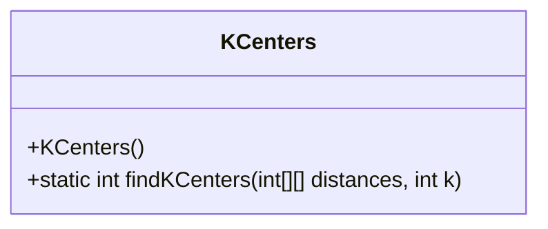
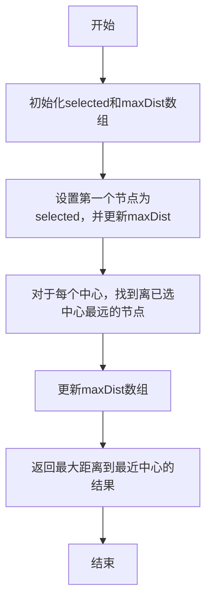
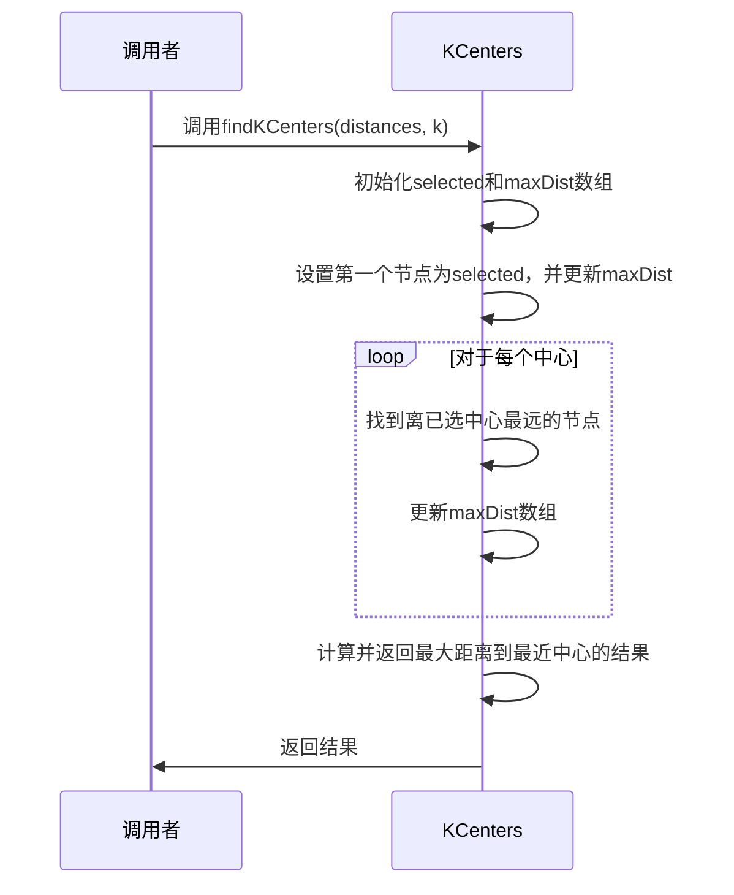
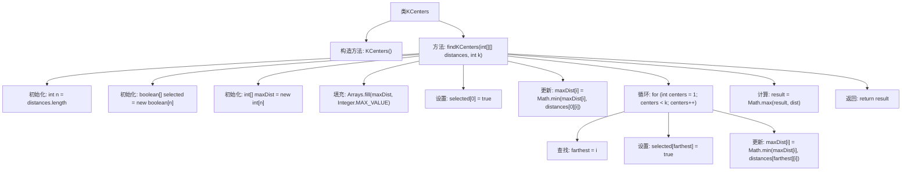

# 基础信息

|      |      |
|------|------|
| 名称 | KCenters |
| 编码语言 | .java |
| 代码路径 | Java/src/main/java/com/thealgorithms/greedyalgorithms/KCenters.java |
| 包名 | com.thealgorithms.greedyalgorithms |
| 依赖项 | ['java.util.Arrays'] |
| 概述说明 | KCenters类利用距离矩阵和中心数k计算最大最近中心距离。 |

# 说明

KCenters类的主要功能是通过给定的距离矩阵和指定的中心数量k，计算并确定每个数据点到其最近中心的最大距离。该过程旨在优化中心点的选择，以确保所有数据点与其最近中心的最大距离最小化，从而提高聚类的效果。这一方法常用于聚类算法中，特别是在需要确定最佳中心位置时。

# 类列表 Class Summary

| 名称   | 类型  | 说明 |
|-------|------|-------------|
| KCenters | class | KCenters类通过距离矩阵和中心数k，计算最近中心的最大距离。 |

## 类 KCenters

|      |      |
|------|------|
| 访问范围 | public final |
| 类型 | class |
| 名称 | KCenters |
| 说明 | KCenters类通过距离矩阵和中心数k，计算最近中心的最大距离。 |

### UML类图

**描述：**  
`KCenters` 类包含一个静态方法 `findKCenters`，用于计算给定距离矩阵和中心数 `k` 的情况下，最大距离到最近中心的值。方法通过初始化数组、选择中心节点、更新距离数组等步骤，最终返回最大距离值。流程图和时序图清晰地展示了方法的执行流程和调用关系。

### 内部方法调用关系图

这段代码实现了一个名为`KCenters`的类，其中包含一个静态方法`findKCenters`，用于计算给定距离矩阵和中心数量k的情况下，到最近中心的最大距离。代码首先初始化了两个数组`selected`和`maxDist`，然后通过迭代选择最远的节点作为中心，并更新距离数组，最后返回最大距离。流程图清晰地展示了代码的执行流程和各个步骤之间的调用关系。

### 字段列表 Field List

| 名称  | 类型  | 说明 |
|-------|-------|------|

### 方法列表 Method List

| 名称  | 类型  | 说明 |
|-------|-------|------|
| findKCenters | int | 查找k个中心点的最大距离，基于距离矩阵和k值。 |

