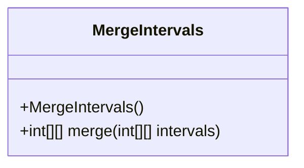
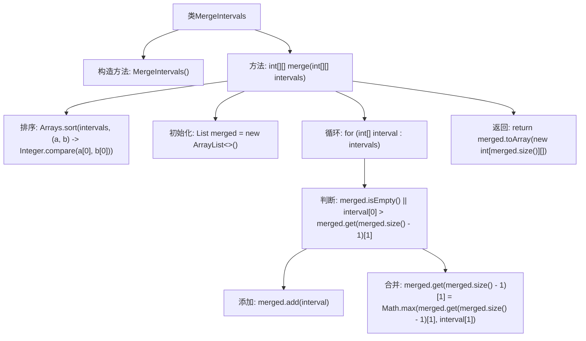

# 基础信息

|      |      |
|------|------|
| 名称 | MergeIntervals |
| 编码语言 | .java |
| 代码路径 | Java/src/main/java/com/thealgorithms/greedyalgorithms/MergeIntervals.java |
| 包名 | com.thealgorithms.greedyalgorithms |
| 依赖项 | ['java.util.ArrayList', 'java.util.Arrays', 'java.util.List'] |
| 概述说明 | 排序后遍历合并重叠区间。 |

# 说明

合并重叠区间的过程首先需要对所有区间进行排序，确保它们按照起始位置有序排列。接着，通过遍历这些已排序的区间，逐一检查当前区间与前一个区间是否存在重叠。如果存在重叠，则将它们合并为一个更大的区间；如果不存在重叠，则保留当前区间作为新的独立区间。最终，所有重叠的区间都会被合并，得到一个不重叠的区间集合。这种方法确保了高效且准确地处理区间重叠问题。

# 类列表 Class Summary

| 名称   | 类型  | 说明 |
|-------|------|-------------|
| MergeIntervals | class | 合并重叠区间，排序后遍历并合并。 |

## 类 MergeIntervals

|      |      |
|------|------|
| 访问范围 | public final |
| 类型 | class |
| 名称 | MergeIntervals |
| 说明 | 合并重叠区间，排序后遍历并合并。 |

### UML类图

这段代码定义了一个名为 `MergeIntervals` 的类，它是一个工具类，用于合并重叠的区间。类中包含一个私有构造函数，防止外部实例化该类。主要功能由 `merge` 方法实现，该方法接收一个二维整数数组 `intervals`，表示多个区间，并返回一个合并后的二维整数数组。`merge` 方法首先对区间按起始时间进行排序，然后遍历排序后的区间列表，通过比较当前区间与已合并的最后一个区间的结束时间，决定是否合并区间。最终，将合并后的区间列表转换为二维数组并返回。

### 内部方法调用关系图

这段代码定义了一个`MergeIntervals`类，其中包含一个`merge`方法，用于合并重叠的区间。首先对区间按起始时间进行排序，然后遍历每个区间，判断是否与已合并的区间重叠。如果不重叠，则直接添加到合并列表中；如果重叠，则更新已合并区间的结束时间。最后将合并后的区间列表转换为二维数组并返回。

### 字段列表 Field List

| 名称  | 类型  | 说明 |
|-------|-------|------|

### 方法列表 Method List

| 名称  | 类型  | 说明 |
|-------|-------|------|
| merge | int[][] | 合并重叠区间的算法：排序后遍历，无重叠直接添加，有重叠则合并。 |

