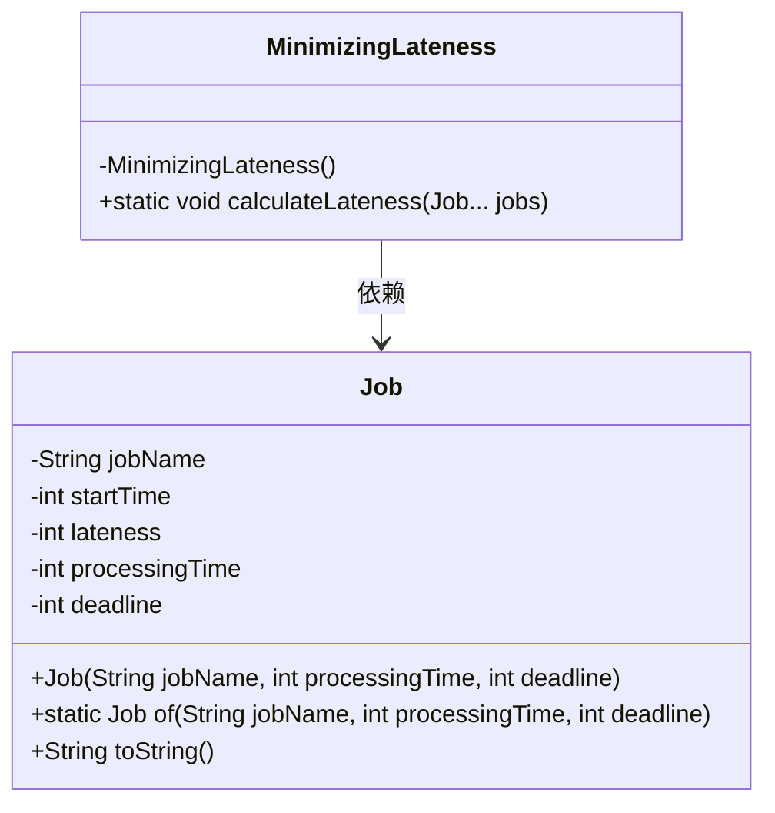
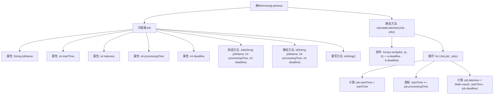

# 基础信息

|      |      |
|------|------|
| 名称 | MinimizingLateness |
| 编码语言 | .java |
| 代码路径 | Java/src/main/java/com/thealgorithms/greedyalgorithms/MinimizingLateness.java |
| 包名 | com.thealgorithms.greedyalgorithms |
| 依赖项 | ['java.util.Arrays'] |
| 概述说明 | MinimizingLateness类按截止时间排序作业，计算开始时间和延迟。 |

# 说明

MinimizingLateness类用于计算作业的延迟情况，通过按作业的截止时间进行排序，并计算每个作业的开始时间和延迟时间，从而有效管理和优化作业的完成顺序，确保尽可能减少延迟。

# 类列表 Class Summary

| 名称   | 类型  | 说明 |
|-------|------|-------------|
| MinimizingLateness | class | MinimizingLateness类计算作业延迟，按截止时间排序并计算开始时间和延迟。 |

## 类 MinimizingLateness

|      |      |
|------|------|
| 访问范围 | public final |
| 类型 | class |
| 名称 | MinimizingLateness |
| 说明 | MinimizingLateness类计算作业延迟，按截止时间排序并计算开始时间和延迟。 |

### UML类图

这段代码定义了一个`MinimizingLateness`类，用于计算作业的延迟时间。`Job`类表示一个作业，包含作业名称、开始时间、处理时间、截止时间和延迟时间。`MinimizingLateness`类中的`calculateLateness`方法根据作业的截止时间排序，并计算每个作业的开始时间和延迟时间。`Job`类还提供了`of`方法用于创建作业实例，并重写了`toString`方法以便于输出作业信息。

### 内部方法调用关系图

这段代码定义了一个`MinimizingLateness`类，其中包含一个内部类`Job`，用于表示任务及其相关属性。`Job`类包含了任务的名称、开始时间、延迟、处理时间和截止时间等属性，并提供了构造方法和静态工厂方法`of`。`MinimizingLateness`类中的`calculateLateness`方法根据任务的截止时间对任务进行排序，并计算每个任务的开始时间和延迟。该方法通过循环遍历任务列表，更新每个任务的开始时间和延迟，确保任务在截止时间前完成或计算其延迟。

### 字段列表 Field List

| 名称  | 类型  | 说明 |
|-------|-------|------|

### 方法列表 Method List

| 名称  | 类型  | 说明 |
|-------|-------|------|
| calculateLateness | void | 按截止时间排序任务，计算每个任务的开始时间和延迟。 |

