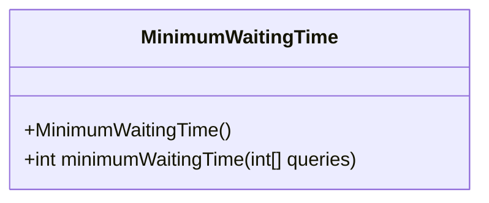
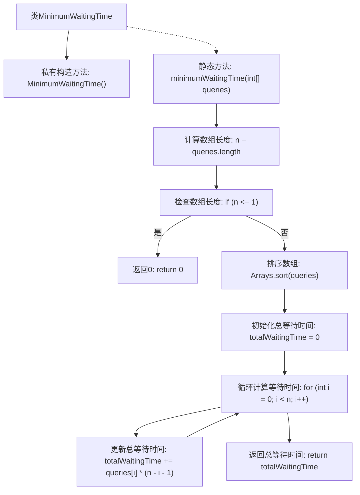

# 基础信息

|      |      |
|------|------|
| 名称 | MinimumWaitingTime |
| 编码语言 | .java |
| 代码路径 | Java/src/main/java/com/thealgorithms/greedyalgorithms/MinimumWaitingTime.java |
| 包名 | com.thealgorithms.greedyalgorithms |
| 依赖项 | ['java.util.Arrays'] |
| 概述说明 | 排序查询列表并累加各查询等待时间，计算最小总等待时间。 |

# 说明

计算查询列表的最小等待时间，首先对查询列表进行排序，然后依次累加每个查询的等待时间。通过排序确保查询按最短时间优先处理，从而最小化总等待时间。该方法通过优化查询处理顺序，有效减少整体等待时间，提高系统效率。

# 类列表 Class Summary

| 名称   | 类型  | 说明 |
|-------|------|-------------|
| MinimumWaitingTime | class | 计算查询列表的最小等待时间，排序后累加各查询等待时间。 |

## 类 MinimumWaitingTime

|      |      |
|------|------|
| 访问范围 | public final |
| 类型 | class |
| 名称 | MinimumWaitingTime |
| 说明 | 计算查询列表的最小等待时间，排序后累加各查询等待时间。 |

### UML类图

这段代码定义了一个名为 `MinimumWaitingTime` 的类，该类包含一个私有的构造函数和一个公有的静态方法 `minimumWaitingTime`。该方法接收一个整数数组 `queries`，表示查询时间，并计算并返回最小等待时间。方法首先检查数组长度，若长度小于等于1则直接返回0。否则，对数组进行排序，并计算每个查询的等待时间，最终返回总等待时间。

### 内部方法调用关系图

这段代码定义了一个名为 `MinimumWaitingTime` 的类，其中包含一个私有构造方法和一个静态方法 `minimumWaitingTime`。该方法首先检查查询数组的长度，如果长度小于等于1，则直接返回0。否则，它对数组进行排序，然后通过循环计算每个查询的等待时间，并累加得到总等待时间。最终，方法返回计算得到的总等待时间。

### 字段列表 Field List

| 名称  | 类型  | 说明 |
|-------|-------|------|

### 方法列表 Method List

| 名称  | 类型  | 说明 |
|-------|-------|------|
| minimumWaitingTime | int | 计算最小等待时间，排序后累加每个查询的等待时间。 |

