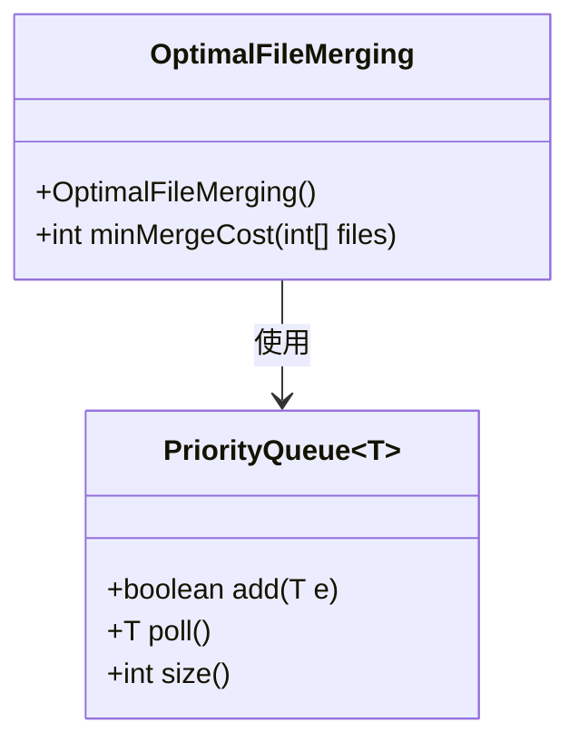
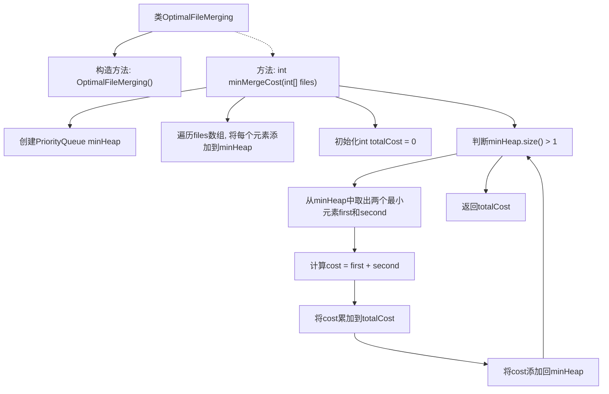

# 基础信息

|      |      |
|------|------|
| 名称 | OptimalFileMerging |
| 编码语言 | .java |
| 代码路径 | Java/src/main/java/com/thealgorithms/greedyalgorithms/OptimalFileMerging.java |
| 包名 | com.thealgorithms.greedyalgorithms |
| 依赖项 | ['java.util.PriorityQueue'] |
| 概述说明 | 使用最小堆合并文件，累加成本，直到只剩一个文件。 |

# 说明

该描述涉及一个计算最小文件合并成本的算法。具体步骤包括使用最小堆数据结构，从中选择并合并最小的两个文件，将合并成本累加，然后重复这一过程，直到所有文件合并成一个文件。该方法通过每次选择最小成本的操作，确保整体合并成本最小化。整个过程强调了对最小堆的高效利用和成本累加的逐步计算，最终实现全局最优的合并方案。

# 类列表 Class Summary

| 名称   | 类型  | 说明 |
|-------|------|-------------|
| OptimalFileMerging | class | 计算最小文件合并成本：使用最小堆，合并最小文件并累加成本，直到只剩一个文件。 |

## 类 OptimalFileMerging

|      |      |
|------|------|
| 访问范围 | public final |
| 类型 | class |
| 名称 | OptimalFileMerging |
| 说明 | 计算最小文件合并成本：使用最小堆，合并最小文件并累加成本，直到只剩一个文件。 |

### UML类图

**描述：**

`OptimalFileMerging` 类是一个工具类，用于计算合并多个文件的最小成本。它包含一个私有构造函数，防止实例化，以及一个静态方法 `minMergeCost`，该方法接收一个整数数组表示文件大小，并返回合并这些文件的最小成本。该方法使用 `PriorityQueue`（最小堆）来实现文件的合并过程，每次从堆中取出两个最小的文件进行合并，并将合并后的文件重新放回堆中，直到堆中只剩一个文件。最终，所有合并步骤的成本之和即为最小合并成本。

### 内部方法调用关系图

这段代码实现了一个计算合并文件最小成本的算法。通过使用最小堆（PriorityQueue），代码首先将所有文件大小添加到堆中，然后反复取出两个最小的文件进行合并，并将合并后的文件大小重新放回堆中，直到堆中只剩一个文件。每次合并的成本累加到总成本中，最终返回总成本作为结果。

### 字段列表 Field List

| 名称  | 类型  | 说明 |
|-------|-------|------|

### 方法列表 Method List

| 名称  | 类型  | 说明 |
|-------|-------|------|
| minMergeCost | int | 计算合并文件的最小成本，使用最小堆累加文件大小。 |

