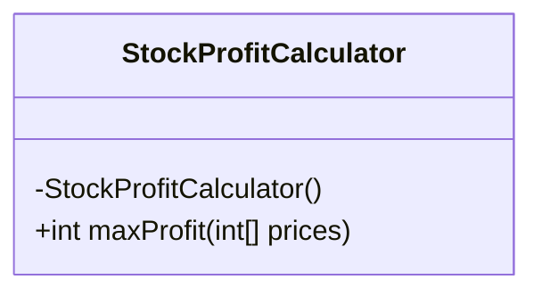
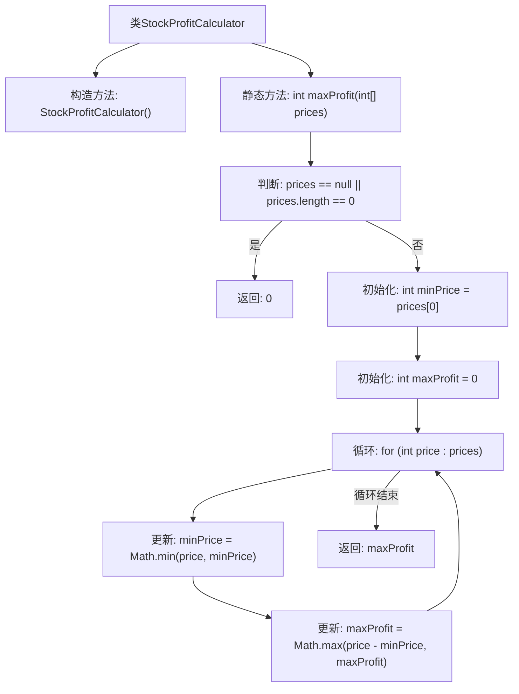

# 基础信息

|      |      |
|------|------|
| 名称 | StockProfitCalculator |
| 编码语言 | .java |
| 代码路径 | Java/src/main/java/com/thealgorithms/greedyalgorithms/StockProfitCalculator.java |
| 包名 | com.thealgorithms.greedyalgorithms |
| 依赖项 | [] |
| 概述说明 | 计算股票价格列表中的最大利润。 |

# 说明

计算股票价格列表中的最大利润涉及在给定的一系列股票价格中，找出最佳买入和卖出时机，以最大化利润。首先，需要遍历价格列表，记录当前最低价格作为买入点。然后，计算当前价格与最低价格的差值，作为潜在利润。通过比较所有潜在利润，找出其中的最大值，即为最大利润。此方法确保在单次遍历中完成计算，时间复杂度为O(n)，适用于处理大规模数据。

# 类列表 Class Summary

| 名称   | 类型  | 说明 |
|-------|------|-------------|
| StockProfitCalculator | class | 计算股票价格列表中的最大利润。 |

## 类 StockProfitCalculator

|      |      |
|------|------|
| 访问范围 | public final |
| 类型 | class |
| 名称 | StockProfitCalculator |
| 说明 | 计算股票价格列表中的最大利润。 |

### UML类图

**描述：**
`StockProfitCalculator` 是一个工具类，用于计算股票交易中的最大利润。该类包含一个私有的构造函数，确保无法实例化。核心方法 `maxProfit` 接受一个整数数组 `prices`，表示不同日期的股票价格，并返回通过一次买入和卖出交易可以获得的最大利润。如果无法获得利润，则返回 0。该方法通过遍历价格数组，动态更新最低价格和最大利润，最终返回计算结果。

### 内部方法调用关系图

这段代码定义了一个`StockProfitCalculator`类，其中包含一个静态方法`maxProfit`，用于计算给定股票价格列表中的最大利润。方法首先检查输入是否为空或长度为0，如果是则返回0。否则，初始化最小价格和最大利润，然后遍历价格列表，更新最小价格和最大利润，最终返回计算得到的最大利润。流程图展示了方法的执行步骤和逻辑流程。

### 字段列表 Field List

| 名称  | 类型  | 说明 |
|-------|-------|------|

### 方法列表 Method List

| 名称  | 类型  | 说明 |
|-------|-------|------|
| maxProfit | int | 计算股票价格数组中最大利润的Java方法。 |

