# 基础信息

|      |      |
|------|------|
| 名称 | greedyalgorithms |
| 编码语言 | .java |
| 代码路径 | Java/src/main/java/com/thealgorithms/greedyalgorithms |
| 包名 | Java.src.main.java.com.thealgorithms.greedyalgorithms |
| 概述说明 | 贪心算法解决带宽分配、背包、找零、文件合并、股票利润、作业延迟、作业调度、二进制加法、埃及分数、区间合并、聚类中心、等待时间、活动选择、稳定婚姻、数字分离等问题。 |

# 说明

## 概述
该代码模块主要实现了多种贪心算法的应用，涵盖了资源分配、优化问题、调度问题、数学计算等多个领域。贪心算法通过在每个步骤中选择当前最优的局部解，逐步构建全局最优解，适用于许多需要高效解决方案的场景。该模块中的算法包括带宽分配、背包问题、硬币找零、文件合并、股票利润计算、作业调度、二进制加法、埃及分数、区间合并、聚类中心选择、等待时间优化、活动选择、稳定婚姻匹配以及大数处理等。

## 主要业务场景
1. **资源分配与优化**：如带宽分配算法和背包问题，通过计算资源的价值与需求的比值，优化资源的使用效率，确保在有限资源下最大化总价值。
2. **调度与安排**：如作业调度、活动选择和最小等待时间计算，通过优先处理高利润或短时间的任务，优化任务的完成顺序，减少延迟或等待时间。
3. **数学计算与表示**：如二进制加法、埃及分数和大数处理，提供了高效的数学运算和表示方法，适用于需要精确计算的场景。
4. **聚类与匹配**：如聚类中心选择和稳定婚姻匹配，通过优化中心点的选择或生成稳定的配对关系，解决数据聚类和匹配问题。
5. **文件与区间处理**：如文件合并和区间合并，通过最小堆或排序策略，高效地合并文件或区间，减少处理成本或重叠问题。

这些算法在实际应用中具有广泛的适用性，能够有效解决各种优化和调度问题，提升系统的效率和性能。

### 包内部结构视图

```mermaid
graph TD
    greedyalgorithms --> BandwidthAllocation.java
    greedyalgorithms --> FractionalKnapsack.java
    greedyalgorithms --> CoinChange.java
    greedyalgorithms --> OptimalFileMerging.java
    greedyalgorithms --> StockProfitCalculator.java
    greedyalgorithms --> MinimizingLateness.java
    greedyalgorithms --> JobSequencing.java
    greedyalgorithms --> BinaryAddition.java
    greedyalgorithms --> EgyptianFraction.java
    greedyalgorithms --> MergeIntervals.java
    greedyalgorithms --> KCenters.java
    greedyalgorithms --> MinimumWaitingTime.java
    greedyalgorithms --> ActivitySelection.java
    greedyalgorithms --> GaleShapley.java
    greedyalgorithms --> DigitSeparation.java
```

该流程图展示了`greedyalgorithms`目录下的多个Java文件，这些文件涵盖了不同的贪心算法实现，如带宽分配、分数背包、硬币找零等。每个文件都是`greedyalgorithms`目录的直接子节点，清晰地反映了文件与目录之间的层级关系。

# 文件列表 File List

| 名称   | 类型  | 说明 |
|-------|------|-------------|
| [MinimumWaitingTime.java](MinimumWaitingTime.md) | file | 排序查询列表并累加各查询等待时间，计算最小总等待时间。 |
| [BinaryAddition.java](BinaryAddition.md) | file | BinaryAddition类实现二进制加法，支持求和、进位及字符串相加功能。 |
| [DigitSeparation.java](DigitSeparation.md) | file | DigitSeparation类可将大数拆分为逆序和正序数字列表。 |
| [GaleShapley.java](GaleShapley.md) | file | GaleShapley类实现稳定婚姻匹配算法，基于偏好列表生成稳定配对。 |
| [ActivitySelection.java](ActivitySelection.md) | file | 贪心算法选择最大不重叠活动数。 |
| [KCenters.java](KCenters.md) | file | KCenters类利用距离矩阵和中心数k计算最大最近中心距离。 |
| [MergeIntervals.java](MergeIntervals.md) | file | 排序后遍历合并重叠区间。 |
| [EgyptianFraction.java](EgyptianFraction.md) | file | 埃及分数类用于将给定分数转换为单位分数列表。 |
| [JobSequencing.java](JobSequencing.md) | file | JobSequencing类实现按利润降序排序的作业调度算法，输出最优序列。 |
| [MinimizingLateness.java](MinimizingLateness.md) | file | MinimizingLateness类按截止时间排序作业，计算开始时间和延迟。 |
| [StockProfitCalculator.java](StockProfitCalculator.md) | file | 计算股票价格列表中的最大利润。 |
| [OptimalFileMerging.java](OptimalFileMerging.md) | file | 使用最小堆合并文件，累加成本，直到只剩一个文件。 |
| [CoinChange.java](CoinChange.md) | file | Java类通过降序硬币面额计算最少硬币数解决找零问题。 |
| [FractionalKnapsack.java](FractionalKnapsack.md) | file | 动态规划求解背包问题，允许物品部分装入。 |
| [BandwidthAllocation.java](BandwidthAllocation.md) | file | 带宽分配算法按价值需求比排序，顺序分配以最大化总价值。 |

