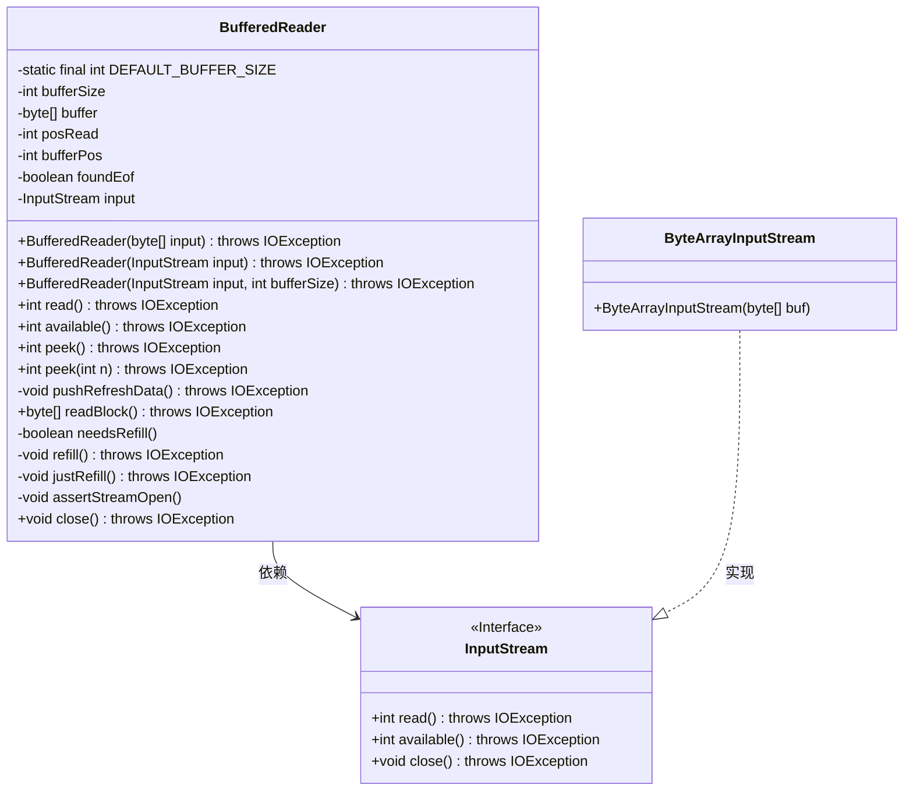
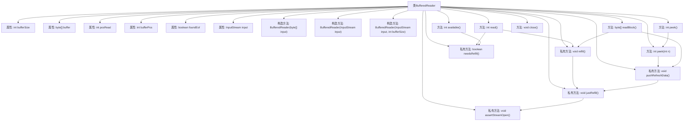

# 基础信息

|      |      |
|------|------|
| 名称 | BufferedReader |
| 编码语言 | .java |
| 代码路径 | Java/src/main/java/com/thealgorithms/io/BufferedReader.java |
| 包名 | com.thealgorithms.io |
| 依赖项 | ['java.io.ByteArrayInputStream', 'java.io.IOException', 'java.io.InputStream'] |
| 概述说明 | BufferedReader类支持单字节、块读取及预读功能。 |

# 说明

BufferedReader类是一种用于从输入流中读取数据的工具，支持多种读取方式，包括单字节读取、块读取以及预读功能。这些功能使其能够高效地处理不同类型的数据输入，满足多样化的读取需求。

# 类列表 Class Summary

| 名称   | 类型  | 说明 |
|-------|------|-------------|
| BufferedReader | class | BufferedReader类用于从输入流读取数据，支持单字节读取、块读取和预读功能。 |

## 类 BufferedReader

|      |      |
|------|------|
| 访问范围 | public |
| 类型 | class |
| 名称 | BufferedReader |
| 说明 | BufferedReader类用于从输入流读取数据，支持单字节读取、块读取和预读功能。 |

### UML类图

这段代码定义了一个 `BufferedReader` 类，用于从输入流中读取数据，并提供了缓冲功能。它包含多个方法，如 `read()`、`peek()`、`available()` 和 `readBlock()`，用于读取和操作数据。`BufferedReader` 依赖于 `InputStream` 接口，而 `ByteArrayInputStream` 是 `InputStream` 的一个实现类。代码通过缓冲区管理数据读取，支持流式操作，并处理了流关闭和缓冲区刷新等边缘情况。

### 内部方法调用关系图

这段代码定义了一个`BufferedReader`类，用于从输入流中读取数据。它包含多个构造方法，允许从字节数组或输入流初始化，并支持读取单个字节、查看下一个字符、读取数据块等操作。类内部通过缓冲区管理数据读取，并在需要时刷新缓冲区。代码还处理了流关闭和异常情况，确保数据的正确读取和资源释放。

### 字段列表 Field List

| 名称  | 类型  | 说明 |
|-------|-------|------|
| posRead = 0 | int | 定义私有整型变量posRead并初始化为0。 |
| DEFAULT_BUFFER_SIZE = 5 | int | 默认缓冲区大小为5。 |
| buffer | byte[] | 私有字节数组缓冲区 |
| input | InputStream | 私有输入流变量input。 |
| bufferPos = 0 | int | 定义私有整型变量bufferPos并初始化为0。 |
| foundEof = false | boolean | 定义私有布尔变量foundEof，初始值为false。 |
| bufferSize | int | 定义了一个私有整型变量bufferSize。 |

### 方法列表 Method List

| 名称  | 类型  | 说明 |
|-------|-------|------|
| pushRefreshData | void | 刷新数据并重新填充缓冲区。 |
| needsRefill | boolean | 方法判断缓冲区是否需要重新填充。 |
| close | void | 关闭输入流并置空，确保资源释放。 |
| refill | void | 该方法重置读取位置并调用重填操作。 |
| justRefill | void | 方法`justRefill`从输入流读取数据填充缓冲区，直到达到缓冲区大小或文件末尾。 |
| available | int | 方法返回输入流可用字节数，若需填充则直接返回，否则计算缓冲区内剩余字节数。 |
| peek | int | 方法peek()调用peek(1)并返回结果，可能抛出IOException。 |
| readBlock | byte[] | 读取数据块并返回克隆数组，刷新缓冲区后复制数据，最后重新填充缓冲区。 |
| peek | int | peek方法检查输入n是否超出可用数据或缓冲区大小，若超出则抛出异常，否则返回缓冲区第n个元素。 |
| read | int | 读取数据，若需填充则先填充，返回无符号字节值或EOF标记。 |
| assertStreamOpen | void | 检查输入流是否关闭，若关闭则抛出异常。 |

