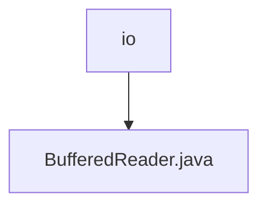

# 基础信息

|      |      |
|------|------|
| 名称 | io |
| 编码语言 | .java |
| 代码路径 | Java/src/main/java/com/thealgorithms/io |
| 包名 | Java.src.main.java.com.thealgorithms.io |
| 概述说明 | BufferedReader类支持单字节、块读取及预读功能。 |

# 说明

BufferedReader类是一种用于从输入流中读取数据的工具，支持多种读取方式，包括单字节读取、块读取以及预读功能。这些功能使其能够高效地处理不同类型的数据输入，满足多样化的读取需求。

### 包内部结构视图

这段流程图展示了路径 `Java/src/main/java/com/thealgorithms/io` 及其子文件 `BufferedReader.java` 的层级关系。`io` 是父节点，`BufferedReader.java` 是其子节点，表示该文件位于 `io` 目录下。

# 文件列表 File List

| 名称   | 类型  | 说明 |
|-------|------|-------------|
| [BufferedReader.java](BufferedReader.md) | file | BufferedReader类支持单字节、块读取及预读功能。 |

