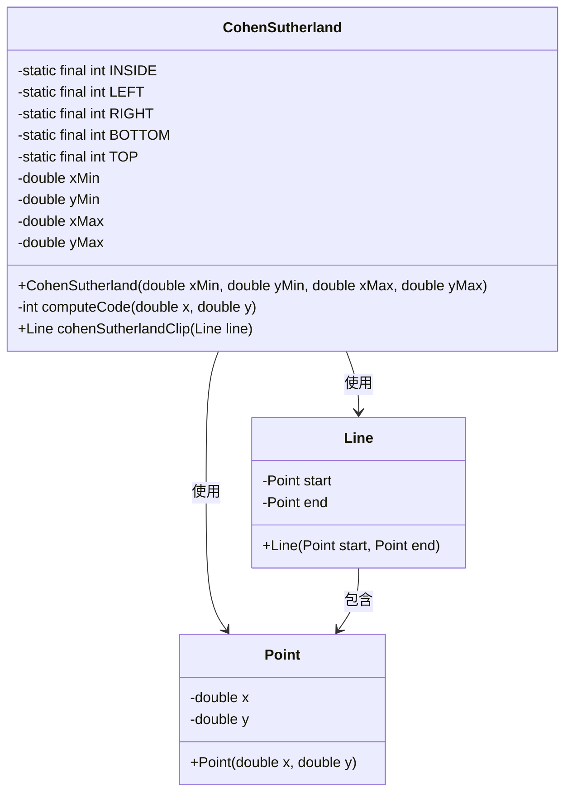

# 基础信息

|      |      |
|------|------|
| 名称 | CohenSutherland |
| 编码语言 | .java |
| 代码路径 | Java/src/main/java/com/thealgorithms/lineclipping/CohenSutherland.java |
| 包名 | com.thealgorithms.lineclipping |
| 依赖项 | ['com.thealgorithms.lineclipping.utils.Line', 'com.thealgorithms.lineclipping.utils.Point'] |
| 概述说明 | CohenSutherland算法用于线段裁剪，计算区域码并处理与矩形窗口的交点。 |

# 说明

CohenSutherland算法是一种用于线段裁剪的经典方法，主要用于确定线段与矩形窗口的交点。该算法通过计算线段的端点区域码来判断线段与窗口的位置关系。区域码由四位二进制数表示，分别对应线段的上下左右四个边界。如果两个端点的区域码均为零，则线段完全在窗口内；如果两个端点的区域码按位与结果不为零，则线段完全在窗口外。否则，算法通过计算线段与窗口边界的交点，逐步裁剪线段，直到确定线段在窗口内的部分。该算法高效且易于实现，广泛应用于图形处理领域。

# 类列表 Class Summary

| 名称   | 类型  | 说明 |
|-------|------|-------------|
| CohenSutherland | class | CohenSutherland算法实现线段裁剪，计算区域码并处理线段与矩形窗口的交点。 |

## 类 CohenSutherland

|      |      |
|------|------|
| 访问范围 | public |
| 类型 | class |
| 名称 | CohenSutherland |
| 说明 | CohenSutherland算法实现线段裁剪，计算区域码并处理线段与矩形窗口的交点。 |

### UML类图

**描述：**  
`CohenSutherland` 类实现了Cohen-Sutherland线段裁剪算法，用于裁剪线段与矩形窗口的交集。它通过计算点的区域码来确定线段与窗口的关系，并使用递归方法逐步裁剪线段，直到线段完全在窗口内或完全被拒绝。`Line` 类表示线段，包含两个 `Point` 类的实例作为起点和终点。`Point` 类表示二维空间中的点，包含 `x` 和 `y` 坐标。

### 内部方法调用关系图

```mermaid
graph TD
    A["类CohenSutherland"]
    B["常量: INSIDE = 0"]
    C["常量: LEFT = 1"]
    D["常量: RIGHT = 2"]
    E["常量: BOTTOM = 4"]
    F["常量: TOP = 8"]
    G["属性: double xMin"]
    H["属性: double yMin"]
    I["属性: double xMax"]
    J["属性: double yMax"]
    K["构造方法: CohenSutherland(double xMin, double yMin, double xMax, double yMax)"]
    L["方法: int computeCode(double x, double y)"]
    M["方法: Line cohenSutherlandClip(Line line)"]
    N["计算区域码: code |= LEFT/RIGHT/BOTTOM/TOP"]
    O["判断点是否在矩形内: code1 == 0 && code2 == 0"]
    P["判断点是否在矩形外同一区域: code1 & code2 != 0"]
    Q["计算交点: x = x1 + (x2 - x1) * (yMax - y1) / (y2 - y1)"]
    R["更新点坐标: x1 = x; y1 = y; code1 = computeCode(x1, y1)"]
    S["返回裁剪后的线段: return new Line(new Point(x1, y1), new Point(x2, y2))"]
    T["返回null: return null"]

    A --> B
    A --> C
    A --> D
    A --> E
    A --> F
    A --> G
    A --> H
    A --> I
    A --> J
    A --> K
    A --> L
    A --> M
    L --> N
    M --> O
    M --> P
    M --> Q
    M --> R
    M --> S
    M --> T
```

这段代码实现了Cohen-Sutherland线段裁剪算法，用于判断一条线段是否在给定的矩形区域内，并返回裁剪后的线段。算法通过计算线段的两个端点的区域码，判断线段是否完全在矩形内、完全在矩形外或部分在矩形内。对于部分在矩形内的线段，算法通过计算交点来裁剪线段，直到线段完全在矩形内或完全被裁剪掉。

### 字段列表 Field List

| 名称  | 类型  | 说明 |
|-------|-------|------|
| RIGHT = 2 | int | 定义私有静态常量RIGHT，值为2。 |
| LEFT = 1 | int | 定义私有静态常量LEFT，值为1。 |
| xMin | double | 定义双精度浮点数变量xMin。 |
| yMax | double | 定义双精度浮点数变量yMax。 |
| INSIDE = 0 | int | 定义私有静态常量INSIDE，初始值为0。 |
| yMin | double | 定义双精度浮点数变量yMin。 |
| TOP = 8 | int | 定义了一个私有静态常量TOP，值为8。 |
| BOTTOM = 4 | int | 定义私有静态常量BOTTOM，值为4。 |
| xMax | double | 定义双精度浮点变量xMax。 |

### 方法列表 Method List

| 名称  | 类型  | 说明 |
|-------|-------|------|
| computeCode | int | 计算点相对于矩形的位置编码，包括左、右、下、上。 |
| cohenSutherlandClip | Line | Cohen-Sutherland算法裁剪线段，判断线段与矩形的关系并返回裁剪结果。 |

