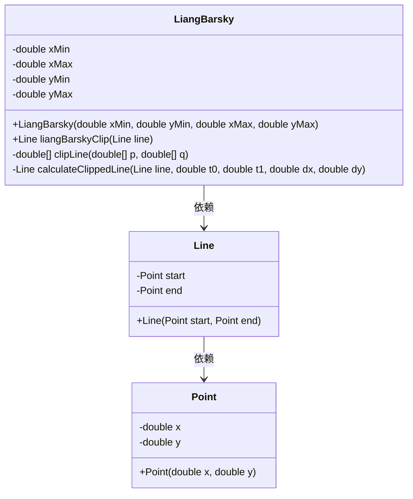
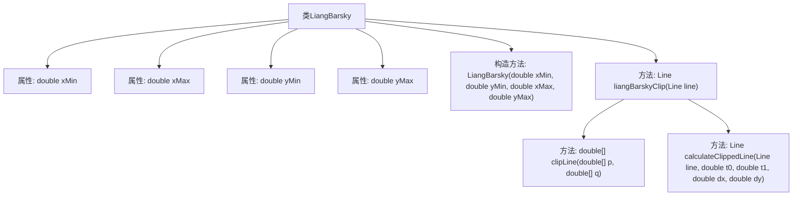
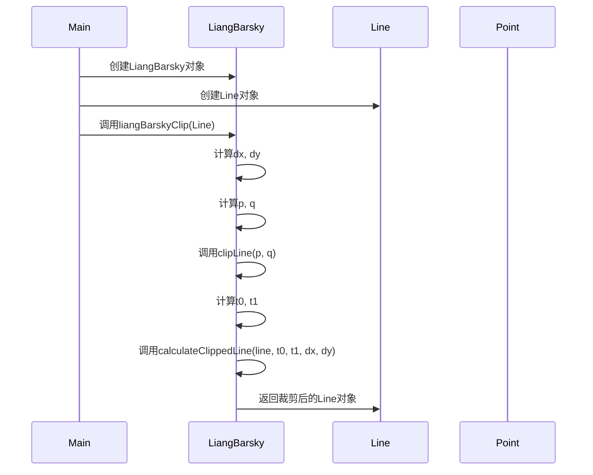

# 基础信息

|      |      |
|------|------|
| 名称 | LiangBarsky |
| 编码语言 | .java |
| 代码路径 | Java/src/main/java/com/thealgorithms/lineclipping/LiangBarsky.java |
| 包名 | com.thealgorithms.lineclipping |
| 依赖项 | ['com.thealgorithms.lineclipping.utils.Line', 'com.thealgorithms.lineclipping.utils.Point'] |
| 概述说明 | LiangBarsky类通过调整t0和t1参数实现线段裁剪，返回裁剪后的线段。 |

# 说明

LiangBarsky类实现了线段裁剪算法，该算法通过调整参数t0和t1来裁剪线段，最终返回裁剪后的线段。

# 类列表 Class Summary

| 名称   | 类型  | 说明 |
|-------|------|-------------|
| LiangBarsky | class | LiangBarsky类实现线段裁剪算法，通过调整参数t0和t1裁剪线段，返回裁剪后的线段。 |

## 类 LiangBarsky

|      |      |
|------|------|
| 访问范围 | public |
| 类型 | class |
| 名称 | LiangBarsky |
| 说明 | LiangBarsky类实现线段裁剪算法，通过调整参数t0和t1裁剪线段，返回裁剪后的线段。 |

### UML类图

类图描述：  
`LiangBarsky` 类实现了 Liang-Barsky 算法，用于裁剪线段。它包含裁剪窗口的边界值（`xMin`, `xMax`, `yMin`, `yMax`）以及裁剪线段的方法 `liangBarskyClip`。`Line` 类表示一条线段，包含起点和终点，分别由 `Point` 类表示。`Point` 类定义了点的坐标（`x`, `y`）。`LiangBarsky` 类依赖于 `Line` 和 `Point` 类来完成裁剪操作。

### 内部方法调用关系图

这段代码实现了一个基于Liang-Barsky算法的线段裁剪功能。类`LiangBarsky`定义了裁剪窗口的边界，并通过`liangBarskyClip`方法对输入的线段进行裁剪。裁剪过程中，首先计算线段的参数`p`和`q`，然后通过`clipLine`方法确定裁剪参数`t0`和`t1`，最后通过`calculateClippedLine`方法计算裁剪后的线段并返回。整个过程确保了线段在裁剪窗口内的可见部分被正确保留。

### 字段列表 Field List

| 名称  | 类型  | 说明 |
|-------|-------|------|
| xMin | double | 定义双精度浮点数变量xMin。 |
| xMax | double | 声明双精度浮点变量xMax。 |
| yMin | double | 定义双精度浮点数变量yMin。 |
| yMax | double | 定义双精度浮点数变量yMax。 |

### 方法列表 Method List

| 名称  | 类型  | 说明 |
|-------|-------|------|
| calculateClippedLine | Line | 计算裁剪线段并返回新线段。 |
| liangBarskyClip | Line | Liang-Barsky算法裁剪线段，计算裁剪后的新线段。 |
| clipLine | double[] | 该方法裁剪线段，返回有效参数t0和t1，若线段越界则返回null。 |

