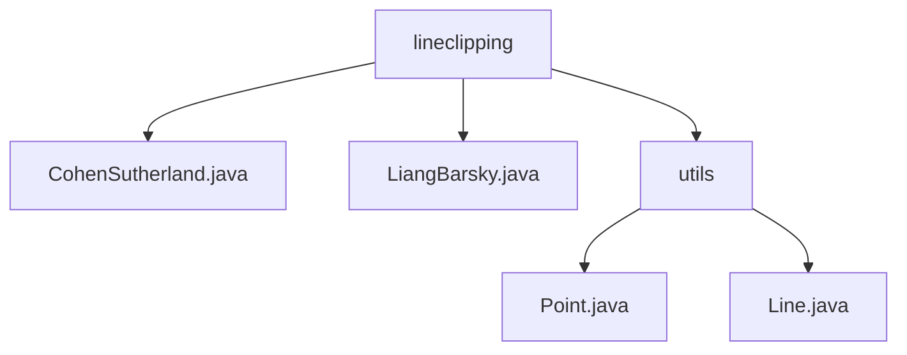

# 基础信息

|      |      |
|------|------|
| 名称 | lineclipping |
| 编码语言 | .java |
| 代码路径 | Java/src/main/java/com/thealgorithms/lineclipping |
| 包名 | Java.src.main.java.com.thealgorithms.lineclipping |
| 概述说明 | CohenSutherland和LiangBarsky算法用于线段裁剪，Point和Line类处理二维几何图形。 |

# 说明

## 概述
该代码模块主要用于处理二维平面上的几何图形，包括点和线段的表示与操作。模块的核心类是 `Point` 和 `Line`，分别用于表示平面上的点和线段。此外，模块还实现了两种经典的线段裁剪算法：Cohen-Sutherland算法和Liang-Barsky算法。这些算法用于确定线段与矩形窗口的交点，并裁剪出线段在窗口内的部分。模块的设计简洁且功能完备，适用于需要处理二维平面几何图形的各种应用场景。

## 主要业务场景
1. **点的表示与操作**：`Point` 类用于表示二维平面上的点，提供了点的坐标（x, y）的存储和操作。通过 `equals` 方法可以比较两个点是否相同，`hashCode` 方法用于生成点的哈希值，`toString` 方法用于将点的坐标信息转换为字符串形式。这些功能使得 `Point` 类可以用于需要精确表示和比较点的场景，如几何计算、图形绘制等。

2. **线段的表示与操作**：`Line` 类用于表示二维平面上的线段，提供了线段的起点和终点的存储和操作。通过构造函数可以初始化线段，`equals` 方法可以比较两个线段是否相同，`hashCode` 方法用于生成线段的哈希值，`toString` 方法用于将线段转换为可读的字符串格式。这些功能使得 `Line` 类可以用于需要精确表示和比较线段的场景，如几何计算、图形绘制、线段裁剪等。

3. **线段裁剪**：模块实现了两种经典的线段裁剪算法：
   - **Cohen-Sutherland算法**：该算法通过计算线段的端点区域码来判断线段与窗口的位置关系，并逐步裁剪线段，直到确定线段在窗口内的部分。该算法高效且易于实现，广泛应用于图形处理领域。
   - **Liang-Barsky算法**：该算法通过调整参数 `t0` 和 `t1` 来裁剪线段，最终返回裁剪后的线段。该算法同样适用于图形处理中的线段裁剪场景。

该模块的设计简洁且功能完备，适用于需要处理二维平面几何图形的各种应用场景，如几何计算、图形绘制、线段裁剪等。

### 包内部结构视图

该流程图展示了`lineclipping`文件夹下的文件结构，包含两个直接文件`CohenSutherland.java`和`LiangBarsky.java`，以及一个子文件夹`utils`，其中包含`Point.java`和`Line.java`两个文件。

# 文件列表 File List

| 名称   | 类型  | 说明 |
|-------|------|-------------|
| [LiangBarsky.java](LiangBarsky.md) | file | LiangBarsky类通过调整t0和t1参数实现线段裁剪，返回裁剪后的线段。 |
| [CohenSutherland.java](CohenSutherland.md) | file | CohenSutherland算法用于线段裁剪，计算区域码并处理与矩形窗口的交点。 |
| [utils](utils/_module.md) | package | Point类表示二维点，含x、y属性，实现equals、hashCode、toString方法。Line类表示线段，含起点、终点属性，实现构造函数、相等性判断、哈希、字符串表示方法。 |

