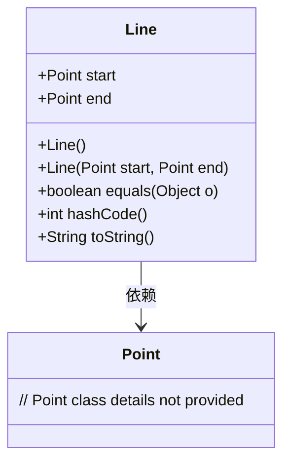
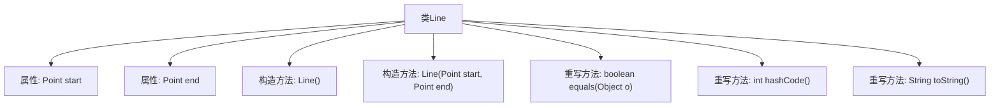

# 基础信息

|      |      |
|------|------|
| 名称 | Line |
| 编码语言 | .java |
| 代码路径 | Java/src/main/java/com/thealgorithms/lineclipping/utils/Line.java |
| 包名 | com.thealgorithms.lineclipping.utils |
| 依赖项 | ['java.util.Objects'] |
| 概述说明 | Line类定义线段，包含起点终点，支持构造、相等、哈希和字符串操作。 |

# 说明

Line类用于表示线段，包含两个关键属性：起点和终点。该类提供了多种功能，包括构造函数用于初始化线段，相等性判断方法用于比较两个线段是否相同，哈希方法用于生成线段的哈希值以便在哈希表中使用，以及字符串表示方法用于将线段转换为可读的字符串格式。这些功能使得Line类能够有效地处理和操作线段数据。

# 类列表 Class Summary

| 名称   | 类型  | 说明 |
|-------|------|-------------|
| Line | class | Line类表示线段，包含起点和终点，提供构造、相等、哈希和字符串表示方法。 |

## 类 Line

|      |      |
|------|------|
| 访问范围 | public |
| 类型 | class |
| 名称 | Line |
| 说明 | Line类表示线段，包含起点和终点，提供构造、相等、哈希和字符串表示方法。 |

### UML类图

类图描述：`Line`类表示一条线段，包含两个`Point`类型的公有成员`start`和`end`，分别表示线段的起点和终点。类中提供了默认构造函数和带参数的构造函数，并重写了`equals`、`hashCode`和`toString`方法，用于比较两个`Line`对象是否相等、生成哈希码以及返回线段的字符串表示。`Line`类依赖于`Point`类来表示线段的起点和终点。

### 内部方法调用关系图

该流程图展示了`Line`类的结构及其内部方法的关系。`Line`类包含两个属性`start`和`end`，分别表示线的起点和终点。类中定义了两个构造方法，一个无参构造方法`Line()`和一个带参构造方法`Line(Point start, Point end)`。此外，类重写了`equals`方法用于比较两个`Line`对象是否相等，重写了`hashCode`方法用于生成对象的哈希码，以及重写了`toString`方法用于返回对象的字符串表示。这些方法共同构成了`Line`类的核心功能。

### 字段列表 Field List

| 名称  | 类型  | 说明 |
|-------|-------|------|
| end | Point | end是Point类型的公共变量。 |
| start | Point | 定义了一个名为start的Point类型公共变量。 |

### 方法列表 Method List

| 名称  | 类型  | 说明 |
|-------|-------|------|
| hashCode | int | 重写hashCode方法，使用start和end生成哈希值。 |
| equals | boolean | 重写equals方法，比较Line对象的起点和终点是否相同。 |
| toString | String | 重写toString方法，返回起点到终点的字符串。 |

