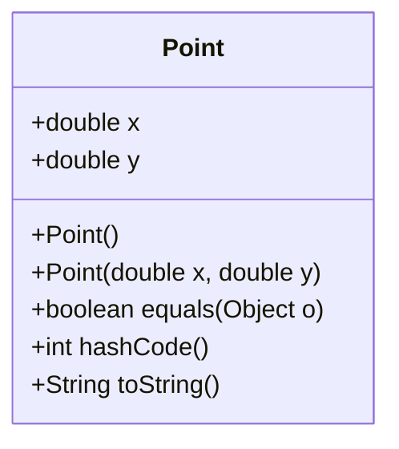
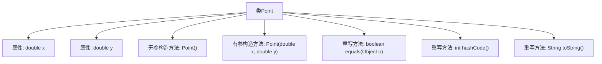

# 基础信息

|      |      |
|------|------|
| 名称 | Point |
| 编码语言 | .java |
| 代码路径 | Java/src/main/java/com/thealgorithms/lineclipping/utils/Point.java |
| 包名 | com.thealgorithms.lineclipping.utils |
| 依赖项 | ['java.util.Objects'] |
| 概述说明 | Point类表示二维点，含x、y坐标，实现equals、hashCode和toString方法。 |

# 说明

Point类用于表示二维平面上的点，包含两个属性x和y，分别表示点的横坐标和纵坐标。该类实现了equals方法，用于比较两个点是否相同；hashCode方法，用于生成点的哈希值；以及toString方法，用于将点的坐标信息转换为字符串形式。这些方法的实现确保了点的基本操作和表示的完整性和一致性。

# 类列表 Class Summary

| 名称   | 类型  | 说明 |
|-------|------|-------------|
| Point | class | Point类表示二维点，包含x、y坐标，实现equals、hashCode和toString方法。 |

## 类 Point

|      |      |
|------|------|
| 访问范围 | public |
| 类型 | class |
| 名称 | Point |
| 说明 | Point类表示二维点，包含x、y坐标，实现equals、hashCode和toString方法。 |

### UML类图

这段代码定义了一个名为 `Point` 的类，用于表示二维坐标系中的一个点。类中包含两个公有属性 `x` 和 `y`，分别表示点的横坐标和纵坐标。类提供了两个构造函数，一个默认构造函数和一个带参数的构造函数。此外，类还重写了 `equals`、`hashCode` 和 `toString` 方法，分别用于比较两个点是否相等、生成点的哈希码以及返回点的字符串表示形式。这些方法确保了 `Point` 类在集合操作中的正确性和可读性。

### 内部方法调用关系图

这段代码定义了一个`Point`类，包含两个属性`x`和`y`，分别表示点的横纵坐标。类中提供了无参和有参的构造方法，用于初始化`Point`对象。`equals`方法用于比较两个`Point`对象是否相等，`hashCode`方法生成对象的哈希码，`toString`方法返回对象的字符串表示。代码结构清晰，功能明确，适用于需要处理二维坐标的场景。

### 字段列表 Field List

| 名称  | 类型  | 说明 |
|-------|-------|------|
| x | double | 声明一个公有的双精度浮点型变量x。 |
| y | double | 声明一个双精度浮点型变量y。 |

### 方法列表 Method List

| 名称  | 类型  | 说明 |
|-------|-------|------|
| toString | String | 重写toString方法，返回(x, y)格式字符串。 |
| equals | boolean | 重写equals方法，比较Point对象的x和y坐标是否相等。 |
| hashCode | int | 重写hashCode方法，使用Objects.hash计算x和y的哈希值。 |

