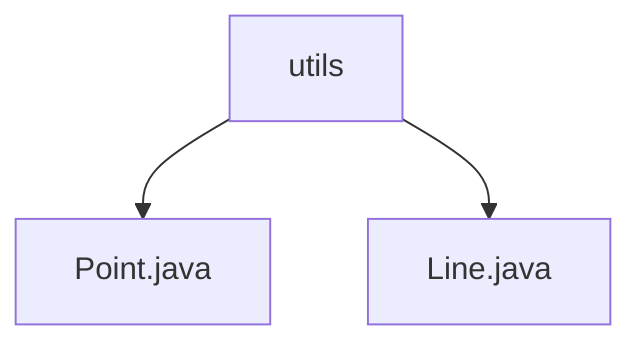

# 基础信息

|      |      |
|------|------|
| 名称 | utils |
| 编码语言 | .java |
| 代码路径 | Java/src/main/java/com/thealgorithms/lineclipping/utils |
| 包名 | Java.src.main.java.com.thealgorithms.lineclipping.utils |
| 概述说明 | Point类表示二维点，含x、y属性，实现equals、hashCode、toString方法。Line类表示线段，含起点、终点属性，实现构造函数、相等性判断、哈希、字符串表示方法。 |

# 说明

## 概述
该代码模块主要用于处理二维平面上的几何图形，包括点和线段的表示与操作。模块的核心类是 `Point` 和 `Line`，分别用于表示平面上的点和线段。`Point` 类提供了点的基本属性和操作，如坐标表示、相等性比较、哈希值生成和字符串表示。`Line` 类则提供了线段的起点和终点的表示，以及线段的基本操作，如初始化、相等性判断、哈希值生成和字符串表示。这些类的设计确保了点和线段的基本操作和表示的完整性和一致性。

## 主要业务场景
1. **点的表示与操作**：`Point` 类用于表示二维平面上的点，提供了点的坐标（x, y）的存储和操作。通过 `equals` 方法可以比较两个点是否相同，`hashCode` 方法用于生成点的哈希值，`toString` 方法用于将点的坐标信息转换为字符串形式。这些功能使得 `Point` 类可以用于需要精确表示和比较点的场景，如几何计算、图形绘制等。

2. **线段的表示与操作**：`Line` 类用于表示二维平面上的线段，提供了线段的起点和终点的存储和操作。通过构造函数可以初始化线段，`equals` 方法可以比较两个线段是否相同，`hashCode` 方法用于生成线段的哈希值，`toString` 方法用于将线段转换为可读的字符串格式。这些功能使得 `Line` 类可以用于需要精确表示和比较线段的场景，如几何计算、图形绘制、线段裁剪等。

该模块的设计简洁且功能完备，适用于需要处理二维平面几何图形的各种应用场景。

### 包内部结构视图

该流程图展示了路径的层级关系，`utils` 是顶层目录，包含两个文件：`Point.java` 和 `Line.java`。这些文件位于 `utils` 目录下，结构清晰，层级关系明确。

# 文件列表 File List

| 名称   | 类型  | 说明 |
|-------|------|-------------|
| [Line.java](Line.md) | file | Line类定义线段，包含起点终点，支持构造、相等、哈希和字符串操作。 |
| [Point.java](Point.md) | file | Point类表示二维点，含x、y坐标，实现equals、hashCode和toString方法。 |

