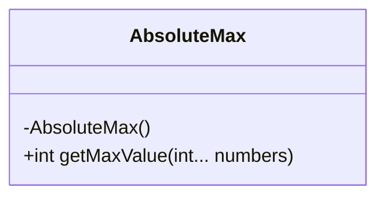
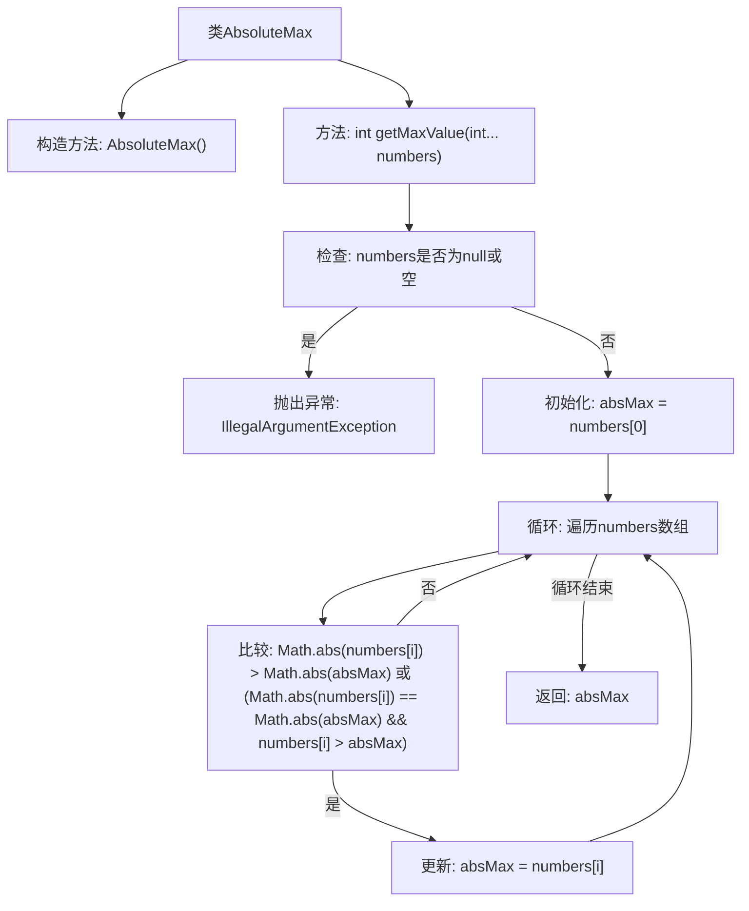

# 基础信息

|      |      |
|------|------|
| 名称 | AbsoluteMax |
| 编码语言 | .java |
| 代码路径 | Java/src/main/java/com/thealgorithms/maths/AbsoluteMax.java |
| 包名 | com.thealgorithms.maths |
| 依赖项 | [] |
| 概述说明 | AbsoluteMax类用于获取数字绝对最大值，处理空或null输入异常。 |

# 说明

AbsoluteMax类是一个用于获取数字绝对最大值的工具类。它包含一个方法，能够处理输入为空或null的情况，并抛出相应的异常。该类的设计旨在确保在处理数字数据时，能够准确地获取其绝对最大值，同时避免因无效输入导致的程序错误。通过这种方式，AbsoluteMax类提高了代码的健壮性和可靠性，适用于需要处理数字绝对最大值的各种场景。

# 类列表 Class Summary

| 名称   | 类型  | 说明 |
|-------|------|-------------|
| AbsoluteMax | class | AbsoluteMax类提供获取数字绝对最大值的方法，处理空或null输入异常。 |

## 类 AbsoluteMax

|      |      |
|------|------|
| 访问范围 | public final |
| 类型 | class |
| 名称 | AbsoluteMax |
| 说明 | AbsoluteMax类提供获取数字绝对最大值的方法，处理空或null输入异常。 |

### UML类图

这段代码定义了一个名为 `AbsoluteMax` 的最终类，该类包含一个私有的构造方法和一个公有的静态方法 `getMaxValue`。`getMaxValue` 方法接受一个可变长度的整数数组作为参数，返回数组中的绝对最大值。如果输入数组为空或为 `null`，方法会抛出 `IllegalArgumentException` 异常。方法通过遍历数组，比较每个元素的绝对值，最终确定并返回绝对最大值。

### 内部方法调用关系图

这段代码定义了一个名为 `AbsoluteMax` 的类，包含一个私有构造方法和一个静态方法 `getMaxValue`。该方法接受一个整数数组作为参数，返回数组中绝对值最大的数。如果数组为空或为 `null`，则抛出 `IllegalArgumentException` 异常。流程图展示了从检查输入、初始化变量、遍历数组、比较绝对值到最终返回结果的全过程。

### 字段列表 Field List

| 名称  | 类型  | 说明 |
|-------|-------|------|

### 方法列表 Method List

| 名称  | 类型  | 说明 |
|-------|-------|------|
| getMaxValue | int | 静态方法getMaxValue返回数组中绝对值最大且值最大的整数，空数组或null抛出异常。 |

