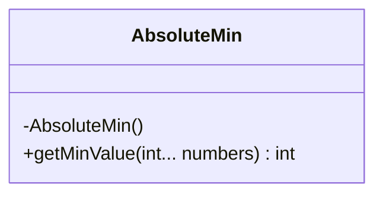
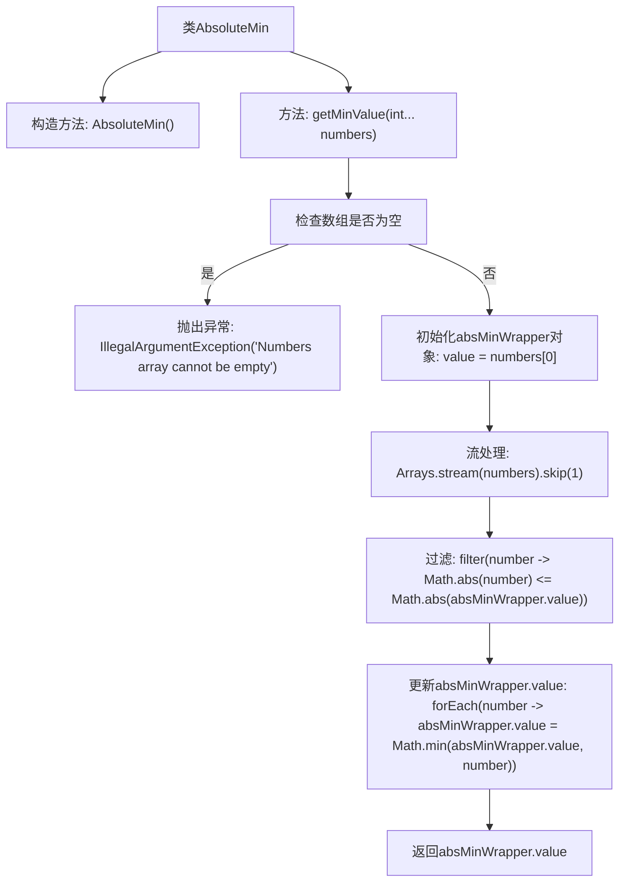

# 基础信息

|      |      |
|------|------|
| 名称 | AbsoluteMin |
| 编码语言 | .java |
| 代码路径 | Java/src/main/java/com/thealgorithms/maths/AbsoluteMin.java |
| 包名 | com.thealgorithms.maths |
| 依赖项 | ['java.util.Arrays'] |
| 概述说明 | 绝对最小值类用于比较数字并获取绝对值最小的值。 |

# 说明

绝对最小值类是一个用于比较数字并获取绝对值最小的值的工具。它通过分析给定数字的绝对值，确定其中最小的一个。该方法适用于需要找出数值上最接近零的数的场景，无论这些数是正数还是负数。通过这种方式，用户可以快速找到一组数字中绝对值最小的那个，从而简化相关计算或决策过程。

# 类列表 Class Summary

| 名称   | 类型  | 说明 |
|-------|------|-------------|
| AbsoluteMin | class | 绝对最小值类，通过比较数字获取绝对值最小的值。 |

## 类 AbsoluteMin

|      |      |
|------|------|
| 访问范围 | public final |
| 类型 | class |
| 名称 | AbsoluteMin |
| 说明 | 绝对最小值类，通过比较数字获取绝对值最小的值。 |

### UML类图

这段代码定义了一个名为 `AbsoluteMin` 的不可继承的类（`final`），该类包含一个私有的构造函数，防止外部实例化。`AbsoluteMin` 类提供了一个静态方法 `getMinValue`，该方法接受可变数量的整数参数，并返回这些整数的绝对值最小值。如果传入的数组为空，方法会抛出 `IllegalArgumentException`。方法内部使用了一个匿名对象 `absMinWrapper` 来存储当前的最小值，并通过流操作遍历数组，更新最小值。最终返回的 `absMinWrapper.value` 即为绝对值最小值。

### 内部方法调用关系图

**描述：**  
这段代码定义了一个名为 `AbsoluteMin` 的类，其中包含一个私有构造方法和一个静态方法 `getMinValue`。`getMinValue` 方法接受一个可变长度的整数数组作为参数，返回数组中绝对值最小的值。首先，方法检查数组是否为空，如果为空则抛出 `IllegalArgumentException` 异常。接着，方法初始化一个包装对象 `absMinWrapper`，并使用流处理对数组进行过滤和更新，最终返回绝对值最小的值。流程图清晰地展示了方法的执行流程和逻辑判断。

### 字段列表 Field List

| 名称  | 类型  | 说明 |
|-------|-------|------|

### 方法列表 Method List

| 名称  | 类型  | 说明 |
|-------|-------|------|
| getMinValue | int | 获取数组中最接近零的最小值，数组为空时抛出异常。 |

