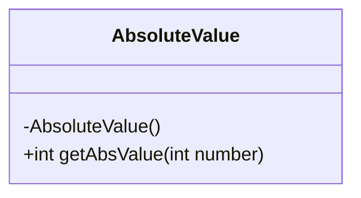
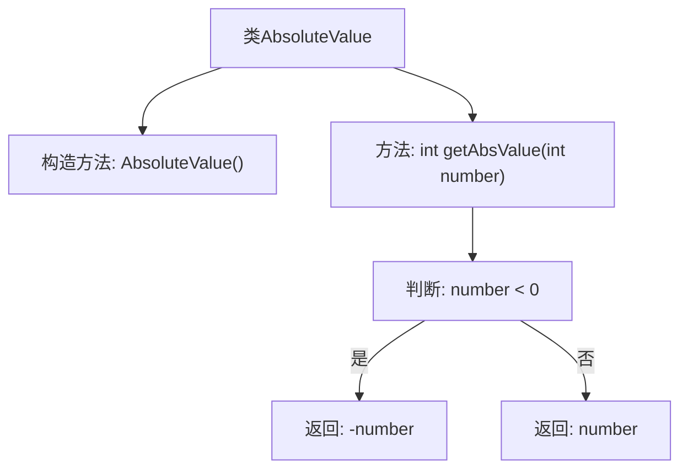

# 基础信息

|      |      |
|------|------|
| 名称 | AbsoluteValue |
| 编码语言 | .java |
| 代码路径 | Java/src/main/java/com/thealgorithms/maths/AbsoluteValue.java |
| 包名 | com.thealgorithms.maths |
| 依赖项 | [] |
| 概述说明 | AbsoluteValue类提供整数绝对值获取方法。 |

# 说明

AbsoluteValue类是一个专门用于处理整数绝对值的工具类。该类提供了一个方法，用于获取给定整数的绝对值。绝对值是指一个数在数轴上与原点的距离，无论该数是正数还是负数，其绝对值始终为非负数。通过调用AbsoluteValue类中的方法，用户可以方便地计算并获取任何整数的绝对值，从而简化相关数学运算和逻辑处理。

# 类列表 Class Summary

| 名称   | 类型  | 说明 |
|-------|------|-------------|
| AbsoluteValue | class | AbsoluteValue类提供获取整数绝对值的方法。 |

## 类 AbsoluteValue

|      |      |
|------|------|
| 访问范围 | public final |
| 类型 | class |
| 名称 | AbsoluteValue |
| 说明 | AbsoluteValue类提供获取整数绝对值的方法。 |

### UML类图

这段代码定义了一个名为 `AbsoluteValue` 的不可继承类（`final`），该类包含一个私有的构造函数，防止外部实例化。类中提供了一个静态方法 `getAbsValue`，用于计算并返回给定整数的绝对值。该方法通过三元运算符判断输入值是否为负数，如果是则返回其相反数，否则直接返回原值。这个类主要用于数学计算，提供了简单的绝对值功能。

### 内部方法调用关系图

该流程图描述了`AbsoluteValue`类的结构及其`getAbsValue`方法的执行流程。`AbsoluteValue`类包含一个私有构造方法和一个静态方法`getAbsValue`，该方法通过判断输入数字是否小于零来决定返回其相反数还是原数。流程清晰展示了条件判断和返回值的逻辑路径。

### 字段列表 Field List

| 名称  | 类型  | 说明 |
|-------|-------|------|

### 方法列表 Method List

| 名称  | 类型  | 说明 |
|-------|-------|------|
| getAbsValue | int | 该方法返回输入整数的绝对值。 |

