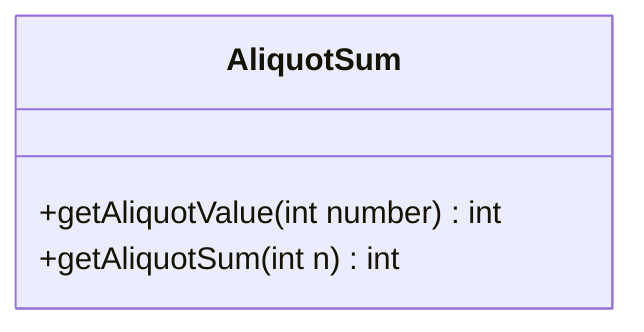
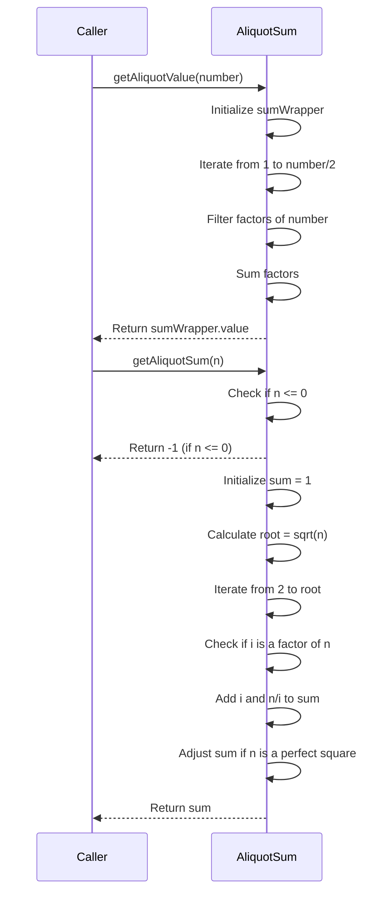
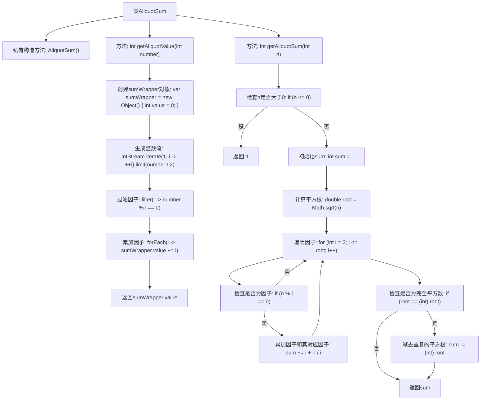

# 基础信息

|      |      |
|------|------|
| 名称 | AliquotSum |
| 编码语言 | .java |
| 代码路径 | Java/src/main/java/com/thealgorithms/maths/AliquotSum.java |
| 包名 | com.thealgorithms.maths |
| 依赖项 | ['java.util.stream.IntStream'] |
| 概述说明 | AliquotSum类提供两个方法计算整数真约数和，分别采用流处理和优化计算效率。 |

# 说明

AliquotSum类包含两个方法用于计算整数的真约数和。第一个方法getAliquotValue采用流处理技术进行计算，而第二个方法getAliquotSum则通过优化计算效率来提升性能。这两个方法共同实现了对整数真约数和的高效计算。

# 类列表 Class Summary

| 名称   | 类型  | 说明 |
|-------|------|-------------|
| AliquotSum | class | AliquotSum类提供两个方法计算整数的真约数和，getAliquotValue使用流处理，getAliquotSum优化了计算效率。 |

## 类 AliquotSum

|      |      |
|------|------|
| 访问范围 | public final |
| 类型 | class |
| 名称 | AliquotSum |
| 说明 | AliquotSum类提供两个方法计算整数的真约数和，getAliquotValue使用流处理，getAliquotSum优化了计算效率。 |

### UML类图

**描述：**  
`AliquotSum` 类提供了两个静态方法 `getAliquotValue` 和 `getAliquotSum`，用于计算一个整数的 Aliquot Sum（即所有真因数之和）。`getAliquotValue` 方法通过遍历从 1 到 `number/2` 的所有整数，找到 `number` 的因数并求和。`getAliquotSum` 方法则通过计算 `n` 的平方根，优化了因数的查找过程，避免了重复计算，并在 `n` 为完全平方数时进行特殊处理。这两个方法都返回 Aliquot Sum，如果输入值不合法（如 `n <= 0`），`getAliquotSum` 会返回 -1。

### 内部方法调用关系图

这段代码定义了一个名为`AliquotSum`的类，包含两个静态方法`getAliquotValue`和`getAliquotSum`，用于计算一个整数的真约数和。`getAliquotValue`方法通过生成整数流并过滤出因子，然后累加这些因子。`getAliquotSum`方法则通过遍历小于等于平方根的整数，找到所有因子并累加，同时处理完全平方数的情况。这两个方法都返回计算得到的真约数和。

### 字段列表 Field List

| 名称  | 类型  | 说明 |
|-------|-------|------|

### 方法列表 Method List

| 名称  | 类型  | 说明 |
|-------|-------|------|
| getAliquotValue | int | 该方法计算并返回给定整数的真约数之和。 |
| getAliquotSum | int | 计算整数n的因数和，优化算法避免重复计算。 |

